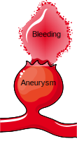
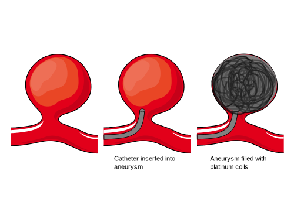
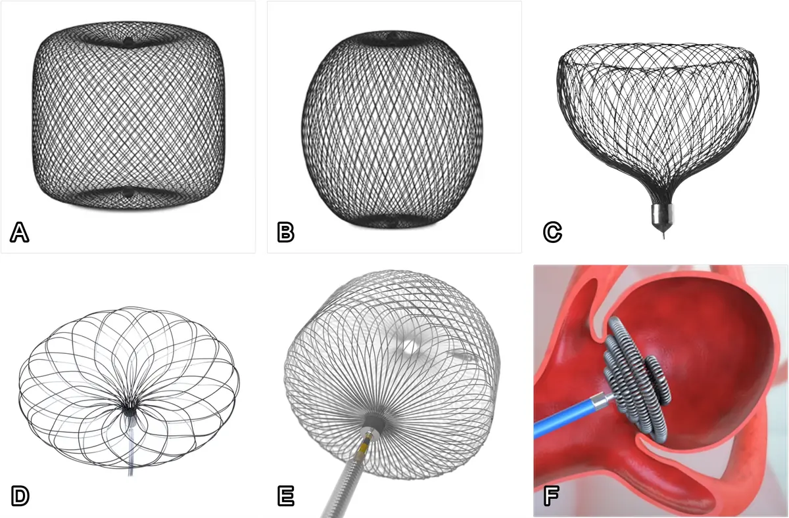
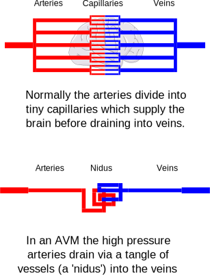
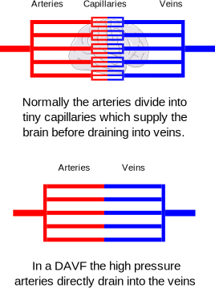
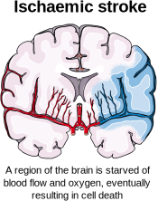
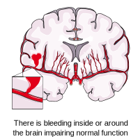

# About Dr Lynch {General}
---
tags: General
keywords: "Jeremy Lynch, Interventional Neuroradiology, Consultant, London, Neurointervention"
about: "Dr Jeremy Lynch MBChB MRCS FRCR is a Consultant Interventional Neuroradiologist based in London. He trained in Bristol, London, and Toronto and specialises in minimally invasive treatments for vascular diseases of the brain, head, neck, and spine."
mainEntity: "https://www.drjeremylynch.com/"
sameAs: "https://www.

## Biography

Dr Jeremy Lynch MBChB MRCS FRCR is a London-based Consultant Interventional Neuroradiologist. He has been an NHS doctor for 13 years and is experienced in the diagnosis and treatment of vascular diseases involving the brain, head and neck, and spine. Dr Lynch trained in Medicine at the University of Bristol and qualified in 2007. He underwent several years of surgical training, during which he gained membership of the Royal College of Surgeons. He then underwent further specialisation in interventional radiology and neuroradiology in a range of specialist hospitals in London including the National Hospital for Neurology and Neurosurgery, Great Ormonds Street Hospital, Kings College Hospital, St George’s Hospital, and Queen’s Hospital. He underwent a further international fellowship in Toronto Western Hospital in Canada where he was one of the first doctors in the world to gain experience in robotic endovascular techniques.

Dr Lynch has published several academic book chapters and journal articles. He is a reviewer for Clinical Neuroradiology. His special interests include the role of new technologies including artificial intelligence in the diagnosis of neurovascular disease. He has been invited to lecture on interventional neuroradiology and neuroimaging in international conferences. He is the author of the popular neurointerventional educational website neurotool.org.

## Training

* International Fellowship Interventional Neuroradiology - Toronto Western Hospital (Ontario, Canada)

* CCT Interventional Radiology (GMC registration)

* Fellowship Interventional Neuroradiology - National Hospital for Neurology and Neurosurgery, Great Ormonds Street Hospital, Kings College Hospital, St George’s Hospital, and Queen’s Hospital (London)

* Radiology/interventional Radiology Training Rotation - Chelsea and Westminster Hospital

* Surgical Training Rotation - Kent, Surrey, and Sussex and Wessex Deaneries

* FRCR - Royal College of Radiologists

* MRCS - Royal College of Surgeons

* Clinical Medicine - University of Bristol

# Interventional neuroradiology
---
description: Overview of interventional neuroradiology, a specialty using minimally invasive procedures to treat vascular diseases of the brain and spine.
tags: General
keywords: "interventional neuroradiology, neurointervention, endovascular neurosurgery, brain aneurysm, stroke, embolisation"
about: "Interventional neuroradiology, also called neurointervention or endovascular neurosurgery, treats conditions such as aneurysms, stroke, carotid stenosis, and brain tumours using image-guided minimally invasive techniques."
mainEntity: "https://www.kch.nhs.uk/services/services-a-to-z/interventional-neuroradiology/"
sameAs: "https://en.wikipedia.org/wiki/Interventional_radiology#Neurointerventional_radiology"
---

Interventional neuroradiology (otherwise known as neurointerventional radiology or endovascular neurosurgery) is a medical specialty that deals with minimally invasive treatments for diseases of the brain and spine involving blood vessels. Common conditions that are treated include brain aneurysms, strokes, carotid stenosis, and brain tumour embolisation.

# Research {General}
---
description: Research portfolio of Dr Lynch.
tags: General
image: research.webp
keywords: "research, neurointervention, aneurysm, thrombectomy, AI, robotics"
about: "Dr Jeremy Lynch has authored multicentre aneurysm device trials, outcome studies in neurointervention, and research into AI and deep learning in radiology, as well as systematic reviews in thrombectomy and robotics."
mainEntity: "https://pubmed.ncbi.nlm.nih.gov/?term=Lynch+J+neuroradiology"
sameAs: "https://www.drjeremylynch.com/research"
---

Dr Jeremy Lynch has an extensive research portfolio spanning artificial intelligence, neurointervention, neuroradiology, and wider clinical practice. His published work includes multicentre trials evaluating new flow diversion and stent technologies for intracranial aneurysms, outcome studies shaping endovascular practice, and research into the use of large language models and deep learning in radiology. He has also contributed systematic reviews and trial protocols addressing thrombectomy techniques, robotics in neurointervention, and stroke management. Alongside these, Dr Lynch has authored research and reviews across broader medical fields, from surgical education and bariatric surgery to paediatric radiology and risk management.

## Books

1. Lynch J, Renowden S, White P. *Oxford Specialist Handbook for Neurointervention*. Oxford University Press.
2. Lynch J, Shelmerdine S, Mahadevan V. *MRCS Part B OSCE: Anatomy*. JP Medical Publishing Ltd. ISBN: 9781907816345.
3. Shelmerdine S, North T, Lynch J, Verma A. *OSCE Cases with Mark Schemes*. Anshan Ltd. ISBN: 9781848290631.
4. Shelmerdine S, North T, Lynch J, Verma A. *Situational Judgement Tests for Foundation Programme Entry*. Anshan Ltd. ISBN: 1848290705.

## Principal Investigator

* **ICARUS trial (2025)**: An international randomised trial comparing urgent intracranial stenting versus continued thrombectomy in stroke patients with intracranial atherosclerosis.
* **SEATED trial (2025)**: A nationwide UK consortium study collecting real-world data on the safety and efficacy of advanced endovascular devices for aneurysm treatment.
* **INSPIRE trial (2024)**: A registry of Medtronic implants designed to track device performance and patient outcomes.
* **PRESIZE trial (2024)**: A UK multicentre study evaluating the accuracy of *PreSize Neurovascular* software in predicting deployed stent length for flow diverters.
* **PROFATE trial (2023)**: A multicentre randomised controlled trial assessing whether proximal blood flow arrest improves thrombectomy outcomes in acute ischaemic stroke.

## Publications

* Sood A, Mansoor N, Memmi C, Lynch M, Lynch J. Generative pretrained transformer-4, an artificial intelligence text predictive model, has a high capability for passing novel written radiology exam questions. Int J Comput Assist Radiol Surg. 2024 Apr;19(4):645-653.
* Pasarikovski CR, Lynch J, Corrin M, Ku JC, Kumar A, Pereira VM, Krings T, da Costa L, Black SE, Agid R, Yang VX. Carotid stenting for symptomatic carotid artery web: Multicenter experience. Interv Neuroradiol. 2024 Jan 17:15910199231226293.
* Benger, M., Wood, D., Kafiabadi, S., Al Busaidi, A., Guilhem, E., Lynch, J., Townend, M., Montvila, A., Siddiqui, J., Gadapa, N., Barker, G. J., Ourselin, S., Cole, J. H., & Booth, T. (Year). Factors affecting the labeling accuracy of brain MRI studies relevant for deep learning abnormality detection. Frontiers in Radiology, Neuroradiology.
* Hendriks EJ, Guardini F, Chung E, Lynch J, Krings T. Delayed foreshortening and prolapse of Silk Vista Baby into superior cerebellar artery aneurysm. World Neurosurg. 2023 Oct 11:S1878-8750(23)01430-4.
* Booth TC, Bassiouny A, Lynch J, Sonwalkar H, Bleakley A, Iqbal A, Minett T, Buwanabala J, Narata AP, Patankar T, Islim FI, Kandasamy N, Balasundaram P, Sciacca S, Siddiqui J, Walsh D, Tolias C, Kailaya-Vasan A, Sultan AA, Abd El-Latif M, Mortimer A, Sastry A. Outcome study of the Pipeline Vantage Embolization Device (second version) in unruptured (and ruptured) aneurysms (PEDVU(R) study). J Neurointerv Surg. 2023 Dec 9:jnis-2023-020754.
* Sciacca S, Bassiouny A, Mansoor N, Minett T, Balasundaram P, Siddiqui J, Joshi Y, Derakhshani S, Kandasamy N, Booth TC, Lynch J. Early Outcomes of the Pipeline Vantage Flow Diverter : A Multicentre Study. Clin Neuroradiol. 2023 Jun 28. doi: 10.1007/s00062-023-01314-x. Epub ahead of print. PMID: 37378843.
* Batur H, Lynch J, Sayin B, Derakhshani S, Akmangit I, Daglioglu E, Arat A. Utility of flow diverters in treatment of acutely ruptured uncoilable aneurysms of the posterior circulation of the brain. Jpn J Radiol. 2023 Mar 15.
* Dhillon, Permesh Singh; Butt, Waleed; Podlasek, Anna; Bhogal, Pervinder; McConachie, Norman; Lenthall, Robert; Nair, Sujit; Malik, Luqman; Lynch, Jeremy; Goddard, Tony; Barrett, Emma; Krishnan, Kailash; Dineen, Robert A .; England, Timothy J. Effect of proximal blood flow arrest during endovascular thrombectomy (ProFATE): Study protocol for a multicentre randomised controlled trial. European Stroke Journal. 2023;0(0).
* Vollherbst DF, Cekirge HS, Saatci I, Baltacioglu F, Onal B, Koc O, Rautio R, Sinisalo M, Tomasello A, Vega P, Martínez-Galdámez M, Lynch J, Mendes Pereira V, Bendszus M, Möhlenbruch MA. First clinical multicenter experience with the new Pipeline Vantage flow diverter. J Neurointerv Surg. 2022 Feb 16:neurintsurg-2021-018480.
* Wood DA, Kafiabadi S, Al Busaidi A, Guilhem EL, Lynch J, Townend MK, Montvila A, Kiik M, Siddiqui J, Gadapa N, Benger MD, Mazumder A, Barker G, Ourselin S, Cole JH, Booth TC. Deep learning to automate the labelling of head MRI datasets for computer vision applications. Eur Radiol. 2022 Jan;32(1):725-736.
* Wood DA, Kafiabadi S, Busaidi AA, Guilhem E, Montvila A, Lynch J, Townend M, Agarwal S, Mazumder A, Barker GJ, Ourselin S, Cole JH, Booth TC. Accurate brain-age models for routine clinical MRI examinations. Neuroimage. 2022 Jan 5;249:118871.
* Martínez-Galdámez M, Onal Y, Cohen JE, Kalousek V, Rivera R, Sordo JG, Echeverria D, Pereira VM, Blasco J, Mardighian D, Velioglu M, van Adel B, Wang BH, Gomori JM, Filioglo A, Čulo B, Lynch J, Binboga AB, Onay M, Galvan Fernandez J, Schüller Arteaga M, Guio JD, Bhogal P, Makalanda L, Wong K, Aggour M, Gentric JC, Gavrilovic V, Navia P, Fernandez Prieto A, González E, Aldea J, López JL, Lorenzo-Gorriz A, Madelrieux T, Rouchaud A, Mounayer C. First multicenter experience using the Silk Vista flow diverter in 60 consecutive intracranial aneurysms: technical aspects. J Neurointerv Surg. 2021 Dec;13(12):1145-1151.
* Crinnion W, Jackson B, Sood A, Lynch J, Bergeles C, Liu H, Rhode K, Mendes Pereira V, Booth TC. Robotics in neurointerventional surgery: a systematic review of the literature. J Neurointerv Surg. 2021 Nov 19:neurintsurg-2021-018096.
* Wood DA, Kafiabadi S, Busaidi AA, Guilhem E, Montvila A, Lynch J, Townend M, Agarwal S, Mazumder A, Barker GJ, Ourselin S, Cole JH, Booth TC. Deep learning models for triaging hospital head MRI examinations. Med Image Anal. 2022 May;78:102391.
* Eef J Hendriks, Lynch J, Saravana Kumar Swaminathan, Patrick Nicholson, Ronit Agid, Ivan Radovanovic, Vitor M Pereira, Karel terBrugge1, Timo Krings. Embolization Strategies for Intracranial Dural Arteriovenous Fistulas with an Isolated Sinus: a Single-Center Experience in 20 Patients. J Neurointerv Surg. 2021 Jun 3;neurintsurg-2021-017652.
* Cancelliere NM, Lynch J, Nicholson P, Dobrocky T, Swaminathan SK, Hendriks EJ, Krings T, Radovanovic I, Drake KE, Turner R, Sungur JM, Pereira VM. Robotic-assisted intracranial aneurysm treatment: 1 year follow-up imaging and clinical outcomes. J Neurointerv Surg. 2021 Dec 15:neurintsurg-2021-017865.
* Zeleňák K, Krajina A, Meyer L, Fiehler J, Esmint Artificial Intelligence And Robotics Ad Hoc Committee, Behme D, Bulja D, Caroff J, Chotai AA, Da Ros V, Gentric JC, Hofmeister J, Kass-Hout O, Kocatürk Ö, Lynch J, Pearson E, Vukasinovic I.How to Improve the Management of Acute Ischemic Stroke by Modern Technologies, Artificial Intelligence, and New Treatment Methods. Life (Basel, Switzerland). 2021 May;11(6).
* Dobrocky T, Lee H, Nicholson P, Agid R, Lynch J, Swaminathan SK, Krings T, Radovanovic I, Pereira VM. When Two Is Better than One : The Buddy-wire Technique in Flow-diversion Procedures. Clin Neuroradiol. 2021 Jul 8.
* Lynch J, Sciacca S, Siddiqui J, Kanagarajah L, Derakhshani S. Safety and Efficacy of the Neuroform Atlas Stent for Treatment of Intracranial Aneurysms : A Systematic Review and Meta-Analysis. Clin Neuroradiol. 2021 Dec;31(4):1167-1180.
* Dobrocky T, Piechowiak EI, Goldberg J, Barvulsky Aleman E, Nicholson P, Lynch J, Bervini D, Kaesmacher J, Agid R, Krings T, Raabe A, Gralla J, Pereira VM, Mordasini P. Absence of pontine perforators in vertebrobasilar dolichoectasia on ultra-high resolution cone-beam computed tomography. J Neurointerv Surg. 2021 Jun;13(6):580-584.
* Wood DA, Kafiabadi S, Al Busaidi A, Guilhem E, Lynch J, Townend M, Montvila A,Siddiqui J, Gadapa N, Benger M, Barker G, Ourselin S, Cole JH, Booth T.C. Labelling imaging datasets on the basis of neuroradiology reports: a validation study.
* Wood, David A.; Lynch, Jeremy; Kafiabadi, Sina; Guilhem, Emily; Al Busaidi, Aisha; Montvila, Antanas; Varsavsky, Thomas; Siddiqui, Juveria; Gadapa, Naveen; Townend, Matthew; Kiik, Martin; Patel, Keena; Barker, Gareth; Ourselin, Sebastian; Cole, James H.; Booth, Thomas C. Automated Labelling using an Attention model for Radiology reports of MRI scans (ALARM). February 2020 .
* D. Atasoy, N. Kandasamy, J. Hart, J. Lynch, S.-H. Yang, D. Walsh, C. Tolias and T.C. Booth. Outcome Study of the Pipeline Embolization Device with Shield Technology in Unruptured Aneurysms (PEDSU). American Journal of Neuroradiology December 2019, 40 (12) 2094-2101
* Sciacca S, Lynch J, Dagnanam I. Barker RP. Midbrain, pons and medulla anatomy and syndromes – an attempt to (brain)stem the rising tide of uncertainty. RadioGraphics.
* Lynch J, Carlton L. The Apparently Normal CT Head: A review of some of the most commonly encountered missed pathologies. Rad Magazine. 01/01/2019
* Lynch J, Parameswaran R. Management of Unilateral Recurrent Laryngeal Nerve Injury after Thyroid Surgery: A review. Head & Neck. 2017 Apr 3.
* Shelmerdine S, Lynch J, Arthurs OJ. Presentation to Publication: Abstract to Publication Ratios for ESPR, SPR and IPR. Pediatric Radiology 2016 Sep 13;46(10):1371-7
* Lynch J, Cox A, Vasdev N, Patel A. Bilateral Obstruction of Bilaterally Duplicated Collecting Systems Requiring Upper and Lower Moiety Drainage. Ann R Coll Surg Engl. 2016 Apr;98(4)
* Craciun H, Mankad K, Lynch J. Risk management in radiology departments. World J Radiol 2015. June 28; 7(6): 00-00
* S Shelmerdine, S Ameli-Renani, Lynch J, M Gonsalves. Transarterial catheter embolisation for an unusual cause of upper gastrointestinal haemorrhage. BMJ Case Reports. 2015 May 28;2015
* Shelmerdine SC, Lynch J. Smartphone applications in paediatric radiology: availability and authority. Pediatr Radiol. 2015 Aug;45(9):1293-302.
* Lynch J, Montgomery M, Shelmerdine S, Taylor J, Singh S. Ruptured Aneurysm of an Aberrant Left Hepatic Artery: A Case Report. BMJ Case Rep. 2013 Nov 5;2013
* Lynch J, Belgaumkar A. Bariatric Surgery is Effective and Safe in Patients Over 55: A Systematic Review and Meta-Analysis. Obesity Surgery. 2012 Sep;22(9):1507-16.
* Hashim B, Lynch J, Gywali P. An audit into anticoagulation and junior doctor education. Journal of Clinical Audits 2012. 4:2
* Lynch J, Etkind S. Spontaneous Liver Haematoma as a Result of Thrombolytic Therapy. Grand Rounds Journal. 2010. 10:1-4
* Lynch J, Aughwane P, Hammond TM. Video Games And Surgical Ability: A Literature Review. Journal of Surgical Education. May-Jun 2010;67(3):184-9.

# Terms and Conditions {General}

The content on this website is provided for general information and educational purposes only. It is not medical advice and should not be relied upon as such.

Accessing or reading this information does not create a doctor–patient relationship. A professional relationship is established only when you book and attend a consultation or clinic appointment through the appropriate booking channels.

While reasonable efforts are made to ensure that the information is accurate and up to date, no guarantee is given regarding its completeness, accuracy, reliability, or suitability for any particular purpose.

To the fullest extent permitted by law, the website owner accepts no liability for any loss, injury, or damage, whether direct or indirect, arising from use of this website or reliance on its content.

Users are strongly advised to seek advice from a qualified healthcare professional regarding any medical concerns or conditions. Never disregard or delay seeking medical advice because of information found on this website.

# Fees {General}
---
description: Information about consultation fees and charges for imaging, angiography, and endovascular treatments.
tags: General
keywords: "consultation fees, CT, MRI, angiography, embolisation, private health insurance"
about: "Consultation fees are £250 for in-person and £200 for virtual or follow-up appointments. Imaging, angiography, and embolisation are charged separately and may be covered by private insurance."
mainEntity: "https://www.drjeremylynch.com/fees"
sameAs: "https://www.drjeremylynch.com/fees"
---

## Consultation Fees

The fee for an in-person consultation is £250 and for a virtual/telephone consultation it is £200. Follow-up consultations are £200.

This covers a clinic appointment to discuss your condition, review relevant medical information, and provide specialist advice. Please note that this does not include the cost of any investigations, imaging, or procedures, which will be charged separately if required.

If you have private health insurance, the consultation fee may be covered by your insurer. Please note that you may still be responsible for any policy excess, co-payment, or shortfall depending on the terms of your cover. Self-paying patients are welcome and the consultation fee is payable before the appointment.

## CT or MRI Imaging Investigations

If a CT or MRI scan is required, this will be arranged at an appropriate facility. The cost of imaging investigations can vary depending on the type of scan and the provider, and is therefore charged separately from the consultation fee.

Patients with private health insurance will usually have the cost of imaging covered by their insurer, subject to the terms of their policy. Self-paying patients will be advised of the likely cost before proceeding.

## Cerebral or Spinal Angiography

In some cases, an angiogram may be recommended to obtain detailed images of the blood vessels in the brain or spine. This is a specialist procedure carried out in a hospital setting under local anaesthetic, with X-ray guidance.

As this is a more complex investigation, the cost can vary depending on the hospital and specific requirements.

Patients with private health insurance will usually have the procedure covered by their insurer, subject to the terms of their policy (including any excess or shortfall). Self-paying patients will be provided with an estimate of costs before the procedure is arranged.

##  Treatments such as Embolisation

In some cases, treatment of a vascular condition may be recommended using minimally invasive techniques such as endovascular embolisation. These are highly specialised procedures performed in hospital under imaging guidance.

The cost of such procedures will vary depending on the nature and complexity of the treatment, as well as any additional requirements such as anaesthesia, hospital stay, or follow-up care.

Patients with private health insurance will usually have these treatments covered by their insurer, subject to the terms of their policy (including any excess or shortfall). Self-paying patients will be provided with a clear estimate before proceeding.

# Cancellations {General}
---
description: Cancellation policy for clinic appointments including required notice and potential charges.
tags: General
keywords: "cancellations, appointment policy, clinic terms"
about: "Appointments must be cancelled with at least 48 hours’ notice to avoid charges. Late cancellations or non-attendance may incur a fee."
mainEntity: "https://www.drjeremylynch.com/cancellations"
sameAs: "https://www.drjeremylynch.com/cancellations"
---

If you are unable to attend a booked appointment, please provide at least 48 hours’ notice of cancellation. This allows the appointment to be offered to another patient.

Cancellations made with less than 48 hours’ notice, or non-attendance without prior notice, may incur a cancellation fee at the discretion of the clinic.

If the doctor needs to cancel or reschedule an appointment, all reasonable efforts will be made to notify you as soon as possible and to offer an alternative appointment. No liability is accepted for any costs or inconvenience arising from such changes.

By booking an appointment, you acknowledge and agree to these terms.

# The Wellington Hospital {Locations}
---
description: The Wellington Hospital in St John’s Wood, London is a major private hospital operated by HCA Healthcare.
tags: Locations
image: wellington_building.webp
keywords: "Wellington Hospital, London, private hospital, HCA Healthcare, neurosurgery, interventional neuroradiology"
about: "The Wellington Hospital is the UK’s largest private hospital, offering neurosurgery, cardiac care, oncology, rehabilitation, and interventional neuroradiology in state-of-the-art facilities."
mainEntity: "https://www.hcahealthcare.co.uk/facilities/the-wellington-hospital"
sameAs: "https://en.wikipedia.org/wiki/Wellington_Hospital,_London"
---

All interventional neuroradiology procedures are performed at The Wellington Hospital using its state-of-the-art biplane angiography suite and expert staff. The HCA Wellington Hospital, in St John’s Wood, London, is the largest private hospital in the UK, providing the full range of tertiary services. The site comprises the South Building, the North Building, a Diagnostics and Outpatients Centre, and the Platinum Medical Centre, which specialises in oncology.

The hospital was founded by Dr Arthur Levin and originally commissioned by British and Commonwealth Holdings. The South Building, designed by Fred Woodhead, opened in April 1974, followed by the North Building in 1978. A Diagnostics and Outpatients Centre in Golders Green opened in 2007, and the Platinum Medical Centre—with MRI and PET-CT scanners—opened in May 2011.

# Kings College Hospital {Locations}
---
description: King’s College Hospital in Denmark Hill, London is an NHS teaching hospital and trauma centre providing advanced interventional neuroradiology services.
tags: Locations
keywords: "King’s College Hospital, NHS, Denmark Hill, trauma centre, interventional neuroradiology, stroke, aneurysm"
about: "King’s College Hospital is a leading NHS teaching hospital and trauma centre in London, providing interventional neuroradiology for aneurysms, stroke, AVMs, and other vascular conditions."
mainEntity: "https://www.kch.nhs.uk/services/services-a-to-z/interventional-neuroradiology/"
sameAs: "https://en.wikipedia.org/wiki/King%27s_College_Hospital"
---

King’s College Hospital in Denmark Hill, London, is a major NHS teaching hospital and one of London’s key adult and children Major Trauma Centres. It serves local areas and acts as a tertiary referral centre for much of southern England. The hospital is a cornerstone of King’s Health Partners and closely affiliated with King’s College London, offering a broad spectrum of specialist services, including neurosciences and neurosurgery

the interventional Neuroradiology at King’s treats complex vascular conditions of the head, neck, brain, and spine using image-guided techniques. These include treating cerebral aneurysm, retrieving clots in stroke patients via mechanical thrombectomy; embolising brain, head and neck tumours; managing arteriovenous malformations and fistulas; treating carotid artery and intracranial stenoses; placing venous stents for symptom relief; and addressing subdural haemorrhage and nosebleeds using embolisation. The service also performs critical diagnostic procedures, such as cerebral angiography, myelography, lumbar puncture, amytal testing, and test occlusion.

As one of the UK’s most established interventional neuroradiology programmes, King’s handles substantial caseloads—performing approximately 150–200 mechanical thrombectomies and a similar number of aneurysm treatments each year—and contributes actively to research and clinical trials that shape neurovascular practice globally. The service is supported by a multidisciplinary infrastructure, including a modern biplane angiography suite, and collaborates closely with neurosurgeons, neurologists, stroke physicians, intensive care teams, anaesthetists, and specialist nurses to ensure comprehensive, patient-centred care

# Queens Hospital in Romford {Locations}
---
description: Queen’s Hospital in Romford is a modern NHS teaching hospital with specialist neurosurgery and interventional neuroradiology services.
tags: Locations
keywords: "Queen’s Hospital Romford, NHS, neurosurgery, interventional neuroradiology, Essex"
about: "Queen’s Hospital Romford, operated by Barking, Havering and Redbridge University Hospitals NHS Trust, is a major centre for neurosurgery and interventional neuroradiology serving Essex and surrounding regions."
mainEntity: "https://www.bhrhospitals.nhs.uk/queens-hospital/"
sameAs: "https://en.wikipedia.org/wiki/Queen%27s_Hospital,_Romford"
---

Queen’s Hospital in Romford is a large NHS teaching hospital operated by the Barking, Havering and Redbridge University Hospitals NHS Trust. Serving approximately 800,000 people, it was purpose-built and opened in 2006 to replace several older hospitals in the area. The hospital consists of multiple interconnected circular towers surrounded by low-rise buildings that house wards, diagnostics, theatres, and an effective layout for inpatient and outpatient services.

It features an emergency department, hyper-acute stroke unit, specialist neuroscience centre, renal dialysis, a birthing centre, 16 operating theatres, and a helipad for urgent air transfers. As a teaching site affiliated with Barts and The London School of Medicine and Dentistry, the hospital plays a key role in training future clinicians.

Within its neurosurgery division, Queen’s offers a comprehensive range of adult treatments for brain, spine, and peripheral nerve disorders. This includes specialist programmes for brain tumours, cerebrovascular diseases, spinal conditions, functional neurosurgery, and peripheral nerve issues, supported by a dedicated neurosurgical ward, operating theatres, and a neuro-intensive care unit. The hospital functions as the regional neurosurgical centre for Essex and surrounding areas, providing training for junior surgeons and engaging in clinical trials and research collaborations.

The vascular neurosurgery and interventional neuroradiology team treat complex cerebrovascular conditions such as aneurysms, arteriovenous malformations (AVMs), subarachnoid haemorrhages, arteriovenous fistulas, cavernous malformations, intracerebral haemorrhage, and other vascular disorders of the brain and spinal cord.

#  Introduction to brain aneurysms {Aneurysms}
---
title: "Introduction to brain aneurysms"
description: "Introduction to brain aneurysms: Overview of what brain aneurysms are, their causes, risks, and who is most affected."
keywords: "brain aneurysm, cerebral aneurysm, intracranial aneurysm, subarachnoid haemorrhage"
tags: "Aneurysm, Brain aneurysm, Cerebral aneurysm"
about: "Cerebral aneurysm"
mainEntity: "https://en.wikipedia.org/wiki/Cerebral_aneurysm"
sameAs: "https://en.wikipedia.org/wiki/Cerebral_aneurysm"
---

## What is an aneurysm?

An aneurysm is a bulge in the wall of a blood vessel caused by a small area of weakness. Aneurysms can occur in various parts of the body, but one of the most common locations is the brain. These are known as intracranial or cerebral aneurysms. Some aneurysms have the potential to rupture which can result in bleeding around the brain called subarachnoid haemorrhage.

{#fig:aneurysm }

Brain aneurysms most commonly affect middle aged and older adults with a higher prevalence in women. They are extremely rare in children. The cause of a particular aneurysm usually is unknown, although some individuals have a genetic predisposition to developing them. Aneurysms can also rarely develop after certain infections or trauma.

{#fig:aneurysm_angio}

## What is the prevalence of brain aneurysms?

Brain aneurysms are present in about 3% of the population (3 in 100 people). There are some factors that increase the risk of developing a brain aneurysm:

1. **Family history of brain aneurysm or subarachnoid haemorrhage (bleeding around the brain)**
2. **Atherosclerosis**: This is a condition characterised by the buildup of plaque in the arteries. It is associated with an increased risk of brain aneurysms.
3. **Smoking**: This can result in damage to the blood vessels due to chemicals inhaled.
4. **High blood pressure**: This causes greater pressure on the walls of blood vessels.
5. **Female gender**
6. **increased Age**
7. **Autosomal Dominant Polycystic Kidney Disease (ADPKD)**: This is a genetic condition leading to the development of multiple cysts in the kidneys. walls o bloodIt is also associated with brain aneurysms.
8. **Sickle cell disease**: This is a disorder of the red blood cells that is also associated with brain aneurysms.

## Are brain aneurysms dangerous?

Many aneurysms are benign, causing no symptoms and never rupturing. However, some do rupture, leading to life-threatening bleeding around the brain known as subarachnoid haemorrhage. Rarely, unruptured aneurysms cause symptoms such as impaired vision,  seizures, or strokes. These symptoms result from inflammation, pressure on nearby brain structures, or the formation of blood clots. Unfortunately, there is no test that can reliably predict which aneurysms will rupture or cause symptoms, though certain factors are known to increase the risk:

* **Aneurysm size**: Larger aneurysms carry a higher risk.
* **Location**: Aneurysms in the posterior circulation (e.g. basilar artery) are more prone to rupture.
* **Growth over time**: Increasing size on follow-up imaging suggests higher risk.
* **Previous rupture**: Patients who have had one ruptured aneurysm are at higher risk of another rupturing.
* **Family history**: A strong family history of aneurysmal subarachnoid haemorrhage increases risk.
* **Smoking**: Significantly associated with both aneurysm formation and rupture.
* **Hypertension**: High blood pressure is a known risk factor.
* **Age and sex**: Rupture risk increases with age and is more common in females.
* **Aneurysm shape**: Irregular or lobulated shapes are more likely to rupture than smooth, round ones.

## References

1. Vlak MH, Algra A, Brandenburg R, Rinkel GJ. Prevalence of unruptured intracranial aneurysms, with emphasis on sex, age, comorbidity, country, and time period: a systematic review and meta-analysis. Lancet Neurol. 2011 Jul;10(7):626-36.

2. Juvela S. Prevalence of and risk factors for intracranial aneurysms. Lancet Neurol. 2011 Jul;10(7):595-7. doi: 10.1016/S1474-4422(11)70125-9. PMID: 21641283.

#  Symptoms of brain aneurysms {Aneurysms}
---
description: Key warning signs and differences between ruptured and unruptured aneurysms.
keywords: "brain aneurysm, cerebral aneurysm, intracranial aneurysm, subarachnoid haemorrhage"
tags: "Aneurysm, Brain aneurysm, Cerebral aneurysm"
about: "Cerebral aneurysm"
mainEntity: "https://en.wikipedia.org/wiki/Cerebral_aneurysm"
sameAs: "https://en.wikipedia.org/wiki/Cerebral_aneurysm"
---

A brain aneurysm typically doesn't cause symptoms until it's very large or it ruptures.

## Ruptured Brain Aneurysm

Aneurysm rupture is a serious and dramatic event that is very noticeable. Commonly there is a severe headache, neck, pain, and sensitivity to light, which may be accompanied by loss of consciousness and patients are usually immediately brought to the hospital for further investigation and treatment.

Rarely, however, aneurysm rupture can produce less noticeable symptoms although typically, there is still a severe headache. If you have any concerns you should immediately contact emergency medical services, especially if you’re known to have a brain aneurysm.

## Unruptured Brain Aneurysm

In rare instances unruptured aneurysms symptoms might include:

* Pain above and behind an eye.
* Dilated pupil.
* Vision changes (e.g., double vision).
* Facial numbness.

#  Diagnosis of brain aneurysms {Aneurysms}
---
description: Medical imaging and tests used to identify brain aneurysms and related complications.
keywords: "brain aneurysm, cerebral aneurysm, intracranial aneurysm, subarachnoid haemorrhage"
tags: "Aneurysm, Brain aneurysm, Cerebral aneurysm"
about: "Cerebral aneurysm"
mainEntity: "https://en.wikipedia.org/wiki/Cerebral_aneurysm"
sameAs: "https://en.wikipedia.org/wiki/Cerebral_aneurysm"
---

## Computerised Tomography (CT Scan)

A CT scan utilises X-rays to create a detailed image of the brain. This technology is widely available, quick, and particularly effective in identifying bleeding in or around the brain, which can occur if an aneurysm ruptures. The scan may be performed with or without an iodinated 'contrast' dye, which helps in distinguishing different brain structures more clearly, such as the blood vessels. Although a CT scan does involve a small amount of radiation, the dosage is generally not high enough to pose a significant risk to the patient.

CT Angiography is a specialized CT scan that uses an injection of contrast dye to visualize the blood vessels, making it an effective tool in the diagnosis of brain aneurysms. It is usually possible to see the shape and size of an aneurysm, if present. The procedure is mostly non-invasive, other than the small injection required for the contrast.

CT scans involve being placed in a donut shaped machine. Scans usually take about 10 minutes.

## Magnetic Resonance Imaging (MRI)

MRI and MR angiography (MRA) are techniques that generate high-resolution images of the brain and blood vessels respectively, without using X-rays. Instead, they use strong magnetic fields. These methods can can see certain aneurysms in more detail, and are used in the follow-up of embolised (but not clipped) aneurysms. However, they are generally slower, more expensive, and cannot be used on patients with certain metallic implants, due to the powerful magnets involved.

MRI scans involve being positioned in a tunnel and typically take 20-60 minutes.

## Cerebral Angiography

Cerebral angiography is a more invasive diagnostic procedure that uses X-rays to produce very high-resolution images of the brain's blood vessels, and it is the gold-standard method for identifying aneurysms. During this test, a small incision is made in the patient's groin or wrist, through which a catheter is guided to the blood vessels in the neck. Contrast dye is then injected through the catheter to visualize the aneurysm. This procedure provides the most detailed images of an aneurysm, but it is more invasive than MRI or CT/CTA scans. The major risk is of developing a stroke during the procedure, on the order of 0.5%.

## Lumbar Puncture

A lumbar puncture, often known as a spinal tap, is a medical procedure where a needle is inserted into the lower portion of the spine (the lumbar region) to extract a sample of cerebrospinal fluid (CSF). This fluid envelops your brain and spinal cord, acting as a protective layer and facilitating a stable environment.

In the context of aneurysms, it is usually performed when doctors suspect an aneurysm as having ruptured but other imaging tests, such as a CT scan, aren't conclusive. This could be because the bleed was minimal, or the blood has already dispersed. During a lumbar puncture, the collected CSF is meticulously examined for the presence of blood or xanthochromia. The latter is a yellowish or pinkish discoloration that results from the breakdown of red blood cells in the CSF — both of these signs point towards a recent subarachnoid haemorrhage.

#  Ruptured aneurysms {Aneurysms}
---
description: Consequences, treatments, and long-term outcomes following aneurysm rupture.
keywords: "brain aneurysm, cerebral aneurysm, intracranial aneurysm, subarachnoid haemorrhage"
tags: "Aneurysm, Brain aneurysm, Cerebral aneurysm"
about: "Cerebral aneurysm"
mainEntity: "https://en.wikipedia.org/wiki/Cerebral_aneurysm"
sameAs: "https://en.wikipedia.org/wiki/Cerebral_aneurysm"
---

## What are the consequences of aneurysm rupture?

Aneurysm rupture results in a severe headache caused by bleeding around the brain, termed subarachnoid haemorrhage. A common description of this is a "thunderclap" headache. It may be accompanied by a stiff neck, sickness, vomiting, sensitivity to light, and loss of consciousness. Aneurysmal haemorrhage may lead to death. Rates of mortality vary in different studies and range from 20-50%. There is some evidence that the mortality rate from aneurysm rupture is decreasing over time due to advances in medical care.

A patient with a ruptured aneurysm is admitted to hospital. In the initial phase, the individual is placed in an intensive care unit (ICU) where healthcare professionals can closely monitor their condition. The duration of the hospital stay will differ from person to person. Depending on the severity of the condition, it may range from a couple of weeks to a longer duration.

One complication that may arise after aneurysm rupture  is hydrocephalus. This condition is characterised by an accumulation of cerebrospinal fluid (CSF) in the brain, leading to increased pressure, which could potentially affect brain function. Management of hydrocephalus is often tackled by temporary methods like external ventricular drains or more permanent solutions such as a shunt. A shunt serves to divert the CSF to another part of the body where it can be reabsorbed more effectively.

Another significant complication that may follow aneurysm rupture is cerebral vasospasm. This involves the narrowing of the brain's blood vessels, leading to reduced blood flow and potentially causing strokes and brain damage. Vasospasms usually occur a few days after the initial bleeding, making regular monitoring crucial. Medications, and sometimes additional procedures, are employed to mitigate this risk.

## How are ruptured aneurysms treated?

Ruptured aneurysms require immediate treatment to prevent further bleeding, as the consequences of this may be disastrous. Two techniques are available to achieve this. The primary and less invasive method is endovascular coiling. In this procedure, a catheter is inserted into a blood vessel and guided towards the aneurysm, whereupon small coils are released. These coils facilitate blood clotting, thus averting further rupture. The UK National Institute for Health and Care Excellence (NICE) recommends endovascular treatment for aneurysmal rupture if it possible due to the significantly improved chance of survival following the treatment. In addition, patients have a higher likelihood of living independently coupled with a reduced risk of developing seizures. This is based on evidence from high-quality clinical trials such as the International Subarachnoid Aneurysm Trial conducted over a period of 16 years.

The alternative method, surgical clipping, involves a neurosurgeon creating an opening in the skull and placing a metallic clip on the aneurysm's neck, effectively blocking the blood flow within. This is performed in the minority of cases where endovascular treatment is not possible.

## What are the long-term consequences of aneurysm rupture?

It is possible to make a full recovery from aneurysm rupture. Unfortunately, some patients are left with permanent disabilities, such as weakness in the face, hands, or legs, or speech or visual difficulties. Patients may also experience more vague symptoms that persist over time, such as a reduced ability to concentrate and frequent headaches.

## References

1. Subarachnoid haemorrhage caused by a ruptured aneurysm: diagnosis and management. NICE guideline [NG228]. Published: 23 November 2022. Section 1.2.

2. Molyneux AJ, Birks J, Clarke A, Sneade M, Kerr RS. The durability of endovascular coiling versus neurosurgical clipping of ruptured brain aneurysms: 18 year follow-up of the UK cohort of the International Subarachnoid Aneurysm Trial (ISAT). Lancet. 2015 Feb 21;385(9969):691-7.

#  Unruptured aneurysms {Aneurysms}
---
description: When treatment is necessary, factors influencing risk, and management options.
keywords: "brain aneurysm, cerebral aneurysm, intracranial aneurysm, subarachnoid haemorrhage"
tags: "Aneurysm, Brain aneurysm, Cerebral aneurysm"
about: "Cerebral aneurysm"
mainEntity: "https://en.wikipedia.org/wiki/Cerebral_aneurysm"
sameAs: "https://en.wikipedia.org/wiki/Cerebral_aneurysm"
---

## I have an aneurysm. Does it need to be treated?

Not necessarily.

Aneurysms can be dangerous but some require no treatment at all. The decision to treat is often a complex one and requires discussion with an experienced medical professional. Any medical treatment involves a degree of risk, no matter how small. It is probable that for certain low-risk aneurysms the risk of the aneurysm is outweighed by the risk of the treatment.

For incidentally discovered unruptured brain aneurysms there are three broad management strategies:

1. Monitoring with scans: a period of observation may be undertaken to ensure the aneurysm is not growing or changing.
2. Endovascular treatment. This involves treating the aneurysm through the blood vessels. Generally, a small incision is made in the groin or wrist and a very thin tube is directed, under X-rays, into the aneurysm. Through this tube tiny coils and stents can be inserted to block off the aneurysm. This is less invasive and usually safer than surgical treatment.
3. Surgical clipping. This is an operation involving temporarily removing some of the skull bone ('craniotomy') to access the aneurysm and place a clip around its neck. It is by nature more invasive than endovascular treatment. The procedure is carried out with the use of an operating microscope.

There are no medications that can be given to shrink aneurysms, however stopping smoking and controlling blood pressure (if it is high) can reduce the risk of rupture.

## What factors might lead to an aneurysm being treated? {#factors}

* Symptoms: If the aneurysm is causing symptoms such as double vision or headaches. This is uncommon, however, as most aneurysms do not cause symptoms.
* Location: Aneurysms located in certain parts of the brain are more dangerous than others. This includes aneurysms within the ‘posterior' circulation, which includes the basilar, vertebral, and posterior cerebral arteries.
* Size: Larger aneurysms are more likely to rupture. This rule does not hold universally true, however, as it is not uncommon to see ruptured smaller aneurysms. Conversely large aneurysms in certain locations (such as cavernous aneurysms) are not thought to be very risky.
* Shape: Aneurysms with an irregular shape have been associated with increased rupture rates.
* Previous aneurysm rupture: If the aneurysm has previously ruptured, or the patient has other brain aneurysms which have bled before, then treatment is more likely to be recommended.
* High blood pressure: Blood pressure should be controlled in patients with aneurysms as it predisposes aneurysms to rupture.
* Smoking: Aneurysms are more likely to rupture in people who smoke and cessation is recommended if possible.

# Endovascular treatment of aneurysms {Aneurysms}
---
description: Minimally invasive procedures including coiling, stent-assisted coiling, flow diversion, and intrasaccular devices.
keywords: "brain aneurysm, cerebral aneurysm, intracranial aneurysm, subarachnoid haemorrhage, London"
tags: "Aneurysm, Brain aneurysm, Cerebral aneurysm"
about: "Cerebral aneurysm"
mainEntity: "https://en.wikipedia.org/wiki/Cerebral_aneurysm"
sameAs: "https://en.wikipedia.org/wiki/Cerebral_aneurysm"
---

The development of endovascular techniques has completely revolutionised the treatment of brain aneurysms increasing the safety of the procedure and reducing the invasiveness and recovery time. The majority of brain aneurysms are now treated using endovascular techniques. There are very few aneurysms that cannot now be treated endovascularly.

## What does endovascular treatment involve?

Rather than requiring a large incision and direct surgical access to the aneurysm, endovascular treatment achieves its goal by guiding small, specialized devices through the patient's blood vessels (the body’s own natural highways) to the site of the aneurysm. Embolisation means to promote clot formation within the aneurysm, commonly by inserting devices such as coils into the aneurysm or placing stents acoss its neck.

## How does it work?

All endovascular treatments aim to initiate the body’s natural healing process and involve first filling the aneurysm with a stable clot. This seals off the aneurysm, preventing blood from entering it. The wall of the blood vessel remodels over time, completing the healing and eliminating the aneurysm.

## What are the types of endovascular treatment?

1. Coiling (Endovascular Coiling or Coil Embolization). This involves small, soft platinum coils being threaded through a catheter and placed directly into the aneurysm.
2. Stent-Assisted Coiling. Stents are  small, tube-shaped devices that are used in conjunction with coils to provide support to the weakened arterial wall. They also help keep the coils within the aneurysm sac. The stent remains in the artery permanently.
3. Flow Diversion. This treatment employs a device called a flow diverter, similar to a stent but with denser walls. It's placed in the artery carrying blood to the aneurysm. Instead of filling the aneurysm with coils, the flow diverter redirects blood flow away from the aneurysm. This reduced blood flow into the aneurysm promotes clotting within the aneurysm, leading to its closure. Coils are not mandatory but are sometimes also placed.
4. Intrasaccular devices such as the Woven Endobridge (WEB). These are placed directly into the aneurysm sac via a catheter, similar to coiling, but are able to treat aneurysms that would otherwise require stents.

## How is coil embolisation performed?

Coil embolisation is undertaken during general anaesthesia. The doctor  makes a small incision of about 3 mm, typically in the wrist or groin, to access a blood vessel. Following this, they insert a long, thin tube, called a catheter, through the incision into the blood vessel. Using a method called fluoroscopy, which involves real-time X-ray imaging, the doctor is able to navigate the catheter through the patient's vascular system until it reaches the blood vessels of the brain where the aneurysm is located.

Once the catheter is in position, small platinum coils are threaded through the catheter and into the aneurysm. These coils are soft and flexible, allowing them to adapt to the shape of the aneurysm. As the blood comes into contact with the coils, it begins to clot, gradually filling up the aneurysm over time. This process effectively isolates the aneurysm from the rest of the circulatory system, thus preventing it from rupturing. The coils are left in place and do not need to be removed.

After the coils are properly placed, the catheter is carefully withdrawn from the body. The patient is usually required to stay in the hospital for the night following the procedure to enable the medical team to monitor the recovery.

{#fig:aneurysm_angio}

## What is stent assisted coiling?

Stent-assisted coiling involves the insertion of a small, mesh-like tube called a stent in addition to coils.

Similar to coil embolisation, a tiny catheter is navigated through the blood vessels, starting from an access point typically in the wrist or groin, all the way up to the site of the aneurysm in the brain. The stent is then placed across the opening of the aneurysm, acting like a small scaffold that provides support to the blood vessel wall, which can be weakened due to the aneurysm.

Once the stent is in place, small coils are threaded through the catheter and placed into the aneurysm. The coils promote blood clotting, thereby filling the aneurysm and preventing it from rupturing. The stent helps to hold these coils in place and prevents them from slipping into the normal blood vessel. It's particularly useful in treating wide-neck aneurysms, where the risk of coils slipping into the parent vessel (the blood vessel supplying the aneurysm) is higher. The stent also typically increases the durability of the procedure, reducing the risk of recurrence.

After the procedure, you will likely need to take a course of antiplatelet medications such as clopidogrel, in addition to aspirin. These help to prevent the formation of blood clots around the stent. This is a routine precaution and an important part of ensuring the success of the procedure. Antiplatelet medications are given in low doses and make the platelets in your blood less sticky, reducing the chance that a clot will form. These are often stopped at 6 months, with aspirin continuing for 1-2 years.

{#fig:aneurysm_angio}

## What is flow diversion?

Flow diversion is another minimally invasive endovascular treatment designed to manage brain aneurysms. The primary aim of this treatment is to divert blood flow away from the aneurysm and therefore prevent rupture.

A flow diverter, similar to a stent, is a small tubular mesh device that's placed inside the parent artery, the blood vessel supplying the aneurysm. The flow diverter is designed to alter the blood flow dynamics in the artery, thereby diverting blood away from the aneurysm. They can be used with or without placement of coils in the aneurysm.

Over time, this decreased blood flow into the aneurysm encourages the formation of a blood clot within the aneurysm, which helps to seal it off from the rest of the blood vessel. As the aneurysm shrinks and heals, the artery regains a more normal shape and function. This process can take several weeks to months.

Flow diversion is particularly effective for recurrent, large, wide-necked, or thrombosed aneurysms that can't be adequately treated with other methods. It is also necessary to take a course of antiplatelet medications after insertion of flow diverters.

{#fig:aneurysm_angio}

## What is an intrasaccular device?

Intrasaccular devices such as the WEB (Woven EndoBridge) device may be used in the treatment of wide neck aneurysms which would otherwise require stents or flow diverters.

The WEB device, made of ultra-fine braided wires, is a flexible, self-expanding mesh that resembles a tiny basket. It is introduced into the aneurysm using a catheter navigated through the blood vessels from a small incision usually made in the wrist or groin. Once inside the aneurysm, the WEB device expands to fit the shape and size of the aneurysm, serving as a barrier that disrupts the blood flow within. This promotes clot formation within the aneurysm, sealing it off and isolating it from the rest of the circulation, thereby reducing or eliminating the risk of rupture.

A benefit of the WEB device is related to post-procedure medications. With stents or flow diverters, patients are typically required to take antiplatelet medications for a period of time to prevent blood clot formation around the treatment site. However, because of the way the WEB sits in the aneurysm itself rather than the blood vessel, patients usually do not need to take these medications.

## Is endovascular treatment durable?

Endovascular treatment is highly effective at permanently eliminating the aneurysm and providing lifelong protection from rupture. For this reason it is now the most common method to treat brain aneurysms worldwide and has been employed to save countless lives.

In preventing adverse consequences such as disability or death endovascular treatment is comparable surgical clipping. It is the recommended treatment in ruptured aneurysms as studies have shown that endovascular treatment is safer.

However whilst very high, as with every medical treatment, including surgical clipping, the success rate is not 100%. In a large study at least one further treatment was necessary in 4.9% of patients to eliminate the risk from the aneurysm. For this reason, endovascularly treated aneurysms are  monitored with follow-up scans for a period of time to ensure that the aneurysm is eliminated. If a further treatment is required this can normally be performed safely in a planned elective setting also with an endovascular procedure.

The key benefit arises from the low invasiveness of the procedure, reducing harm incurred during the treatment itself.

## What are the risks of endovascular treatment?

Endovascular embolisation of aneurysms is normally performed successfully without complication, but all medical treatments carry the potential for risk.

Recovery is usually relatively rapid after endovascular treatment. Patients typically spend one night in hospital for monitoring and are discharged the day after. The site of arterial entry in the wrist or groin might be sore for a few days when it heals. Rarely there are minor side effects like oozing or bleeding from these sites. Applying pressure usually stops this. A small, typically temporary bruise may also form. Occasionally the patient might experience headaches that typically settle over days to weeks.

Serious but rare risks include a 5% chance of stroke from the procedure due to aneurysm rupture or blood vessel occlusion, causing potential limb weakness, speech or vision difficulty which could be temporary or permanent. A very rare 1% risk of a severe brain injury leading to death exists. There is a small chance of vessel damage in the groin or wrist from the catheter entry necessitating surgery.

# Surgical treatment of aneurysms {Aneurysms}
---
description: Explanation of surgical clipping, risks, recovery, and when it is preferred.
keywords: "brain aneurysm, cerebral aneurysm, intracranial aneurysm, subarachnoid haemorrhage"
tags: "Aneurysm, Brain aneurysm, Cerebral aneurysm"
about: "Cerebral aneurysm"
mainEntity: "https://en.wikipedia.org/wiki/Cerebral_aneurysm"
sameAs: "https://en.wikipedia.org/wiki/Cerebral_aneurysm"
---

Surgical clipping is an established but more invasive method of treatment that still has a role in managing certain cerebral aneurysms. The procedure involves making an opening in the skull (a procedure called a craniotomy) to locate the aneurysm. With the help of a microscope, the surgeon places the clip on the aneurysm's neck, sealing it off from the rest of the blood vessel.

Recovery times vary but are typically longer than for endovascular treatment. Like all surgical procedures clipping carries some risks. Strokes occur in about 5-15% of cases which can manifest as weakness in the limbs, disturbances in speech, or visual problems. There is about a 1% chance of catastrophic brain injury resulting in death. The surgery might also affect the area of your brain near the aneurysm. This could lead to short-term effects due to swelling or bruising, or in rare cases, long-term effects. These effects would be specific to the location of each aneurysm and may also cause neurological stroke-like symptoms.

The procedure can lead to some physical discomfort in the days following the surgery. Swelling and bruising to the face are common, which might cause your eyes to close temporarily. Alongside this headaches are relatively common. The wound site can become infected. One unusual sensation some patients note is the feeling that the bone flap, the piece of bone removed during the surgery, seeming to move. This sensation, while strange, is not dangerous. The bone flap is secured with plates during the operation and will heal properly in time. The muscle used for chewing food might be impacted temporarily by the operation. As this muscle heals, you might find it challenging to open your mouth or chew, but these symptoms typically resolve within six months.

The period following the operation requires careful management of your activities. In the first few weeks after going home, it's essential to maintain a routine, stay hydrated, eat well, and rest regularly. Enlist help for household chores if possible and consider some gentle exercise to gradually build up your strength. Most people require about 2-3 months off work for full recovery. Returning to work earlier won't necessarily harm you, but it may prolong the recovery period due to increased tiredness.

However, in skilled hands, surgical clipping can provide a solution for many types of aneurysms, particularly those that may not be suitable for other treatments, like coil embolisation or flow diversion.

## References

1. Rizvi A, Seyedsaadat SM, Alzuabi M, Murad MH, Kadirvel R, Brinjikji W, Kallmes DF. Long-Term Rupture Risk in Patients with Unruptured Intracranial Aneurysms Treated with Endovascular Therapy: A Systematic Review and Meta-Analysis. AJNR Am J Neuroradiol. 2020 Jun;41(6):1043-1048. doi: 10.3174/ajnr.A6568. Epub 2020 May 28. PMID: 32467181; PMCID: PMC7342755.

#  Further information {Aneurysms}
---
description: Additional resources and references for patients and professionals.
keywords: "brain aneurysm, cerebral aneurysm, intracranial aneurysm, subarachnoid haemorrhage"
tags: "Aneurysm, Brain aneurysm, Cerebral aneurysm"
about: "Cerebral aneurysm"
mainEntity: "https://en.wikipedia.org/wiki/Cerebral_aneurysm"
sameAs: "https://en.wikipedia.org/wiki/Cerebral_aneurysm"
---

## United Kingdom

* [The Brain & Spine Foundation](https://www.brainandspine.org.uk/): The Brain & Spine Foundation provides professional information and support for neurological conditions affecting those living in the UK.

## United States
* [The Aneurysm and AVM Foundation](https://www.taafonline.org/): This based charity is dedicated to bettering the lives, support networks, and medical care of those affected by aneurysm and other types of vascular malformation of the brain.

- [National Institute of Neurological Disorders and Stroke](https://www.ninds.nih.gov/): A service of the National Institutes of Health. Provides detailed, scientifically reliable information about a variety of neurological disorders, including aneurysms and stroke.

- [Brain Aneurysm Foundation](https://www.bafound.org/): Provides comprehensive resources about brain aneurysms, including prevention, symptoms, treatment, and support for patients and families.

- [Subarachnoid Haemorrhage Information](https://patient.info/brain-nerves/subarachnoid-haemorrhage-leaflet): Patient.info provides a patient-oriented resource on subarachnoid haemorrhage. It includes information about symptoms, causes, diagnosis, treatment, and complications.

- [Brain & Life](https://www.brainandlife.org/): Published by the American Academy of Neurology, it provides information about various neurological conditions, including aneurysms and strokes.

* [DrBulletin](https://www.drbulletin.com/): The latest medical research news for a range of subjects including neurointervention and neurosurgery.

# Are there any new treatments for brain aneurysms? {features}
---
description: What has changed in brain aneurysm treatment, and what the newest minimally invasive options mean for patients.
image: feature_newaneurysm.webp
tags: Aneurysm
keywords: "brain aneurysm treatment, new devices, minimally invasive, London"
about: "Overview of how surgical clipping, endovascular coiling, flow diverters, and intrasaccular devices have changed brain aneurysm treatment."
mainEntity: "https://www.nhs.uk/conditions/brain-aneurysm/treatment/"
sameAs: "https://en.wikipedia.org/wiki/Cerebral_aneurysm"
---

## Surgical clipping

Surgeons performed clipping, placing a small metal clip across the aneurysm’s neck to seal it. Open surgical clipping of intracranial aneurysms was pioneered in the early twentieth century, with Walter Dandy performing the first successful neck-clipping in 1937. Early procedures carried high risks because of poor visualisation, limited clip designs and inadequate anaesthesia. The introduction of the operating microscope in the late 1950s allowed surgeons to work with far greater precision, while the development of refined craniotomy approaches and more sophisticated clip designs reduced complications and improved vessel preservation. Advances in angiography, CT and MR imaging, along with intraoperative fluorescence techniques, further enhanced accuracy and safety. Modern anaesthesia and intensive care support also played a crucial role in lowering mortality. Over the decades, these innovations transformed clipping from a hazardous operation into a reliable and effective treatment, though its role has more recently been shared with less invasive endovascular methods.

## Endovascular treatment

Endovascular treatment works from inside the blood vessels, usually by passing a thin tube from the wrist or groin up to the brain. The first breakthrough came in 1990 with Guglielmi detachable coils, which allowed aneurysms to be packed internally. In 1997, Jacques Moret introduced balloon remodelling, and the same year saw the first stent-assisted coiling, opening the door to treating wider-necked aneurysms. The pivotal ISAT trial in 2002 showed that for ruptured aneurysms suitable for either approach, coiling gave better long-term outcomes than clipping.

## Flow diverters

In 2007, the arrival of flow-diverter stents transformed practice, offering durable reconstruction for large, giant, wide-necked, fusiform or recurrent aneurysms. Flow diverters are fine-mesh tubes placed across the aneurysm neck inside the parent artery, reducing inflow, encouraging clotting within the sac, and promoting vessel healing.

## Intrasaccular devices

{#fig:aneurysm_angio}

The most recent development are intrasaccular devices. These sit inside the aneurysm itself at the neck, blocking blood entry without the need for a permanent stent. This makes them attractive in bifurcation aneurysms, since long-term dual antiplatelet therapy can usually be avoided.

Intrasaccular devices sit inside the aneurysm itself, typically at the neck, to block inflow. Many of these do not require a permanent stent, so long-term dual antiplatelet therapy is often unnecessary. They are especially attractive for bifurcation aneurysms where two vessels branch at the aneurysm neck. Some evidence suggests intrasaccular devices are the safest way to treat cerebral aneurysms.

* **WEB (Woven EndoBridge, MicroVention)**. The first widely used option, introduced in 2011. It is a soft braided mesh that fills the aneurysm neck. WEB often avoids stents and long-term dual antiplatelets.
* **Contour and Neqstent (Stryker)**. Neck-bridging intrasaccular implants designed to plug the neck. Contour can be used alone in select cases, while Neqstent is intended to be combined with coils passed through its struts to complete occlusion.
* **Artisse (Medtronic)**. A softer device than WEB when constrained, which can make deployment easier in shallow or angled aneurysms. Like WEB, it usually avoids long-term dual antiplatelets.
* **Nautilus (EndoStream)**. One of the most recent devices. It provides neck coverage and a flow-disruption effect, then allows coiling through a central opening. Early series report high occlusion with minimal complications. It is not widely available yet.

## What does this progress mean for patients?

Modern treatments now enable a broader range of aneurysm shapes and locations, with shorter recovery, lower complication rates in many scenarios, and durable results. Intrasaccular devices, in particular, reduce the need for permanent stents and strong antiplatelet medication, which is an advantage in both elective and ruptured cases when anatomy allows.

## Key takeaways

* Modern care offers **more options**: coiling, balloon-assisted coiling, **stent-assisted** coiling, **flow diverters**, and **intrasaccular devices**.
* **Flow diverters** give **durable** occlusion for large, wide-necked and complex aneurysms.
* **Intrasaccular devices** like **WEB**, **Artisse**, **Contour/Neqstent**, and **Nautilus** often **avoid stents** and long-term dual antiplatelets, while achieving high occlusion rates.
* Since **ISAT**, many ruptured aneurysms suitable for either approach are treated **endovascularly**, with better long-term outcomes than clipping.
* Overall, endovascular therapy is becoming **safer** and **more durable**, with **shorter recovery** for many patients.

# How long do you need to stay in hospital for a brain aneurysm? {features}
---
description: What to expect when staying in hospital for treatment of a brain aneurysm.
image: feature_stayhospital.webp
tags: Aneurysm
keywords: "brain aneurysm hospital stay, recovery, neurosurgery, London"
about: "Typical hospital stays after surgical clipping, endovascular treatment, and in cases of ruptured aneurysms."
mainEntity: "https://www.nhs.uk/conditions/brain-aneurysm/treatment/"
sameAs: "https://en.wikipedia.org/wiki/Subarachnoid_haemorrhage"
---

If you are told you have a brain aneurysm, one of the first questions you may ask is how long you might need to stay in hospital for treatment. The answer depends on whether the aneurysm has **ruptured** (bled) or is **unruptured** (found before bleeding).

We will begin by discussing **unruptured aneurysms**, treated electively (planned in advance). These are usually found incidentally on a brain scan. Not all need treatment straight away. For those that do, there are two main treatment approaches:

* **Endovascular treatment**: A **minimally invasive** procedure performed from inside the blood vessels. A thin tube (catheter) is passed through an artery in the groin or wrist up to the brain. Devices such as coils, stents or flow diverters are placed to block or redirect blood flow away from the aneurysm.
* **Surgical clipping**: An **open operation**. A small section of the skull is temporarily removed, and a tiny metal clip is placed across the base (neck) of the aneurysm to seal it off. The bone is then replaced and fixed with plates.

Both treatments are effective. Historically, surgery was the only option. Today, most aneurysms suitable for endovascular treatment are treated that way because it is less invasive and recovery is often quicker.

## Hospital stay for unruptured aneurysms

Staying in hospital after aneurysm treatment allows doctors to monitor closely for complications such as stroke, seizures, or bleeding. It also gives time to manage pain effectively and care for the surgical or access site wound. The hospital stay supports early mobilisation and recovery in a safe environment, while also ensuring that plans for discharge and follow-up care are properly arranged.

For **endovascular treatment**, the average stay is about **one day**. Many patients go home the following morning, once routine scans and checks confirm that everything is stable. However, if the treatment has complications then hospital stays can be longer.  There may be some discomfort at the groin or wrist access site, but this usually settles quickly. Patients can mobilise soon after treatment and often return to normal activities within days. Returning to work is sometimes possible within the same week if recovery is smooth.

For **surgical clipping**, the hospital stay is usually **about a week**. This longer stay is because open surgery is more invasive, involves a wound in the skull, and requires closer monitoring as the body heals.  In the first days, swelling and bruising of the face are common and can temporarily close the eyes. Headaches can also develop. Some patients notice the **bone flap** (the piece of bone replaced after surgery) feels like it moves, but this is not dangerous and heals securely. The chewing muscle can be sore, making it harder to open the mouth or chew for a few months. These symptoms usually improve within six months.
Most people need a few weeks to months off work. Going back earlier is possible but can lead to more fatigue. If complications develop, similar to endovascular therapy, hospital stays can be longer.

## What about ruptured aneurysms?

When an aneurysm **ruptures**, it causes a type of stroke called a **subarachnoid haemorrhage (SAH)**. This is a life-threatening emergency. In this situation, hospital stays are much longer, usually at least **14 days**, and often longer if complications develop. Care almost always includes time in an **intensive care unit (ICU)**.

Treatment may be either endovascular or surgical, but the general trend is towards endovascular approaches when suitable, as supported by the **International Subarachnoid Aneurysm Trial (ISAT)**. This large study showed that, in patients with ruptured aneurysms suitable for either approach, endovascular treatment led to better outcomes and fewer long-term complications than open surgery.

## Key takeaways

* For **unruptured aneurysms**, hospital stay is about **1 day** after endovascular treatment and **about a week** after surgical clipping.
* **Endovascular treatment** is minimally invasive, usually with a **quicker recovery** and early return to normal activities.
* **Clipping** is more invasive, requiring a longer stay and a recovery that can take **weeks to months**.
* For **ruptured aneurysms** (subarachnoid haemorrhage), hospital stay is usually **at least 14 days**, often with time in **ICU**. * The **ISAT trial** showed that endovascular treatment gives better long-term outcomes than surgery for many ruptured aneurysms.

# Is brain aneurysm surgery high risk? {features}
---
description: What to expect from aneurysm treatment, how surgical risks compare with endovascular options, and why many aneurysms are monitored rather than operated on.
image: surgery.webp
tags: Aneurysm
keywords: "brain aneurysm surgery risk, clipping, coiling, London"
about: "Comparing the risks of surgical clipping and endovascular treatment for brain aneurysms, including outcomes and recovery."
mainEntity: "https://www.nhs.uk/conditions/brain-aneurysm/"
sameAs: "https://en.wikipedia.org/wiki/Intracranial_aneurysm"
---

Brain aneurysms (otherwise known as cerebral or intracranial aneurysms) are treated to prevent them from bleeding, to stop a rebleed if one has already burst, or if they are enlarging and causing symptoms by pressing on the brain or nerves. Not every aneurysm needs an operation. Not all need treatment, with many best monitored with scans over time, alongside control of blood pressure, stopping smoking, and other lifestyle changes. Doctors use structured scoring systems such as **PHASES** (which predicts rupture risk) and **UIATS** (Unruptured Intracranial Aneurysm Treatment Score) to help decide whether treatment is necessary.

There are two main treatment options:

* **Surgical clipping**: An operation in which the skull is temporarily opened and a tiny metal clip is placed across the neck of the aneurysm to seal it off.
* **Endovascular treatment**: A minimally invasive approach performed from inside the blood vessels, usually by passing catheters from the groin or wrist up to the brain. Platinum coils, stents, or flow-diverting devices are placed to seal or redirect blood flow away from the aneurysm.

Historically, clipping was the only option. Since the early 2000s, large clinical studies such as the **International Subarachnoid Aneurysm Trial (ISAT)** have shown that endovascular coiling gives good outcomes for many patients. Today, the majority of aneurysms that can be treated this way are managed endovascularly as it is a less invasive technique.

## Risks and recovery with surgical clipping

Surgical clipping is an established but more invasive method of treatment that still has a role in managing certain cerebral aneurysms. The procedure involves making an opening in the skull (a procedure called a craniotomy) to locate the aneurysm. With the help of a microscope, the surgeon places the clip on the aneurysm’s neck, sealing it off from the rest of the blood vessel.

Risks include:

* **Severe brain injury or death**: Rare, around 1%.
* **Stroke**: Occurs in about 5–15% of cases. This can cause weakness of the arms or legs, problems with speech, or vision changes. The lower end is more typical for straightforward anterior circulation aneurysms.
* **Local effects**: The operation can affect the brain close to the aneurysm, leading to temporary swelling or bruising.
* **Epileptic seizures**: Rarely patients can develop epileptic seizures after surgery.
* **Infection**: The wound from the craniotomy (surgical opening in the skull) can very rarely become infected.

Recovery after clipping is usually longer than after endovascular treatment. Short-term discomfort is expected. Swelling and bruising of the face are common, sometimes causing the eyes to close for a few days. Headaches often occur. Some patients notice a feeling that the **bone flap** (the piece of bone removed during surgery and secured with plates) moves. This feels unusual but is not dangerous and heals over time. The chewing muscle may be affected, making it harder to open the mouth or chew for a few months. These symptoms usually improve within six months.

At home, recovery requires pacing. Patients are advised to rest regularly, stay hydrated, eat well, and build up light activity slowly. Many people need a few weeks or months off work. Returning sooner is possible but often increases fatigue.

## Risks and recovery with endovascular treatment

Rather than requiring an incision and direct surgical access to the aneurysm, endovascular treatment guides small, specialized devices through the patient’s blood vessels to the site of the aneurysm. Embolisation means to promote clot formation within the aneurysm by inserting devices such as coils into the aneurysm or placing stents acoss its neck.

* **Severe brain injury or death**: Again rare, around 1%.
* **Stroke**: Occurs in about 3–5% of cases. Towards the lower end in straightforward cases.
* **Access site complications**: The site of entry into the blood vessels is usually the groin or wrist and some discomfort is common but usually temporary. It is possible to get bleeding after the procedure and obstruction of the blood vessel, which very rarely can require treatment such as further injections or surgery.

In contrast to surgery, epileptic seizures and wound infection are generally not a concern.

Advances in technology are reducing risks further. **Intrasaccular devices** such as the WEB, Neqstent, and Nautilus can treat wide-necked aneurysms. These devices have shown good success rates with low complication rates.

Recovery is usually fairly rapid. Many patients are up and about the same or next day. In elective (planned) cases, discharge the day after treatment is usual. Hospital stays and long-term side effects are less frequent than after surgical clipping.

## Why specialist centres matter

Both clipping and endovascular procedures should be performed in hospitals with experienced teams, usually neuroscience centres. Access to an intensive care or high-dependency unit is essential after either procedure. Outcomes are better in centres that perform higher volumes of these procedures, where interventional neuroradiologists (specialists in treating blood vessels from inside) and neurosurgeons work closely together.

## Key takeaways

* Many aneurysms are best monitored with imaging and risk-factor control.
* Two main treatments exist: **surgical clipping** (open operation) and **endovascular therapy** (minimally invasive).
* Historically clipping was the only option, but most aneurysms suitable for endovascular treatment are now treated this way.
* Clipping carries risks including **stroke** (5–15%), seizures, wound infection, and a small risk of **death** (\~1%).
* Endovascular treatment also has risks of stroke and death, in addition to access site complications, but often carries lower risks particularly for certain types of aneurysms and **quicker recovery**, with discharge the next day.
* Newer technology and techniques are making endovascular treatment even safer.
* These procedures are best performed in specialist centres with high volumes and access to **intensive care** support.

# Can you prevent brain aneurysms? {features}
---
description: Are brain aneurysms inevitable or can you reduce your chances?
image: prevent.webp
tags: Aneurysm
keywords: "prevent brain aneurysm, risk factors, lifestyle changes, London"
about: "Explores genetic and lifestyle risk factors for brain aneurysms and how to reduce risk."
mainEntity: "https://www.nhs.uk/conditions/brain-aneurysm/prevention/"
sameAs: "https://en.wikipedia.org/wiki/Cerebral_aneurysm#Prevention"
---

## What causes aneurysms?

Unruptured intracranial aneurysms are found in about 3% of adults. Most aneurysms arise without a single identifiable cause. The vessel wall gradually weakens due to a mix of inherited and biological factors. Turbulent flow at arterial branch points and inflammation in the wall contribute to formation and growth.

At the same time, there are specific aneurysm types with clearer causes. For example, infectious aneurysms are due to infection of the vessel wall, dissecting aneurysms follow a tear in the inner lining, and traumatic pseudoaneurysms follow head injury.

## What raises risk?

**Non-modifiable factors.** Age, female sex after the menopause, and family history matter. Risk is higher if you have two or more first-degree relatives with aneurysm or aneurysmal subarachnoid haemorrhage. Some conditions also raise risk, including autosomal dominant polycystic kidney disease, connective tissue disorders, and coarctation of the aorta.

**Modifiable factors.** Hypertension, smoking, heavy alcohol use, and stimulant drugs such as cocaine or amphetamines increase the chance of aneurysm formation and growth.

## What can you do to reduce risk?

* **Stop smoking.** This is one of the most effective steps to lower formation and growth risk.
* **Control blood pressure.** Aim for good day-to-day control with lifestyle and prescribed medication.
* **Moderate alcohol and avoid stimulants.** Cut excess alcohol and avoid cocaine and amphetamines.
* **General vascular health.** Keep active, manage weight, and control diabetes and lipids where relevant. This supports healthier vessel walls. (Mechanism described in the aneurysm wall section.)
* **Aspirin may be considered in selected cases.** Some centres consider low-dose aspirin to reduce wall inflammation and the chance of growth or rupture, but this should be a clinician-led decision after weighing bleeding risks.

## Should you be screened?

Population screening is not recommended because most aneurysms never rupture and screening does not prevent every bleed. Screening is usually offered if you have two or more first-degree relatives affected, or in certain conditions such as polycystic kidney disease or coarctation. If screening is needed, non-contrast time-of-flight MRA is preferred, typically starting around age 20 with repeat scans every 3 to 5 years until about 60 to 70, tailored to individual risk.

## If an aneurysm is found

Finding an aneurysm is not the same as needing an operation. Most never cause symptoms and most never bleed. The annual rupture risk for typical incidental aneurysms is well under 1 in 400. The majority of incidental aneurysms are safely observed with risk-factor control and periodic imaging. Growth risk can be estimated with tools such as ELAPSS, and rupture risk with PHASES, to guide follow up and treatment decisions in a multidisciplinary meeting.

If treatment is advised, there are two main options: **neurosurgical clipping** and **endovascular treatment** such as coiling or flow diversion. Both are effective.Endovascular treatment is minimally invasive and is often associated with shorter hospital stays and quicker recovery than open surgery.

Finally, remember that the absolute risk of rupture in the general population is low. The incidence of aneurysmal subarachnoid haemorrhage is about 6 to 8 per 100,000 people per year. Focusing on blood pressure, smoking cessation and sensible screening where appropriate will do the most to reduce risk.

## Key takeaways

* **Short** answer: you cannot prevent every aneurysm, but you can lower your risk and catch higher risk problems early.
* Aneurysms are present in about **3%** of adults. Most never rupture.
* Most aneurysms are **idiopathic** in practice, but some types have defined causes such as infection, dissection and trauma.
* **Reduce** risk by stopping smoking, controlling blood pressure, moderating alcohol, avoiding stimulants and maintaining overall vascular health. Consider aspirin only on clinician advice.
* Most incidental aneurysms do not need treatment. When treatment is needed, both **clipping** and endovascular options are effective. Endovascular treatment is minimally invasive and often means a quicker recovery.

# Who should be screened for brain aneurysms? {features}
---
description: Who should and should not be screened for brain aneurysms?
image: feature_screening.webp
tags: Aneurysm
keywords: "brain aneurysm screening, MRI scan, high risk groups, London"
about: "Explains who benefits from aneurysm screening and how it is performed."
mainEntity: "https://www.nhs.uk/conditions/brain-aneurysm/diagnosis/"
sameAs: "https://en.wikipedia.org/wiki/Screening_(medicine)"
---

## What is brain aneurysm screening?
A brain aneurysm is a weak spot in a blood vessel in the brain that can balloon out. Most never cause problems, but if an aneurysm bursts it can cause a serious type of stroke called a subarachnoid haemorrhage (SAH).

Screening for aneurysms means using a special brain scan to look for them before they cause any symptoms. The aim is to find aneurysms in people at higher risk so doctors can advise on monitoring or treatment. Screening is not useful for everyone, but for certain groups it may help reduce the chance of a life-threatening bleed.

## Who is at higher risk and should be screened?
Doctors usually only recommend screening if you are in a group with a higher-than-average risk:

- **Family history:** If you have two or more close relatives (parents, brothers, sisters, or children) who have had a subarachnoid haemorrhage, your risk is much higher. Around 8–10% of people in this group will have an aneurysm when screened. The risk is especially high if you are a woman, a smoker, have high blood pressure, or if your affected relative is a brother or sister.

- **Autosomal dominant polycystic kidney disease (ADPKD):** This inherited kidney condition is linked with aneurysms. About 1 in 10 people with ADPKD will have an aneurysm, and the risk rises to 2 in 10 if there is also a family history of aneurysms or SAH.

- **Coarctation of the aorta:** This is a narrowing of the main artery leaving the heart. Around 1 in 10 people with this condition are found to have an aneurysm, probably related to high blood pressure or other unknown factors.

## Who does not need screening?
Screening is not advised for most people. The majority of aneurysms never rupture, and testing everyone could cause more harm than good. Discovering an aneurysm can cause anxiety, and treatment itself carries some risk.

Even for people who have already had an aneurysm rupture, the chance of developing a new one each year is very low (0.4–2.2%). In a major study (the ISAT trial), only 9 new ruptures occurred across more than 16,500 patient years of follow-up. Studies have shown that screening this group does not improve overall quality of life, and may even reduce it because of anxiety and potential complications from unnecessary treatment.

## How is screening done?
If you fall into a high-risk group, doctors will only arrange screening after a careful discussion of the pros and cons. Important points include:

- **When to start:** Screening is usually started around age 20. Aneurysms are very rare before this age.

- **How often to repeat:** If the first scan is clear, repeat screening is usually suggested every 3–5 years up to age 60–70. The decision depends on your medical history, family history and other risks. For example, if several relatives had an aneurysm rupture before age 40, doctors may stop screening you after age 50 because the main risk period has passed.

- **What scan is used:** The most common test is a 3D time-of-flight magnetic resonance angiography (MRA). This is a type of MRI scan that does not use radiation or injections. It is very good at detecting aneurysms larger than 2 mm, with a sensitivity of 87–100%.

- **Who reads the scans:** Because detecting aneurysms can be tricky, scans should ideally be reviewed by a neuroradiologist (a specialist in brain and blood vessel imaging).

## What is the goal of screening?
The main aim of screening is not just to find aneurysms, but to increase the number of healthy years of life. Screening is a balance: it can provide reassurance or identify aneurysms early, but it also carries the risk of worry and complications.

If you are in a higher-risk group, your doctor can talk through whether screening is right for you and help you make an informed choice.

## Key takeaways
- Screening is **not recommended for everyone**.
- It is usually offered to people with:
- Two or more close relatives who have had a subarachnoid haemorrhage
- Autosomal dominant polycystic kidney disease (ADPKD)
- Coarctation of the aorta
- Screening starts around age 20 and may be repeated every 3–5 years until about age 60–70.
- The test of choice is an MRI-based scan called **MRA**.
- The goal is to improve quality of life, not just to detect aneurysms.

# What are the warning signs of a brain aneurysm? {features}
---
description: Explains the key symptoms of a brain aneurysm rupture, what unruptured aneurysms can cause, and when to seek urgent medical help.
image: feature_an_symptoms.webp
tags: Aneurysm
keywords: "brain aneurysm symptoms, warning signs, thunderclap headache, London"
about: "Typical symptoms of ruptured and unruptured brain aneurysms and when to seek medical care."
mainEntity: "https://www.nhs.uk/conditions/brain-aneurysm/symptoms/"
sameAs: "https://en.wikipedia.org/wiki/Subarachnoid_hemorrhage#Signs_and_symptoms"
---

## What is a brain aneurysm?
A brain aneurysm is a weak spot in a brain artery that can balloon out. Most never cause problems, but a rupture can lead to a serious bleed called a subarachnoid haemorrhage (SAH).

## What are the warning signs of a bleed?
The classic warning sign is a sudden, very severe headache that reaches maximum intensity within minutes. Many people describe it as the “worst headache” they have ever had. Nausea or vomiting, neck stiffness, light sensitivity, fainting, seizures, or sudden problems with speech, sensation or movement can also occur.

## Can a thunderclap headache be benign?
Yes. About 40% of people with a thunderclap headache have a benign cause. Even so, SAH must be ruled out urgently because a rupture can be life-threatening.

## What symptoms can an unruptured aneurysm cause?
Most unruptured aneurysms cause no symptoms. If large or growing, they may press on nearby structures and cause pain behind the eye or double vision due to pressure on eye movement nerves.

## What should I do if I have these symptoms?
Call emergency services immediately if you develop a sudden, extremely severe headache or any of the symptoms above. Early assessment and treatment save lives.

---

## Key takeaways
* A sudden, **worst-ever** headache needs urgent medical assessment.
* Other warning signs include **neck** stiffness, vomiting, fainting, seizures and sudden weakness or speech problems.
* Most unruptured aneurysms are **silent**, but large ones can cause pain behind the eye or double vision.

# Living with an unruptured brain aneurysm {features}
---
description: Covers what it means to be diagnosed with a brain aneurysm, the risks involved, and what patients can do to stay safe.
image: feature.webp
tags: Aneurysm
keywords: "unruptured brain aneurysm, monitoring, lifestyle, London"
about: "How unruptured aneurysms are managed, including risk assessment, monitoring, and lifestyle changes."
mainEntity: "https://www.nhs.uk/conditions/brain-aneurysm/"
sameAs: "https://en.wikipedia.org/wiki/Unruptured_intracranial_aneurysm"
---

## What does it mean to have an unruptured aneurysm?
Unruptured intracranial aneurysms (UIA) are found in about 3% of adults, and most never cause symptoms. Small aneurysms under 7 mm are the ones most often detected incidentally.

## How likely is it to rupture?
For most people the annual risk is low, under 0.25% per year. Based on population figures, only one rupture occurs each year for every 300 to 500 people who have an aneurysm.

## How do doctors decide between monitoring and treatment?
Teams weigh aneurysm factors such as size, site, shape and growth, and personal factors such as age, blood pressure, smoking, other illnesses and family history. Tools like PHASES estimate rupture risk and ELAPSS estimates growth risk to support shared decisions.

## What does monitoring involve?
If monitoring is chosen, you will be advised to control vascular risk factors and have follow-up scans at 6–12 months, then annually or every two years, tailored to your risk of growth. Some units do not follow very small aneurysms under 4 mm in older adults, where the balance of benefit and risk is against intervention.

## What symptoms should I watch for?
Most UIAs are silent. Seek urgent help if you develop a sudden, severe headache that peaks within minutes, or new neurological symptoms such as weakness, speech or vision changes, or seizures.

## Can medicines help?
Your team will focus on blood pressure and other cardiovascular risks. Aspirin has been suggested in some studies to reduce aneurysm wall inflammation and the chances of growth or rupture, but this is individualised and should only be taken on specialist advice.

---

## Key takeaways

* Most unruptured aneurysms do not **rupture**, and many are safely monitored.
* Decisions balance aneurysm **features** and personal risk factors, often using PHASES and ELAPSS.
* Monitoring includes tight control of risk **factors** and planned imaging follow-up.
* Seek urgent care for a sudden, **worst-ever** headache or new neurological symptoms.

# Can lifestyle changes reduce the risk of a brain aneurysm? {features}
---
description: Describes the role of lifestyle in preventing aneurysms and bleeds.
image: feature_health.webp
tags: Aneurysm
keywords: "brain aneurysm prevention, lifestyle, vascular health, London"
about: "The impact of lifestyle on aneurysm risk, including smoking, blood pressure, alcohol, and stimulant use."
mainEntity: "https://www.nhs.uk/live-well/"
sameAs: "https://en.wikipedia.org/wiki/Stroke_prevention"
---

## Which risks can lifestyle influence?
Several acquired risk factors are linked with aneurysm formation and rupture, including high blood pressure, smoking, heavy alcohol use, and stimulant drugs such as cocaine and amphetamines.

## Do lifestyle changes make a difference to aneurysm bleeding rates?
Yes. In developed countries, SAH incidence has fallen over time, in part due to lower smoking rates and better control of vascular risk factors.

## What changes help most?
- Stop smoking and avoid exposure to tobacco.
- Keep blood pressure under control through diet, exercise and medicines if prescribed.
- Limit alcohol to low-risk levels and avoid binge drinking.
- Never use stimulant drugs such as cocaine or amphetamines.
- Maintain overall cardiovascular health, which supports brain vessel health.

## Are there medicines that reduce risk?
Some evidence suggests aspirin may reduce aneurysm wall inflammation and the risk of growth or rupture, but this is not a blanket recommendation. Only take it if your specialist advises it after weighing your personal risks and benefits.

## What about risks I cannot change?
Family history and certain genetic conditions such as autosomal dominant polycystic kidney disease or connective tissue disorders increase risk. Your clinician may discuss targeted screening in these situations.

---

## Key takeaways
- Controlling blood pressure, stopping smoking, moderating alcohol and avoiding stimulant drugs reduce risk.
- Falling SAH rates are linked with better risk-factor control.
- Aspirin may help in selected cases, but only under specialist advice.
- Genetics and family history matter, and may guide screening, but lifestyle still counts.

# Should I have my aneurysm clipped or coiled? {features}
---
description: Understanding the differences between clipping and coiling for brain aneurysms and how to decide which treatment may be best for you.
image: feature_clipcoil.webp
tags: Aneurysm
keywords: "aneurysm clipping, aneurysm coiling, treatment decision, London"
about: "Comparison of clipping and coiling techniques, their risks, benefits, and how doctors and patients decide."
mainEntity: "https://www.nhs.uk/conditions/brain-aneurysm/treatment/"
sameAs: "https://en.wikipedia.org/wiki/Endovascular_coiling"
---

You may be in the situation where doctors have recommended treatment for a brain aneurysm but two options have been offered: **clipping** (surgery) or **coiling** (endovascular treatment). This can be confusing, especially since each treatment has different pros and cons. To make the decision, it is best first to understand the two treatments in detail, as your own priorities may align more with one than the other.

Note that the information below is mainly applicable to unruptured aneurysms. If the aneurysm has recently ruptured then endovascular treatment is generally the first-line treatment unless it is not possible to undertake it. We mention the [ISAT trial](https://www.thelancet.com/journals/lancet/article/PIIS0140-6736(14)60975-2/fulltext) which involved ruptured aneurysms because this is one of a very few trials with systematic imaging follow-up that directly compared coiling and clipping.

## What is clipping?

Clipping is a form of **open surgery** that has been used since the 20th century. It involves a **craniotomy** (opening the skull) to locate the aneurysm. Using a microscope, the surgeon places a small clip across the aneurysm’s neck, sealing it off from the blood vessel.

## Can all aneurysms be treated with clipping?

Not quite all. Aneurysms in certain locations, especially in the **posterior circulation** (the arteries at the back of the brain), are much less commonly clipped as there is a higher risk of complications.

## What are the benefits?

Clipping is an established therapy with an excellent chance of protecting the aneurysm.

## What are the risks?

* **Stroke** in 5–15% of cases, which may cause weakness, speech, or vision problems. The lower end is more typical for straightforward anterior circulation aneurysms.
* **Swelling around the brain** at the site of the surgery, which can cause symptoms that are usually temporary.
* About **1% risk of severe brain injury or death**.
* Rarely, **seizures** (epilepsy) or **infection** of the bone flap site.
* **Temporary discomfort** may include swelling and bruising of the face (sometimes enough to close the eyes for a few days), headaches, a sensation that the bone flap is moving (this is harmless and settles as healing progresses), and difficulty chewing or opening the mouth due to muscle recovery, which usually improves within six months.
* **Recovery** is usually longer than with endovascular treatment. On average, patients are in hospital for about a week after treatment of unruptured aneurysms, although this may vary. A period of recovery at home is also usually needed, with time off work typically required.

## Can aneurysms recur after clipping?

Yes, although this is rare. In the ISAT trial, 6% of clipped aneurysms were incompletely occluded at follow-up. It is worth noting that recurrence rates for unruptured aneurysms are lower than this.

## Can aneurysms bleed after clipping?

This is very rare but not impossible.

## Are aneurysms monitored after clipping?

In the UK, aneurysms are usually not monitored with scans after clipping unless there is a particular concern.

## What is coiling?

Coiling is a form of **endovascular treatment** developed to overcome some of the shortcomings of surgery. It is not a temporary treatment. The intention is to provide life-long protection against aneurysm rupture. A thin catheter is passed from the groin or wrist into the brain’s blood vessels. Platinum coils are placed into the aneurysm, blocking blood flow. Coiling is often combined with other techniques such as **stents**, **flow diverters**, or **intrasaccular devices** to make treatment safer and more effective.

## Can all aneurysms be treated with endovascular treatment?

Almost all aneurysms can now be treated endovascularly, with rare exceptions.

## What are the risks?

* **Stroke** in around 3–5% of cases due to rupture or blockage, usually lower than for surgery. In some series it can be slightly lower for elective, unruptured aneurysms.
* About **1% risk of severe brain injury or death**.
* Rarely, vessel damage at the **groin or wrist** requiring surgery.
* **Temporary** symptoms such as soreness or oozing at the groin or wrist access site. Headaches may also occur in the days following the procedure.
* Recovery is usually **rapid**. Patients typically spend one night in hospital and go home the next day. Especially in older patients or those with health problems, coiling is often safer because recovery is easier.

## Will I need to take life-long blood-thinning medication?

Simple coiling or intrasaccular devices generally do not require antiplatelet (blood-thinning) medication.

When a stent or flow diverter is used, antiplatelet medication is usually prescribed. This usually takes the form of two tablets: low-dose aspirin and a second tablet such as prasugrel (Efient), clopidogrel (Plavix), or ticagrelor (Brilinta). The second tablet is usually discontinued after about 6 months. The low-dose aspirin is usually continued for 1–2 years and then stopped, although rarely it is continued long-term. You will be advised whether this is needed before any procedure.

## Can aneurysms recur after endovascular treatment?

Yes, although this is also uncommon. In the **ISAT trial**, 8% of coiled aneurysms were incompletely occluded at follow-up. If this happens, it is usually seen on scans and further endovascular treatment can be performed. It is worth noting that recurrence rates for unruptured aneurysms are lower than this, and modern treatments such as stents, flow diverters, and intrasaccular devices have further reduced recurrence rates.

## Can aneurysms bleed after endovascular treatment?

As with clipping, this is extremely rare but not impossible.

## Are aneurysms monitored after endovascular treatment?

Yes. Typically, follow-up scans are performed with **MRA** (magnetic resonance angiography, no radiation) or sometimes **CTA** or **DSA** (digital subtraction angiography). These are usually done for a few years and then stopped if the aneurysm is stable.

## Key takeaways

* Both treatments are **very effective**, and the risk of bleeding afterwards is **extremely low**.
* Ultimately this is a **personal decision**, and the final choice depends on your own preferences and circumstances. We encourage you to talk to different specialists, and possibly also to those who have undergone treatment, to get as much information as you can before making the decision.

# How are brain aneurysms treated? {features}
---
description: Outlines the main treatment approaches for brain aneurysms, comparing coiling, clipping, and newer devices, and explains how doctors decide which option is best.
image: feature_aneurysm_rx.webp
tags: Aneurysm
keywords: "brain aneurysm treatment, clipping, coiling, flow diverters, London"
about: "Overview of main treatment approaches for brain aneurysms and how doctors decide the best option."
mainEntity: "https://www.nhs.uk/conditions/brain-aneurysm/treatment/"
sameAs: "https://en.wikipedia.org/wiki/Cerebral_aneurysm#Treatment"
---

## What are the main treatment paths?
Treatment aims to secure the aneurysm and prevent bleeding or rebleeding. Options include endovascular procedures inside the vessel, or open surgery. Decisions depend on aneurysm features and your overall health, and are best made by a multidisciplinary team.

## What is endovascular coiling?
A thin tube is guided into the aneurysm and soft platinum coils are packed inside to block blood flow and encourage healing of the vessel wall. The majority of aneurysms are now treated endovascularly due to the reduced invasiveness.

## What is neurosurgical clipping?
A surgeon opens the skull and places a tiny clip across the neck of the aneurysm to stop blood entering it.

## What newer devices might be used?
Specialist centres may use stents to support coils in wide-necked aneurysms, flow-diverting stents to redirect blood along the artery, or intrasaccular devices placed directly in the aneurysm sac.
In the acute phase after a bleed, stent-assisted coiling and flow diversion need dual antiplatelet medicines and carry higher risk, so they are reserved for select situations.

## How do doctors decide the best approach?
For a ruptured aneurysm, national guidance advises an interventional neuroradiologist and a neurosurgeon to agree a plan with you, choosing between coiling, clipping, or careful monitoring if neither is appropriate.
If there has been a bleed, securing the aneurysm should happen as early as possible, ideally within 24 hours, to reduce the risk of rebleeding.

## What does the evidence say about outcomes after a bleed?
In the ISAT trial, patients suitable for either treatment had lower death and dependency at one year with coiling than with clipping. Advantages for coiling persisted at 10 and 18 years.

## How are unruptured aneurysms managed?
Most do not rupture and can often be monitored. Choices depend on aneurysm size, site and shape, your age and health, and whether the aneurysm is growing. Teams often use tools such as PHASES and ELAPSS to support decision-making, and may recommend monitoring rather than treatment in many cases.
Monitoring typically includes strict control of vascular risk factors and interval imaging at 6–12 months, then yearly or every two years, tailored to growth risk.

---

## Key takeaways

* The majority of aneurysms are now treated **endovascularly**.
* After a bleed, early **treatment** reduces rebleeding risk.
* Newer options include **stents**, flow diverters and intrasaccular devices, used selectively.
* Many unruptured aneurysms are **monitored** rather than treated, using structured risk tools and planned imaging.

#  Introduction to AVMs {AVM}
---
description: An overview of brain arteriovenous malformations, their causes, symptoms, risks, and prognosis.
tags: AVM
keywords: "brain AVM, arteriovenous malformation, neurological disorder, London"
about: "Brain AVMs are abnormal tangles of arteries and veins that bypass capillaries. They may cause seizures, headaches, or bleeding but often remain silent."
mainEntity: "https://www.uclh.nhs.uk/patients-and-visitors/patient-information-pages/cerebral-arterio-venous-malformation-endovascular-treatment"
sameAs: "https://en.wikipedia.org/wiki/Cerebral_arteriovenous_malformation"
---

A brain arteriovenous malformation (AVM) is a complex, abnormal network of blood vessels in the brain. In a healthy brain, blood circulates from arteries to veins via tiny vessels called capillaries. The capillaries allow for the exchange of oxygen and nutrients from the blood to the brain tissue, and the removal of waste products. However, in a brain AVM, there is a direct connections between the arteries and veins, bypassing these capillaries.

Whilst AVMs may lead to health problems, many do not cause any problems and can be left alone without treatment.

The most frequent problems are headaches and seizures. Headaches can vary in intensity and frequency, potentially mimicking migraines in some instances. Seizures may manifest in various ways, ranging from changes in a person's behavior or consciousness to involuntary movements or loss of control over movement.

In serious cases, the abnormal blood vessels in an AVM may rupture, causing bleeding within the brain (intracranial haemorrhage). Bleeding from a ruptured AVM can cause a sudden, severe headache, nausea, vomiting, incontinence, blurred vision, and even loss of consciousness. Depending on the location of the bleed, impairments caused by local brain tissue damage are also possible, including seizure, weakness on one side of the body (hemiparesis), a loss of touch sensation on one side of the body, and deficits in language processing (aphasia).

## Cause

The exact cause of brain AVMs is not fully understood, but they are most commonly believed to originate before birth. They may grow over time or remain static in size.

## Epidemiology of Brain AVMs

Brain AVMs are relatively rare, with an estimated annual detection rate of around 1 per 100,000 people. The prevalence in adults is approximately 18 per 100,000.

AVMs seem to occur more often in males than females. However, symptoms may start or worsen in females during pregnancy due to the increased blood flow and volume. There is also a significant occurrence (15-20%) of AVMs in patients with hereditary hemorrhagic telangiectasia, also known as Osler-Weber-Rendu syndrome, which is a genetic disorder that leads to abnormal blood vessel formation.

## Prognosis of Brain AVMs

The main risk associated with brain arteriovenous malformations (AVMs) is intracranial haemorrhage, which is bleeding inside the skull. This risk varies among patients and is difficult to measure because many patients with AVMs don't show symptoms and therefore never seek medical attention.

The earlier in life an AVM appears, the greater the likelihood of experiencing a haemorrhage over one's lifetime. Ruptured AVMs can lead to serious health complications. Ruptures may cause loss of life or permanent disability.

#  Symptoms of AVMs {AVM}
---
description: Symptoms caused by arteriovenous malformations, including seizures, bleeding, and neurological deficits depending on location.
tags: AVM
keywords: "AVM symptoms, seizures, brain haemorrhage, neurological signs, London"
about: "Brain and spinal AVMs may cause seizures, haemorrhage, or neurological deficits depending on their size and site."
mainEntity: "https://www.mayoclinic.org/diseases-conditions/brain-avm/symptoms-causes/syc-20350260"
sameAs: "https://en.wikipedia.org/wiki/Arteriovenous_malformation#Signs_and_symptoms"
---

Brain and spine arteriovenous malformations (AVMs) are abnormal tangles of blood vessels consisting of connections between the arteries and veins. They often do not cause any clinical problems until they rupture. AVMs can cause symptoms either by bleeding (rupturing), pressing on the brain or spinal cord, or by reducing the amount of oxygen reaching the brain tissue.

Symptoms might include the following:

## Bleeding

Brain AVMs may cause bleeding into the brain (haemorrhage), causing sudden, severe headaches, confusion, nausea, vomiting, and may lead to a loss of consciousness.

## Seizures

Seizures are a sudden, uncontrolled electrical disturbance in the brain that can cause changes in behavior, movements, feelings, and levels of consciousness. They can range in severity, from virtually undetectable periods of inattention or staring to full-blown convulsions.

Seizures can be categorized into focal (partial) and generalized (total) seizures:

1. **Focal (Partial) Seizures**: These seizures appear to result from abnormal activity in just one part of the brain. Focal seizures can occur without a loss of consciousness or with a change in consciousness. Symptoms might include sudden, jerky movements of one part of the body, distortions in hearing or seeing, stomach discomfort, or a sudden sense of fear. These seizures can also progress to a loss of consciousness and convulsions, a progression known as a focal-to-bilateral tonic-clonic seizure.

2. **Generalized (Total) Seizures**: These seizures involve all areas of the brain. They can cause a loss of consciousness, falls, muscle spasms, or convulsions. Generalized seizures are further categorized into several types including absence (formerly known as petit mal), tonic-clonic (formerly known as grand mal), atonic, and myoclonic seizures.

Convulsions refer to repeated, uncontrolled body movements. These are often seen in tonic-clonic seizures where the person may stiffen and have jerking muscle activity. The person may also lose consciousness. Finally, a person's "level of consciousness" refers to their awareness of themselves and their environment. Changes in a person's level of consciousness include being fully awake, responsive, unresponsive, or anything in between.

In the context of AVMs, these symptoms can result from the AVM disrupting the normal electrical activity of the brain.

## Neurological Symptoms

 These depend on the location of the AVM and can include muscle weakness or paralysis in one part of the body, a loss of coordination (ataxia) that can lead to such problems as gait disturbances, difficulties carrying out tasks that require planning, memory deficits, dizziness, visual disturbances such as a loss of part of the visual field, difficulties with speech (dysarthria), and abnormal sensations such as numbness, tingling, or spontaneous pain (paresthesia or dysesthesia).

#  Diagnosis of AVMs {AVM}
---
description: Imaging methods used to diagnose AVMs, including CT, MRI, CTA, MRA, and cerebral angiography.
tags: AVM
keywords: "AVM diagnosis, CT, MRI, cerebral angiography, London"
about: "AVMs are diagnosed using imaging such as CT, MRI, angiography, and contrast-based techniques to define size, location, and blood flow."
mainEntity: "https://www.mayoclinic.org/diseases-conditions/brain-avm/diagnosis-treatment/drc-20350265"
sameAs: "https://en.wikipedia.org/wiki/Arteriovenous_malformation#Diagnosis"
---

There are three primary imaging techniques used in the diagnosis and investigation of brain AVMs: computed tomography (CT), magnetic resonance imaging (MRI), and cerebral angiography.

**Computed Tomography (CT)**

A CT scan is usually the initial imaging study performed when a patient is symptomatic. A CT scan is a type of X-ray that produces detailed cross-sectional images of the brain. It can suggest the approximate site of a bleed if one has occurred.

For a more detailed view, a computerized tomography angiogram (CTA) may be performed. In a CTA, a contrast agent (a type of dye) is injected into the patient's bloodstream. The contrast agent helps to illuminate the blood vessels on the CT scan, providing a more detailed view of the AVM's structure.

**Magnetic Resonance Imaging (MRI)**

MRI is more sensitive than CT in diagnosing AVMs and provides better information about the exact location of the malformation. MRI uses a powerful magnetic field and radio waves to create detailed images of the brain and other structures. An MRI can provide a clear, detailed view of the brain's soft tissues, making it particularly useful in imaging AVMs. For even more detailed imaging, a magnetic resonance angiogram (MRA) can be performed, similar to a CTA, a contrast agent is injected into the bloodstream to highlight the blood vessels.

**Cerebral Angiography**

Cerebral angiography, sometimes also called a cerebral arteriogram, provides the most detailed images of a cerebral AVM. This procedure involves threading a catheter (a thin, flexible tube) through an artery in the arm or leg up to the arteries in the head. A contrast agent is then injected through the catheter. As the contrast agent flows through the blood vessels of the brain, a sequence of X-ray images are taken. These images can provide a highly detailed view of the AVM, showing the exact location, size, and the blood flow pattern.

#  Treatment of AVMs {AVM}
---
description: Explains medical, surgical, radiosurgical, and endovascular treatment options for arteriovenous malformations.
tags: AVM
keywords: "AVM treatment, embolisation, radiosurgery, neurosurgery, London"
about: "Management of AVMs may involve anticonvulsant medicines, surgery, radiosurgery such as Gamma Knife, or endovascular embolisation."
mainEntity: "https://www.butterflyavmcharity.org.uk/treatments/"
sameAs: "https://www.gammaknife.org.uk/conditions-treated/conditions/arteriovenous-malformations"
---

The treatment of brain arteriovenous malformations (AVMs) depends on several factors, including the AVM's location and size, and whether it has caused bleeding.

**Medical Treatment**

Anticonvulsant medications, such as phenytoin, are used to control seizures. Other medications or procedures can be employed to relieve pressure inside the skull caused by the AVM. Curative treatment may be required eventually to prevent  haemorrhage. However, all interventions come with some risk of causing neurological deficits.

**Surgical Treatment**

Surgical removal of the involved blood vessels is a preferred treatment for many types of AVMs. In this procedure, a neurosurgeon temporarily removes part of the skull (craniotomy), separates the AVM from the surrounding brain tissue, and removes (resects) the abnormal vessels. This method can result in an immediate, complete removal of the AVM, but the risks depend on the size and location of the malformation. Not all AVMs are suitable for surgical treatment, and the decision depends on several factors, including the AVM's size, location, and the patient's overall health status.

**Radiosurgical Treatment**

Radiosurgery, such as Gamma Knife therapy, can successfully treat small and medium sized AVMs. This method precisely delivers controlled radiation doses to the AVM area in the brain. While radiosurgery does not require an incision or craniotomy, it may take three or more years to fully know the treatment's effects, during which time there's still a risk of bleeding. Some patients may need repeat treatments. Radiosurgery can also have risks such as headache, seizures, or permanent neurological deficits.

**Endovascular Treatment**

Embolisation is a treatment approach performed by specialists known as interventional neuroradiologists. This procedure involves injecting substances into the blood vessels feeding the AVM to block them, reducing blood flow to the AVM. These substances are delivered via a catheter guided by real-time imaging. Embolisation may be the primary therapy, or an additional treatment before surgery or radiosurgery to reduce the AVM size.

#  Further information {AVM}
---
description: Key UK and international organisations providing information, support, and resources for patients with AVMs.
tags: AVM
keywords: "AVM support, patient resources, charities, London"
about: "Information and support resources for AVM patients and families, including UK charities such as the Butterfly AVM Charity and Brain & Spine Foundation."
mainEntity: "https://www.butterflyavmcharity.org.uk/"
sameAs: "https://www.thebraincharity.org.uk/condition/arteriovenous-malformation/"
---

## United Kingdom

* [The Butterfly AVM Charity](https://www.butterflyavmcharity.org.uk/): The first specific AVM charity in the UK.

* [The Brain & Spine Foundation](https://www.brainandspine.org.uk/): The Brain & Spine Foundation provides professional information and support for neurological conditions affecting those living in the UK.

* [Different Strokes](https://differentstrokes.co.uk/): Different Strokes is a UK based stroke charity run by younger stroke survivors for younger stroke survivors.

* [National Stroke Association](https://www.stroke.org/): Provides resources on stroke prevention, treatment, and recovery, as well as resources for healthcare professionals and stroke survivors.

## United States

* [DrBulletin](https://www.drbulletin.com/): The latest medical research news for a range of subjects including neurointervention and neurosurgery.

# Introduction to DAVF {DAVF}
---
description: An introduction to dural arteriovenous fistulas (DAVFs), including what they are, causes, risks, and how they are discovered.
tags: DAVF
keywords: "dural arteriovenous fistula, DAVF, abnormal vessels, London"
about: "A DAVF is an abnormal connection between arteries and veins in the dura of the brain or spinal cord, bypassing capillaries and raising the risk of haemorrhage."
mainEntity: "https://www.mayoclinic.org/diseases-conditions/dural-arteriovenous-fistulas/symptoms-causes/syc-20350552"
sameAs: "https://en.wikipedia.org/wiki/Dural_arteriovenous_fistula"
---

## What is a dural arteriovenous fistula?

A dural arteriovenous fistula (DAVF) is an abnormal connection between the arteries and veins of the brain.

Normally a fine network of microscopic capillaries connects arteries and veins in all tissues including the brain. Capillaries assist in slowing down the blood flow between arteries and veins. A DAVF is a tangle of feeding arteries and draining veins in the brain that have abnormal connections which bypass the normal capillaries. The word “dura” refers to the membrane covering the brain and spinal cord. The high pressure blood flowing from arteries directly into thinner walled draining veins or venous sinuses results in a risk of brain haemorrhage (bleeding). This abnormal blood flow between arteries and veins is called a shunt. DAVF can vary in size, between a few millimetres to several centimetres and can occur anywhere in the dura directly outside of the brain or spinal cord.

The exact cause of a dural arteriovenous fistula (DAVF) is often unknown. In most cases, DAVFs are not inherited but are thought to develop after events such as blood clots in the brain’s large draining veins (venous thrombosis), head injury, brain surgery, or infection.

DAVFs are classified by risk. High-grade fistulas carry a significant chance of bleeding into or around the brain, especially if bleeding has occurred before, and this can have serious consequences. Low-grade fistulas have little or no risk of bleeding.

Some patients have no symptoms, and the DAVF may be found incidentally on a CT or MRI scan. However, even when discovered by chance, further investigation is usually needed to assess potential risk.

# Symptoms of DAVF {DAVF}
---
description: The symptoms of dural arteriovenous fistulas, ranging from headaches and tinnitus to seizures and brain haemorrhage.
tags: DAVF
keywords: "DAVF symptoms, pulsatile tinnitus, brain haemorrhage, seizures, London"
about: "Symptoms vary by DAVF location and blood flow, including headaches, neurological deficits, pulsatile tinnitus, seizures, and sometimes life-threatening haemorrhage."
mainEntity: "https://www.mayoclinic.org/diseases-conditions/dural-arteriovenous-fistulas/symptoms-causes/syc-20350552"
sameAs: "https://en.wikipedia.org/wiki/Dural_arteriovenous_fistula#Signs_and_symptoms"
---

A dural arteriovenous fistula (DAVF) creates an abnormal connection between high-pressure arteries and low-pressure veins, bypassing the normal capillary network. This abnormal shunting of blood can cause a number of problems. The entry of arterial blood into the venous system raises venous pressure, and since veins are not designed to handle such force, they may stretch, dilate or even rupture, which can lead to bleeding in or around the brain. In some cases, blood flows backwards within the veins, a process known as venous reflux. This congestion reduces normal blood flow in parts of the brain or spinal cord, which over time can injure tissue and produce symptoms such as weakness, numbness or seizures. A DAVF may also divert blood away from healthy brain or spinal tissue, depriving it of oxygen and nutrients and thereby causing further neurological problems. The exact effects depend on the location of the fistula. For example, when a DAVF occurs near the ear, patients may develop pulsatile tinnitus, a rhythmic whooshing sound that follows the heartbeat.

Not everyone with a DAVF develops symptoms. When symptoms do occur, they can vary widely depending on the location of the DAVF and the way it affects blood flow. Some people develop symptoms gradually, while others may notice them suddenly.

## Neurological Symptoms

**Headaches** – New or persistent headaches, often different in pattern or severity from previous ones.

**Visual disturbances** – Blurred vision, double vision, or partial loss of sight.

**Balance and coordination problems** – Difficulty walking or clumsiness.

**Weakness or numbness** – Often affecting one side of the body.

**Cognitive decline** – Gradual problems with memory, thinking or behaviour that can resemble dementia.

## Auditory Symptoms

**Pulsatile tinnitus** – A rhythmic whooshing or ringing sound in the ear, in sync with the heartbeat.

## Severe Symptoms (Emergency)

**Bleeding in or around the brain (intracranial haemorrhage)** – May present with sudden severe headache (“worst ever”), vomiting, loss of consciousness, or neurological deficits such as weakness or difficulty speaking.

**Seizures** – Sudden, uncontrolled electrical activity in the brain. This may cause collapse, loss of consciousness and convulsions.

**Stroke-like symptoms** – Sudden weakness on one side, facial drooping or difficulty speaking.

# Diagnosis of DAVF {DAVF}
---
description: Explains how DAVFs are diagnosed, including CT, MRI, CTA, MRA, and digital subtraction angiography.
tags: DAVF
keywords: "DAVF diagnosis, CT, MRI, angiography, London"
about: "Diagnosis of DAVF uses a stepwise approach including medical history, CT, MRI, angiography and digital subtraction angiography, the gold standard for defining abnormal blood flow."
mainEntity: "https://www.mayoclinic.org/diseases-conditions/dural-arteriovenous-fistulas/diagnosis-treatment/drc-20350558"
sameAs: "https://en.wikipedia.org/wiki/Dural_arteriovenous_fistula#Diagnosis"
---

Diagnosing a dural arteriovenous fistula (DAVF) is a step-by-step process that involves various tests and examinations. The goal is not only to confirm the presence of a DAVF, but also to understand its size, location, and the precise pattern of abnormal blood flow. This helps us formulate a suitable treatment plan.

## Medical History and Physical Examination

The first step involves a thorough review of your medical history. We will ask you detailed questions about your symptoms, including their nature, duration, and severity. We may also ask you about your overall health, including any other medical conditions you may have and any medications you are currently taking.

## Imaging Tests

Several types of imaging tests can help visualize the blood vessels in the brain and detect any abnormalities. These include:

- **Computed Tomography (CT):** A CT scan uses X-ray technology to capture images from various angles, creating cross-sectional views of the brain. These can reveal abnormalities or changes in the brain that might be indicative of a DAVF. Additionally, a CT scan can be combined with angiography (CTA) to provide detailed images of the blood vessels, enhancing the visualization of a possible DAVF.

- **Magnetic Resonance Imaging (MRI):** An MRI is a non-invasive imaging technique that employs powerful magnets and radio waves to generate comprehensive images of the brain and spinal cord. These images can often highlight the presence of a DAVF or illustrate the impact it has on the brain or spinal cord. MRI can also be combined with angiography (MRA) to visualize blood vessels and the flow of blood, offering a detailed view of any abnormal vascular structures associated with DAVF.

- **Digital Subtraction Angiogram (DSA):** DSA is a more invasive procedure that is often used when other imaging tests are inconclusive or when precise details of the blood vessels are needed for treatment planning. In this test, a contrast dye is injected into your blood vessels through a catheter, usually inserted in your groin. As the dye travels through your vessels, a series of X-ray images are taken, which can provide a clear, detailed view of the blood flow and reveal the exact location and characteristics of a DAVF. While more involved and with more potential risks than other imaging studies, DSA is considered the "gold standard" for diagnosing DAVFs due to its high level of detail.

# Treatment of DAVF {DAVF}
---
description: Treatment approaches for DAVFs, including endovascular embolisation, surgical excision, and risk considerations.
tags: DAVF
keywords: "DAVF treatment, embolisation, endovascular, neurosurgery, London"
about: "The mainstay of DAVF treatment is endovascular embolisation, often using coils or liquid agents, but surgery may be needed in select cases."
mainEntity: "https://www.mayoclinic.org/diseases-conditions/dural-arteriovenous-fistulas/diagnosis-treatment/drc-20350558"
sameAs: "https://en.wikipedia.org/wiki/Dural_arteriovenous_fistula#Treatment"
---

The goals of treating a dural arteriovenous fistula are twofold: to relieve symptoms and to reduce the risk of serious bleeding around the brain in the future. The mainstay of treatment is endovascular therapy, in which a catheter is guided through the blood vessels to the site of the fistula. Special materials such as coils, glue or other embolic agents are then used to block the abnormal connection between arteries and veins, restoring more normal blood flow.

## How can endovascular treatment help?

“Endovascular” means that access to the brain or surroundings is achieved by threading a very fine tube through your arteries. Embolisation is a way of blocking abnormal blood vessels and is usually carried out to prevent the DAVF from bleeding. This is done by injecting a special glue-like liquid into the DAVF to cut off the blood vessels supplying the fistula.

## What happens during the embolisation procedure?

Dural arteriovenous fistula (DAVF) embolisation is carried out under general anaesthesia in the angiography suite and typically takes between one and three hours. A multidisciplinary team of radiologists, radiographers, anaesthetists and nurses monitors the patient closely throughout.

The procedure begins with the insertion of a thin, flexible plastic tube (catheter) into either the femoral artery in the groin or an artery in the wrist. The catheter is advanced through the aorta into the cerebral arteries of the neck and brain. Once the most accessible feeding vessel is identified, additional catheters, including a microcatheter, are introduced to reach the point of the fistulous connection. Embolic material, often glue-like in consistency, is then injected to occlude the DAVF. In some cases, small platinum coils are deployed in addition. The embolic material forms an artificial clot, preventing further abnormal blood flow into the fistula. X-rays are obtained throughout to confirm successful obliteration.

At the end of the procedure, the catheters are removed and the puncture site in the groin or wrist is sealed with a collagen plug or controlled manually to prevent bleeding. The procedure usually takes 2–3 hours.

## Will it hurt?

The procedure is performed under general anaesthesia, so no pain is experienced during the intervention. Some discomfort may occur afterwards at the wrist or groin access site, but this is usually mild and resolves with simple analgesics.

## What are the risks of DAVF embolisation?

All medical procedures carry risks, and for dural arteriovenous fistula (DAVF) embolisation these depend on the size, position and configuration of the vessels. In some cases, safe treatment may not be possible.

An iodine-based contrast agent is used to visualise the blood vessels on X-ray. While usually safe, it can occasionally cause allergic reactions and may affect kidney function, especially in patients with pre-existing kidney disease. A blood test may be required beforehand. The procedure is performed under general anaesthetic, and its risks will be discussed by the anaesthetist.

Serious complications are uncommon but can occur. Stroke is the main risk, seen in about 5% of cases, and may cause weakness, speech or visual problems, which can be temporary or permanent. A very rare risk of severe brain injury resulting in death exists, estimated at about 1%.

Radiation from X-rays carries a very small long-term cancer risk and can rarely cause temporary hair loss or skin redness. Patients of childbearing capacity aged 12–55 must be asked about pregnancy before treatment.

Bruising at the access site in the groin or wrist is common and usually minor, though rarely it may enlarge and require further treatment, including surgery.

## Are there any alternatives?

Surgical excision is an alternative treatment in which a craniotomy (skull incision) is performed to directly access the DAVF. The feeding arteries and draining veins are then clipped and disconnected. This is a well-established but more invasive treatment that can provide lasting protection against rupture or haemorrhage. Surgical excision carries its own specific risks, which are discussed in detail by the neurosurgeon.

## What happens after the embolisation?

On arrival to the ward, a period of bed rest is required for recovery. During this time, the nursing staff carry out regular checks, including inspection of the catheter entry site in the groin to ensure there is no bleeding. If bleeding occurs, the period of rest is extended. Some bruising and soreness around the groin is common, but most patients experience little or no after effects.

# Introduction to spinal vascular disease {Spinal}
---
description: An introduction to spinal vascular malformations, including fistulae, AVMs, cavernous malformations, and capillary telangiectasia.
tags: Spinal
keywords: "spinal vascular disease, spinal AVM, spinal fistula, London"
about: "Spinal vascular malformations are abnormal connections between blood vessels in the spinal cord. They include fistulae, AVMs, cavernous malformations, and capillary telangiectasia, and can cause pain, weakness, or neurological deficits."
mainEntity: "https://www.mayoclinic.org/diseases-conditions/spinal-arteriovenous-malformation/symptoms-causes/syc-20355613"
sameAs: "https://en.wikipedia.org/wiki/Spinal_arteriovenous_malformation"
---

Spinal vascular malformations are uncommon conditions that involve abnormal connections between blood vessels in your spinal cord. They are essential to recognize because, if left undiagnosed and untreated, they can lead to serious complications. Symptoms can vary from person to person and can include pain, numbness, weakness, or difficulty moving your limbs. Bladder and bowel function can be impaired. The process of diagnosing these conditions is frequently prolonged due to the gradual onset of symptoms and limited awareness of the disease among non-expert practitioners. Radiological investigation can also be challenging as these conditions can resemble other non-vascular processes.

There are a number of different types.

## Arteriovenous Fistulae

Arteriovenous fistulae form when there is a direct connection between an artery and a vein, bypassing the capillaries. This abnormal shunting of blood can put additional pressure on your heart and blood vessels and can deprive tissues of the necessary oxygen and nutrients, leading to various symptoms such as pain or numbness.

## Arteriovenous Malformations (AVMs)

AVMs are a tangled web of arteries and veins with no capillaries in between. These abnormalities can disrupt normal blood flow and oxygen circulation, causing nearby tissues to suffer. Over time, these vessels can enlarge and rupture, leading to bleeding into the spinal cord. This can cause sudden pain and other neurological issues.

## Cavernous Malformations

Cavernous malformations, also known as cavernomas, are clusters of abnormal, tiny blood vessels and larger, dilated vessels filled with slow-moving blood. They can form anywhere in the body, but when they occur in the spinal cord, they can compress neural structures leading to pain, numbness, or weakness in your limbs.

## Capillary Telangiectasia

Capillary telangiectasia involves clusters of widened capillaries that do not have a normal vessel wall. While they are typically the least symptomatic of spinal vascular malformations, they can occasionally put pressure on the spinal cord, causing symptoms such as difficulty walking or loss of bowel or bladder control.

# Symptoms of spinal vascular disease {Spinal}
---
description: Symptoms of spinal vascular malformations, ranging from pain and weakness to severe neurological deficits and haemorrhage.
tags: Spinal
keywords: "spinal vascular disease symptoms, paralysis, spinal haemorrhage, London"
about: "Spinal vascular malformations may present with pain, weakness, numbness, bladder or bowel problems, and if untreated can cause progressive disability or life-threatening haemorrhage."
mainEntity: "https://www.mayoclinic.org/diseases-conditions/spinal-arteriovenous-malformation/symptoms-causes/syc-20355613"
sameAs: "https://en.wikipedia.org/wiki/Spinal_arteriovenous_malformation#Signs_and_symptoms"
---

The symptoms of spinal vascular malformations can widely vary from person to person. They are largely dependent on the location and severity of the malformation. Some individuals may not experience noticeable symptoms for many years, or even at all, while others may endure symptoms that severely disrupt daily activities or present life-threatening risks.

These conditions typically present symptoms during early adulthood, but it's worth noting that a significant percentage of those diagnosed are under the age of 16.

The onset of symptoms can either be abrupt or gradual. Common initial symptoms often include:

   - Difficulty with walking or climbing stairs
   - Unexpected numbness, tingling, or sudden pain in the legs
   - Weakness affecting one or both sides of the body

As the condition worsens, additional symptoms might manifest, such as:

   - Sudden, severe back pain
   - Loss of sensation in the legs
   - Problems with urination or bowel movements
   - Headaches
   - A stiff neck
   - Increased sensitivity to light

Without timely and appropriate treatment, spinal vascular malformations can progressively lead to disability due to damage to the spinal cord and nearby tissues. Potential complications may include:

   - Difficulties with movement (motor deficits)
   - Pain, tingling sensations, and numbness (sensory deficits)
   - Deformities of the spinal column
   - Bulging of a blood vessel (aneurysm)
   - Increased blood pressure in the veins (venous hypertension), which can cause fluid accumulation (edema) and tissue death from lack of oxygen (spinal cord infarction)
   - Bleeding (haemorrhage), which can accelerate damage to the spinal cord

# Diagnosis of spinal vascular disease {Spinal}
---
description: How spinal vascular malformations are diagnosed, including MRI and angiography to define abnormal vessels.
tags: Spinal
keywords: "spinal vascular disease diagnosis, MRI, spinal angiography, London"
about: "Diagnosis of spinal vascular malformations relies on MRI to detect abnormalities and angiography to define the precise blood vessel connections and flow patterns."
mainEntity: "https://www.mayoclinic.org/medical-professionals/neurology-neurosurgery/news/spinal-vascular-malformations-early-interventions-and-importance-of-proper-diagnosis/mqc-20502077"
sameAs: "https://en.wikipedia.org/wiki/Spinal_arteriovenous_malformation#Diagnosis"
---

Spinal vascular malformations can be challenging to diagnose due to their symptoms often mirroring those of other spinal conditions, such as spinal dural arteriovenous fistula, spinal stenosis, multiple sclerosis, or a spinal cord tumor.

To determine the cause of your symptoms, your doctor will likely recommend several tests, including:

   - **Magnetic Resonance Imaging (MRI):** This imaging test uses strong magnetic fields and radio waves to produce detailed images of your spinal cord. An MRI can help identify abnormalities such as a mass resulting from irregularly connected blood vessels often seen in vascular malformations.

   - **Angiography:** This test is typically required to pinpoint the exact location and characteristics of the blood vessels involved in the malformation. During an angiography, a slender tube, known as a catheter, is inserted into an artery in the groin and carefully directed towards the spinal cord. A dye is then injected into the blood vessels in the spinal cord, making them visible under X-ray imaging. This helps provide a clearer picture of any vascular irregularities.

# Treatment of spinal vascular disease {Spinal}
---
description: Treatment approaches for spinal vascular malformations, including surgery, endovascular embolisation, and radiosurgery.
tags: Spinal
keywords: "spinal vascular disease treatment, embolisation, neurosurgery, radiosurgery, London"
about: "Spinal vascular malformations may be treated with surgery, endovascular embolisation, or radiosurgery. Medications can help symptoms, but intervention aims to prevent bleeding and progressive neurological damage."
mainEntity: "https://pubmed.ncbi.nlm.nih.gov/28552139/"
sameAs: "https://en.wikipedia.org/wiki/Spinal_arteriovenous_malformation#Treatment"
---

Treating spinal vascular malformations typically involves a combination of methods aimed at alleviating symptoms and minimizing the risk of potential complications. The treatment plan is customized based on various factors such as the size, location, and blood flow of the malformation, your neurological exam findings, and your overall health status.

The primary aim of treating spinal vascular malformations is to mitigate the risk of bleeding and halt or prevent the progression of disability and other symptoms. Given the close proximity of the malformation to the spinal cord, surgery for spinal vascular malformations is often a technically demanding and complex procedure.

## Medication

Medications to relieve pain may be prescribed to manage symptoms like back discomfort and stiffness. However, many spinal vascular malformations might ultimately necessitate surgical intervention.

## Surgery

Surgical removal of the malformation is sometimes required. There are three main surgical approaches. In this method, a surgeon makes an incision in the skin to remove the malformation, ensuring careful avoidance of the spinal cord and nearby regions. This approach is generally favored when the malformation is relatively small and situated in an easily accessible area of the spinal cord.

## Endovascular Embolisation

This is a minimally invasive procedure, often used to reduce the risk of bleeding and other complications related to spinal vascular malformations. A catheter is inserted into an artery in the leg and navigated to the artery in the spinal cord supplying the malformation. Small particles of a glue-like substance are then injected to block the artery, hence reducing blood flow into the malformation. This procedure doesn't permanently eliminate the malformation. Your doctor may suggest endovascular embolization before other types of surgery to lower the risk of bleeding during surgery or to shrink the malformation, making surgical removal more effective.

## Radiosurgery
This treatment uses targeted radiation to destroy the malformation's blood vessels. Over time, these vessels degenerate and close off. Radiosurgery is frequently employed to treat small, unruptured malformations.

# Introduction to stroke {Stroke}
---
description: An introduction to stroke, including what it is, its main types, symptoms, risk factors, and treatment.
tags: Stroke
keywords: "stroke, ischaemic stroke, haemorrhagic stroke, London"
about: "A stroke is a medical emergency caused by interrupted blood flow to the brain, most often due to a clot (ischaemic) or bleeding (haemorrhagic). It can cause sudden neurological deficits and requires urgent diagnosis and treatment."
mainEntity: "https://www.nhs.uk/conditions/stroke/"
sameAs: "https://en.wikipedia.org/wiki/Stroke"
---

## What is a Stroke?

A stroke is a medical emergency caused by a sudden interruption in the blood flow to the brain, leading to cell death due to lack of oxygen. This is often due to a blood clot blocking a vessel (ischaemic stroke) or bleeding in or around the brain (hemorrhagic stroke). When oxygen supply is cut off, neurological functions become impaired, manifesting in a variety of symptoms. The majority of strokes occurring in those over 65 years old

## Types of Stroke

There are two major categories of strokes:

1. **Ischaemic Stroke**: This is the most common type of stroke, accounting for about 87% of all cases. It is caused by a blood clot blocking a blood vessel in the brain, resulting in a lack of blood flow and oxygen to the brain tissue.

2. **Hemorrhagic Stroke**: This is less common but can be more serious. It is caused by bleeding directly into the brain or the space around the brain, typically due to a ruptured blood vessel or an abnormal vascular structure.

## Symptoms

Symptoms of a stroke usually appear suddenly and may include:

- Weakness or numbness on one side of the body
- Drooping of one side of the face
- Difficulty in speaking or understanding
- Dizziness or loss of balance
- Loss of vision to one side
- Severe headache (typically in hemorrhagic stroke)

In some cases, the symptoms may be temporary, lasting a few minutes or persisting up to 24 hours. This is known as a transient ischaemic attack (TIA) or a "mini-stroke." Even if symptoms resolve they should be treated urgently as they often serve as a warning for an impending full stroke.

## Risk Factors

Key risk factors for stroke include high blood pressure, high blood cholesterol, smoking, obesity, diabetes mellitus, a previous TIA, end-stage kidney disease, and atrial fibrillation.

## Diagnosis and Treatment

Stroke is diagnosed based on physical examination and medical imaging like CT scans or MRI scans. Other tests like ECG and blood tests help determine risk factors and rule out other causes.

Time is critical in stroke treatment. For ischaemic strokes, a medication that can break down the clot may be effective if given within the first few hours. Procedures may be necessary in certain instances to remove the obstructing blood clot, called mechanical thrombectomy.

Additionally, if the stroke leads to brain swelling surgery might be necessary to mitigate pressure on other parts of the brain.

## Prevention

Prevention measures include managing risk factors, surgery for problematic carotid narrowing, and medication in certain cases.

## Long-term Implications

Strokes can have permanent symptoms such as persistent weakness, inability to walk and speak normally, and impaired vision. Stroke rehabilitation is essential to help recover lost functions.

# Symptoms of stroke {Stroke}
---
description: Recognising the symptoms of stroke and understanding the FAST mnemonic to act quickly.
tags: Stroke
keywords: "stroke symptoms, FAST, paralysis, speech problems, London"
about: "Stroke symptoms include weakness, speech problems, vision loss, and severe headache. Recognising these early and acting fast can save lives."
mainEntity: "https://www.nhs.uk/conditions/stroke/symptoms/"
sameAs: "https://en.wikipedia.org/wiki/Stroke#Signs_and_symptoms"
---

## Recognizing the Symptoms of a Stroke

A stroke can be a life-threatening condition, and it's crucial to recognise the signs and act quickly to get medical help. If you suspect that you or someone else is experiencing a stroke, it's essential to seek medical help immediately. Rapid action can significantly improve outcomes and reduce the long-term effects of a stroke. Remember, every minute counts.

## 1. Understanding Stroke Symptoms

A stroke can cause a range of symptoms, depending on which part of the brain is affected. These symptoms usually begin suddenly and may not progress further.

Symptoms of stroke can include:

- **Hemiplegia and muscle weakness**: This can affect your face or cause one arm to drift downward when you try to raise it.
- **Numbness or reduced sensory sensation**: You may experience this on one side of your body or face.
- **Speech difficulty**: You may find it hard to speak clearly or to understand what others are saying.
- **Vision problems**: You may lose vision in one or both eyes, or see double.
- **Severe headache**: This may occur with a hemorrhagic stroke, which involves bleeding in the brain.
- **Balance problems and vertigo**: You may feel dizzy, unsteady or have difficulty walking.

## 2. Remember the FAST Mnemonic

To help you remember the main symptoms of a stroke, you can use the FAST mnemonic:

- **F (Face)**: Ask the person to smile. Does one side of the face droop?
- **A (Arms)**: Ask the person to raise both arms. Does one arm drift downward?
- **S (Speech)**: Ask the person to repeat a simple phrase. Is their speech slurred or strange?
- **T (Time)**: If you observe any of these signs, call your local emergency number immediately.

## 3. Other Symptoms

Depending on the exact part of the brain affected by the stroke, specific symptoms may be experienced:

- **Problems with taste, smell, hearing or vision**
- **Drooping of an eyelid and weakness of ocular muscles**
- **Decreased reflexes, such as a reduced gag or swallow reflex**
- **Altered breathing and heart rate**
- **Confusion or lack of insight into their disability**
- **Difficulty with voluntary movements (apraxia) or issues with coordination**

The more extensive the area of the brain affected, the more functions are likely to be lost.

## 5. Regular Check-ups

If you have any risk factors for a stroke, such as high blood pressure, obesity, diabetes or a previous mini-stroke (TIA), it's important to have regular check-ups with your doctor. They can help you manage your risk and possibly prevent a stroke from occurring.

The symptoms of a stroke can be alarming. Knowing what to look for and acting quickly can make a significant difference. Remember, if you suspect a stroke, don't wait — seek help immediately.

# Diagnosis of stroke {Stroke}
---
description: How strokes are diagnosed, including CT, MRI, angiography, and additional cardiac and vascular investigations.
tags: Stroke
keywords: "stroke diagnosis, CT scan, MRI, angiography, London"
about: "Stroke diagnosis relies on urgent imaging to distinguish between ischaemic and haemorrhagic stroke, with CT, MRI, and angiography guiding treatment decisions."
mainEntity: "https://www.nhs.uk/conditions/stroke/diagnosis/"
sameAs: "https://en.wikipedia.org/wiki/Stroke#Diagnosis"
---

Diagnosing a stroke involves the use of imaging technologies to view the brain and detect any abnormalities. Let's delve into the details of how doctors diagnose a stroke.

Radiology scans are the primary diagnostic tools for identifying stroke. They help distinguish between ischaemic stroke (caused by a blockage) and haemorrhagic stroke (caused by bleeding).

## Computed Tomography (CT) Scan

A CT scan of the brain is often the first imaging modality used in suspected stroke cases because it is quick, affordable, and widely available. While CT is excellent for excluding haemorrhage, it has limited sensitivity in detecting an ischemic stroke in the acute setting. Over time, however, the effects of stroke become more pronounced and obvious on CT scans.

The main goals of an acute CT scan are to:
1. Exclude intracranial haemorrhage, which would rule out the use of thrombolytic therapy.
2. Look for early signs of ischemia.
3. Exclude other conditions that might mimic a stroke, such as a brain tumor.

## CT Angiography

CT angiography involves the injection of a contrast dye into the veins to  identify clots within an intracranial blood vessel, provide insights into the stroke's etiology, assess the carotid and vertebral arteries in the neck, and help to guide intra-arterial thrombolysis or clot retrieval.

## CT Perfusion

CT perfusion is another type of test involving the injection of a contrast dye that can increase the accuracy of stroke diagnosis and helps to determine patient selection for reperfusion therapy. It enables the visualisation of the infarct core (the area of the brain that will not recover) and the penumbra (the area of the brain that is starved of oxygen but has not yet infarcted and may still be salvaged).

## Magnetic Resonance Imaging (MRI)

MRI provides higher sensitivity and specificity than CT for diagnosing acute ischemic stroke. However, it is more time-consuming and not as readily available as CT. MR angiography can also be performed which is similar to CT angiography, and can help identify the location of the blood clot. MR angiography does not necessitate the injection of dye, however.

## 3. Further Investigations

Once a stroke has been diagnosed, additional studies are conducted to determine the underlying cause. These may include:

-  Ultrasound/Doppler study: These tests look at the carotid arteries to detect narrowing (stenosis) or a tear in the artery wall (dissection).
- Electrocardiogram (ECG) and Echocardiogram : These heart tests can identify irregular heart rhythms and clots that could lead to stroke.
-  Holter monitor : This device is worn for 24 to 72 hours to identify intermittent abnormal heart rhythms.
- Angiogram: This procedure involves injecting a contrast dye into the blood vessels to make them visible under X-rays. It can identify any abnormalities such as aneurysms or arteriovenous malformations.
- Blood tests: Various blood tests are conducted to identify possible stroke causes, such as high cholesterol or an abnormal bleeding tendency.

# Treatment of stroke {Stroke}
---
description: Treatment of stroke, including thrombolysis, thrombectomy, neurosurgery, and long-term risk factor management.
tags: Stroke
keywords: "stroke treatment, thrombolysis, thrombectomy, neurosurgery, London"
about: "Treatment for stroke includes clot-busting drugs, mechanical thrombectomy, neurosurgical decompression, supportive care in stroke units, and long-term risk factor management."
mainEntity: "https://www.nhs.uk/conditions/stroke/treatment/"
sameAs: "https://en.wikipedia.org/wiki/Stroke#Treatment"
---

Stroke treatment involves immediate interventions like thrombolysis and thrombectomy, neurosurgical procedures, and supportive care, followed by long-term risk factor management. This article delves into these strategies, outlining their significance in stroke recovery and future stroke prevention.

## Thrombolysis

Thrombolysis, a procedure involving the dissolution of blood clots, plays a crucial role in the treatment of acute ischemic stroke. It is especially effective when administered within the first three hours of symptom onset. Using recombinant tissue plasminogen activator (rtPA), a 10% overall benefit regarding living without disability can be achieved, although this treatment does not improve chances of survival. The sooner it's administered, the greater the benefits.

However, the effect of thrombolysis becomes less certain when administered between three and four and a half hours after symptom onset. Beyond four and a half hours, thrombolysis can result in adverse outcomes. Certain patients with findings of salvageable tissue on medical imaging between 4.5 hours and 9 hours after symptom onset, or those who wake up with a stroke, may still benefit from alteplase treatment.

Endorsements for the use of thrombolysis come from reputable organizations such as the American Heart Association, the American College of Emergency Physicians, and the American Academy of Neurology. It's worth noting that 6.4% of patients with large strokes could experience substantial brain bleeding as a complication of rtPA administration, contributing to increased short-term mortality.

Intra-arterial fibrinolysis, where a catheter is passed up an artery into the brain and the medication is injected at the site of thrombosis, can also enhance outcomes in people with acute ischemic stroke.

## Mechanical thrombectomy

Thrombectomy is a surgical procedure for removing a blood clot. In mechanical thrombectomy, the procedure involves using a special retrieval device to remove the clot and restore normal blood flow. If the clot is removed before it causes permanent damage, the prognosis usually improves. It's performed globally in specialist hospitals and is suitable for many, but not all, stroke patients.

Risks associated with mechanical thrombectomy include potential failure to retrieve the clot, potential allergic reactions to contrast dye agents, and potential kidney dysfunction resulting from the excretion of the contrast agent. Additionally, the procedure requires general anesthesia, posing its own risks. More serious, but rarer, complications include severe brain injury, post-procedure brain bleeding, and radiation-induced health issues.

Mechanical thrombectomy is usually considered an emergency and potentially life-saving treatment. An alternative to thrombectomy is the administration of a ‘clot-busting’ thrombolytic drug, although this option may not be as effective or suitable for all patients due to various risk factors.

## Neurosurgical Intervention and Supportive Care

In certain cases, neurosurgical intervention can be employed to help patients survive the period of maximal swelling after a stroke. Such interventions include decompressive craniectomies, performed with or without duroplasty. These procedures are particularly useful for younger patients with large Middle Cerebral Artery (MCA) infarcts or posterior fossa infarcts.

Moreover, supportive care is integral to the treatment of stroke patients. This often involves dedicated inpatient stroke units to prevent the numerous complications encountered by stroke patients, such as aspiration pneumonia and pressure ulcers.

## Risk Factor Management in Stroke

Risk factor management is a fundamental part of stroke treatment and aims to reduce the chances of future stroke events. This involves lifestyle modifications, such as a balanced diet, regular exercise, smoking cessation, and limited alcohol consumption, combined with appropriate medical therapy. Underlying medical conditions, such as hypertension, diabetes, high cholesterol, and atrial fibrillation, need to be appropriately managed with the help of medication and lifestyle changes.

# Carotid artery stenosis {Stroke}
---
description: What carotid artery stenosis is, its risk factors, diagnosis, and treatment options including stenting and endarterectomy.
tags: Stroke
keywords: "carotid artery stenosis, endarterectomy, stenting, stroke risk, London"
about: "Carotid artery stenosis is a narrowing of the arteries that supply the brain, often caused by atherosclerosis. Severe stenosis may require endarterectomy or stenting to prevent stroke."
mainEntity: "https://www.nhs.uk/conditions/carotid-endarterectomy/"
sameAs: "https://en.wikipedia.org/wiki/Carotid_endarterectomy"
---

## What is carotid artery stenosis?

Carotid artery stenosis is a narrowing of one or both of the carotid arteries. These large arteries, found on each side of the neck, supply blood to the brain, face and head. Narrowing usually happens because of atherosclerosis, where fatty deposits (plaques) build up inside the artery wall.

When healthy, arteries are smooth and open, allowing blood to flow freely. With stenosis, the passage narrows, making blood flow less efficient. The main danger comes when plaque or a blood clot breaks away and travels into the brain, blocking smaller arteries. This can cause a stroke or, if the blockage is temporary, a transient ischaemic attack (TIA).

## How common is carotid stenosis and why does it matter?

Carotid artery stenosis becomes more common with age. It is estimated that up to 5% of the general population may have some degree of narrowing. Around 10–15% of all ischaemic strokes are linked to carotid stenosis. Because stroke is one of the leading causes of disability and death, recognising and managing carotid stenosis is important.

## Causes and risk factors

The most common cause is atherosclerosis, but several factors increase the risk of developing it:

* Smoking
* High blood pressure
* High cholesterol
* Diabetes
* Obesity and lack of exercise
* Older age
* A history of cardiovascular disease

These risks often combine, making lifestyle changes and medical treatment essential in slowing or preventing disease progression.

## Symptoms

Many people with carotid artery stenosis do not have symptoms until the narrowing becomes severe or causes an event. Possible symptoms include:

* A transient ischaemic attack (TIA) with sudden weakness, speech problems or numbness lasting less than 24 hours
* Stroke with more permanent neurological symptoms
* Temporary loss of vision in one eye, described as a dark curtain coming across the vision (amaurosis fugax)

If stenosis has not yet caused symptoms, it is often discovered incidentally, for example when a doctor hears a bruit in the neck.

## How carotid stenosis is diagnosed

The first-line test is duplex ultrasound, a painless scan that uses sound waves to measure blood flow and detect narrowing. If intervention is considered, further imaging such as CT angiography or MR angiography can give more precise information about the artery’s structure and the location of the plaque.

## Treatment approaches

The treatment of carotid artery stenosis has two main aims: to reduce the risk of stroke and to manage risk factors for atherosclerosis.

Medical treatment is important for everyone with carotid stenosis. This usually involves antiplatelet therapy (such as aspirin), cholesterol-lowering medication, strict blood pressure and diabetes control, and lifestyle measures such as stopping smoking and maintaining a healthy weight.

When the narrowing is severe (often 70% or more) and the patient has already had symptoms such as a TIA or stroke, a procedure to reopen the artery can greatly reduce the chance of another stroke.

## Carotid revascularisation

Revascularisation means restoring blood flow by opening the blocked artery. Two main procedures are used:

* **Carotid endarterectomy**, where the surgeon makes an incision in the neck, opens the artery and physically removes the plaque.
* **Carotid stenting**, where a stent (a small metal mesh tube) is placed inside the artery to hold it open and keep blood flowing.

Both procedures carry risks, and the choice depends on factors such as the patient’s overall health, anatomy of the blockage and local expertise.

## Carotid stenting in detail

Carotid stenting is a minimally invasive treatment designed to reduce the risk of stroke in people with significant carotid stenosis. Instead of making a large incision in the neck, doctors use thin tubes (catheters) to reach the carotid artery, usually through an artery in the leg (femoral access), sometimes the arm (radial access), or directly through the neck just above the collarbone (a technique called TCAR, or transcarotid artery revascularisation).

A small balloon may be used to widen the artery before placing the stent. The stent is then positioned across the narrowed segment. Once expanded, it stays in place permanently, acting as a scaffold that keeps the artery open. Modern procedures also use protection devices or flow-reversal systems to reduce the chance of plaque debris travelling into the brain during the procedure.

## Benefits and outcomes of stenting

Carotid stenting offers several advantages compared with open surgery: it is less invasive, involves smaller or no neck incisions, and usually has a shorter recovery time. For most patients, blood flow improves immediately, lowering the risk of stroke.

Studies show that stenting and endarterectomy have similar long-term effectiveness, though stenting may carry a slightly higher risk of minor stroke, while endarterectomy carries a higher risk of nerve injury. Both procedures are generally durable, with more than 95% of patients maintaining good artery function long-term.

## Risks of stenting

Like any procedure, carotid stenting has potential risks, including stroke, bleeding at the puncture site, damage to the artery, low or high blood pressure during the procedure, or, rarely, death. The risks vary depending on the severity of the disease and the patient’s overall health.

## Life after stenting

Carotid stenting does not cure atherosclerosis. Patients must continue with risk factor control and medication to prevent further plaque build-up, both in the treated artery and elsewhere in the circulation. Regular follow-up imaging of the carotid arteries is recommended.

Most patients return to normal activities within a week. Long-term success depends on maintaining healthy lifestyle habits, taking prescribed medicines, and keeping blood pressure, cholesterol and diabetes well controlled.

# Further information  {Stroke}
---
description: Support organisations and further resources for stroke awareness, treatment, and recovery.
tags: Stroke
keywords: "stroke support, charities, awareness, London"
about: "Resources for stroke patients and families in the UK, US, and worldwide, including charities, research organisations, and advocacy groups."
mainEntity: "https://www.stroke.org.uk/"
sameAs: "https://www.world-stroke.org/"
---

## United Kingdom

* [Different Strokes](https://differentstrokes.co.uk/): Different Strokes is a UK based stroke charity run by younger stroke survivors for younger stroke survivors.

- [National Stroke Association](https://www.stroke.org/): Provides resources on stroke prevention, treatment, and recovery, as well as resources for healthcare professionals and stroke survivors.

* [The Brain & Spine Foundation](https://www.brainandspine.org.uk/): The Brain & Spine Foundation provides professional information and support for neurological conditions affecting those living in the UK.

## United States

- [American Stroke Association](http://www.strokeassociation.org/): A division of the American Heart Association. This site provides comprehensive information on all types of stroke, including risk factors, warning signs, and treatment.

- [National Institute of Neurological Disorders and Stroke](https://www.ninds.nih.gov/): A service of the National Institutes of Health. Provides detailed, scientifically reliable information about a variety of neurological disorders, including aneurysms and stroke.

- [World Stroke Organization](https://www.world-stroke.org/): Offers resources about stroke awareness, prevention, and treatment, as well as stories from stroke survivors around the world.

- [Brain & Life](https://www.brainandlife.org/): Published by the American Academy of Neurology, it provides information about various neurological conditions, including aneurysms and strokes.

* [DrBulletin](https://www.drbulletin.com/): The latest medical research news for a range of subjects including neurointervention and neurosurgery.

# Interventional neuroradiology  {Interventional neuroradiology}
---
description: An introduction to interventional neuroradiology, a minimally invasive specialty treating brain and spine vascular conditions using image-guided techniques.
tags: Interventional neuroradiology
keywords: "interventional neuroradiology, neurointervention, endovascular neurosurgery, London"
about: "Interventional neuroradiology is a subspecialty using minimally invasive image-guided techniques to diagnose and treat vascular diseases of the brain, head, neck, and spine. Conditions treated include aneurysms, stroke, AVMs, fistulas, stenosis, and tumours."
mainEntity: "https://www.kch.nhs.uk/services/services-a-to-z/interventional-neuroradiology/"
sameAs: "https://en.wikipedia.org/wiki/Interventional_neuroradiology"
---

## What is an interventional neuroradiology doctor?

Interventional neuroradiologists, otherwise known as neurointerventional radiologists, neurointerventionalists, or endovascular neurosurgeons, are doctors who perform procedures upon the brain or spine without making large incisions. Instead the minimally invasive procedures are performed through the blood vessels, or through small needles. The use of “neuro” in “Neurointerventional” means we particularly focus on treatments for disease or disorders of the nervous system located within the head, neck and spine systems of the body. They use advanced imaging equipment to guide their procedures.

## Are interventional neuroradiologists surgeons?

Doctors who perform interventional neuroradiology procedures undergo many years of specialised training and may come from backgrounds in radiology, surgery, or neurology. The field is also known as neurointervention or endovascular neurosurgery. Unlike traditional open neurosurgery—which requires opening the skull and operating under a microscope—interventional neuroradiology uses minimally invasive techniques. Despite the different approaches, both specialties often treat the same conditions, such as aneurysms and arteriovenous malformations (AVMs).

## Are these techniques safe or are they considered experimental?

Interventional neuroradiology employs techniques that have been proven, through rigorous clinical trials, to be safe and effective. Many vascular diseases of the brain and spine, previously treated through open surgery, can now be treated with reduced complication rates associated with the interventional neuroradiology. As an added benefit there is usually reduced pain and shorter recovery time. Neurointerventionalists work closely with other specialists including neurosurgeons to ensure that the correct treatment is chosen. Many of our patients are referred to us by our surgical colleagues who also recognize the benefits of minimally invasive treatments.

## What are the most common types of diseases that are treated?

There are many conditions treated by interventional neuroradiologists.

Brain aneurysms are bulges on the wall of an artery. We treat them before they burst to prevent a stroke. In the emergency setting we also treat aneurysms that have already burst to stop further bleeding. Approximately 3% of the population have brain aneurysms, however not all of these are dangerous and need treating.

We treat stroke patients by removing the clot which is blocking the artery in the brain. If this is done quickly enough (normally just a few hours after the stroke onset) then the prognosis is much better. Stroke is one of the leading causes of death in the United Kingdom.

We treat stenosis (narrowing) in the blood vessels of the neck or brain using stents or balloons in order to increase the blood flow and prevent stroke.

We treat a disease called arteriovenous fistula, which is an abnormal connection between arteries and veins within the brain or spine. This causes abnormally high pressure in the veins and can lead to symptoms such as tinnitus, vision or hearing loss, or stroke. A related condition, known as arteriovenous malformation, can also often be treated using interventional techniques.

We often treat patients with tumours of the brain, face, or neck who are going to have a surgical resection. We can often shrink the tumour down by blocking the blood flow (embolisation) using tiny particles.

A common procedure that we perform is called a cerebral angiogram. “Cerebral” meaning brain, “angio-” meaning blood vessel, and “-gram” indicating that an X-ray is being performed. This is a diagnostic, minimally invasive procedure to diagnose diseases of the blood vessels of the brain.

## How do interventional neuroradiologists perform their procedures?

This is achieved via inserting a tiny tube called a catheter into an artery or vein. The usual entrance site is the groin or the wrist, as these are easily accessible and safe places. We then advance the tube into the blood vessel involved in the disease process. We can place tiny devices, such as coils or stents, or retrieve blood clots, through these tubes. As the tubes inside the body we use advanced imaging equipment, such as X-rays, CT, or MRI to guide them.

# Introduction to CT scans  {CT scans}
---
description: An introduction to CT scans, their role in emergency medicine and interventional neuroradiology, and how they compare with MRI.
tags: CT scans
keywords: "CT scan, computed tomography, CTA, brain imaging, London"
about: "A CT scan uses X-rays and computer processing to produce detailed cross-sectional images. In neurointervention, CT and CT angiography are essential for diagnosing haemorrhage, stroke, aneurysms, and vascular malformations quickly and accurately."
mainEntity: "https://www.nhs.uk/conditions/ct-scan/"
sameAs: "https://en.wikipedia.org/wiki/CT_scan"
---

A CT scan, or computed tomography scan, is an imaging test that uses X-rays and computer processing to create detailed cross-sectional pictures of the body. It is quick, precise, and widely used in emergency and inpatient settings because it can rapidly detect conditions such as bleeding, fractures, and organ injury.

In interventional neuroradiology, CT is particularly important for assessing conditions affecting the brain and blood vessels, such as haemorrhage or stroke, and in the evaluation of cerebral aneurysms. CT angiography (CTA) involves the injection of intravenous contrast dye to highlight arteries and veins, allowing clinicians to detect aneurysms, vessel narrowing, or arteriovenous malformations with high accuracy. It is often the first-line vascular imaging technique because it is fast, widely available, and non-invasive.

Compared with MRI, CT is usually preferred in urgent cases, such as suspected aneurysmal subarachnoid haemorrhage or acute stroke, because it can be performed rapidly and is excellent at showing fresh blood. MRI, by contrast, offers greater detail of soft tissue and vessel walls without radiation but takes longer, is less available in emergencies, and is more affected by patient movement.

CT scanning has clear advantages: it is quick, precise, and excellent for detecting bleeding and vascular pathology with CTA. Its disadvantages include the use of ionising radiation and the possibility of artefacts, particularly when metal devices such as coils or stents have already been placed, which can obscure detail in follow-up imaging.

# Introduction to MRI scans  {MRI scans}
---
description: An introduction to MRI scans and magnetic resonance angiography, their advantages in neuroimaging, and comparison with CT in neuroradiology.
tags: MRI scans
keywords: "MRI scan, MRA, brain imaging, neuroimaging, London"
about: "MRI uses powerful magnets and radio waves to produce detailed images of the brain and spine. It provides excellent soft tissue contrast without radiation, making it key in assessing stroke, aneurysms, AVMs, and spinal cord disease. MRA enables non-invasive vascular imaging."
mainEntity: "https://www.nhs.uk/conditions/mri-scan/"
sameAs: "https://en.wikipedia.org/wiki/Magnetic_resonance_imaging"
---

MRI scanning, or magnetic resonance imaging, uses powerful magnets and radio waves rather than X-rays to generate detailed images of the body. It provides exceptional contrast between different soft tissues and can create images in multiple planes without moving the patient. Unlike CT, MRI does not involve ionising radiation, which makes it particularly valuable for repeated imaging or for younger patients.

In interventional neuroradiology, MRI plays a central role in the assessment of brain and spinal conditions. It is highly sensitive for detecting ischaemia in stroke, small vascular malformations, and brain or spinal cord pathology that may not be visible on CT. It also contributes to the evaluation of aneurysms and subarachnoid haemorrhage, as it can demonstrate vessel walls, surrounding brain tissue, and the effects of blood products at different stages. MRI is especially valuable in detecting aneurysms located in regions that may be obscured by bone on CT, such as the skull base or posterior circulation, where its superior soft tissue contrast provides clearer information.

Magnetic resonance angiography (MRA) is a specialised application that allows blood vessels to be imaged with or without intravenous contrast. Contrast-enhanced MRA uses gadolinium-based agents to improve vascular detail, while non-contrast techniques rely on blood flow signals to depict arteries and veins. This makes MRA particularly useful for detecting aneurysms, arteriovenous malformations, and vessel stenosis, as well as for long-term follow-up and surveillance, often avoiding the need for repeated radiation exposure.

The advantages of MRI and MRA are their excellent soft tissue detail, the absence of radiation, and the ability to evaluate both vessels and surrounding structures in a single examination. They are also especially effective in areas where CT is limited by bone. Limitations include longer scanning times, sensitivity to patient movement, and contraindications in patients with certain implants or severe claustrophobia. Metallic devices such as coils or stents can cause artefacts, although these are often less pronounced than in CT. For this reason, MRI and MRA are typically used in planned or follow-up settings, while CT and CTA are preferred for rapid emergency imaging.

# Cerebral angiography  {Angiography}
---
description: An introduction to cerebral angiography, including what it is, why it is used, and how it compares to CT and MRI.
tags: Angiography
keywords: "cerebral angiography, angiogram, brain vessels, London"
about: "Cerebral angiography uses X-rays and contrast dye via catheter insertion to image blood vessels in the brain and neck. It is used for diagnosing aneurysms, stenosis, vascular malformations, and for planning interventions."
mainEntity: "https://www.nhs.uk/tests-and-treatments/angiography/"
sameAs: "https://en.wikipedia.org/wiki/Angiography"
---

## What is a cerebral angiogram?

An angiogram is an X-ray test that produces high-resolution images of the blood vessels. Cerebral angiograms produce imaging of the blood vessels of the head and neck.

The test involves insertion of a tube in the groin or wrist that is then navigated through the body to the vessel of interest. An iodine based dye (known as 'contrast') is then injected through the tube.

Why is cerebral angiography performed?
Cerebral angiograms are commonly performed to diagnose diseases of the blood vessels such as:

* Cerebral aneurysms

* Carotid stenosis

* Dural arteriovenous fistulas

They are also used to follow-up diseases previously treated.

## Why not just do a CT or MRI?

The image quality is often superior when using angiography, allowing the discovery of diseases that do not show up on alternative scans and allowing the planning of certain procedures. As CT and MRI scans are safer, faster, and usually more pleasant to undergo we only do cerebral angiograms when we need to. Having said that, generally the risk (and degree of unpleasantness) is not usually very great.

# Before a Cerebral Angiogram  {Angiography}
---
description: Guidance on how to prepare for a cerebral angiogram, including fasting, medication instructions, allergy disclosure, pregnancy considerations, and pre-procedure tests.
tags: Angiography
keywords: "angiogram preparation, pre-angiography instructions, London"
about: "Before a cerebral angiogram, patients may be asked not to eat or drink for a few hours, report allergies, continue or stop medications, and undergo blood tests or health checks to ensure suitability."
mainEntity: "https://www.nhs.uk/tests-and-treatments/angiography/what-happens/"
sameAs: "https://en.wikipedia.org/wiki/Angiography"
---

## Can I eat or drink before the procedure?

In some hospitals you may be given instructions not to eat or drink for a few hours before the procedure. This main reason for this is just in case general anaesthesia or sedation is needed during the procedure. Anaesthetists ideally do not like you to have food or drink in the stomach if you are to have general anaesthesia as there is a risk of regurgitation in to the lungs.

Having said this, the great majority of angiograms do not require general anaesthesia or sedation and so in many other hospitals you are allowed to have a light breakfast before coming to hospital and drink clear fluids until the examination. Exact instructions will be given to you before your angiogram.

## Should I take my normal medications?

You should take your medication as usual unless instructed otherwise (this includes any aspirin-based or anti-platelet medication, for example clopidogrel). You can take your normal medication with small sips of water.

## I have allergies. Can I still take the test?
It is important to inform the staff if you have any allergies. It is especially important to mention allergies to:

Iodine or iodine based contrast agents.

Latex.

Plasters.

Cleaning solutions such as chlorhexidine.

## Can I have an angiogram if I am pregnant?

Cerebral angiograms involve small doses of radiation, but usually directed towards the head. The dose to any developing foetus is very low, and can be further lowered by wearing protective lead clothing. Angiograms are sometimes performed in emergency settings where there may be a danger to the mother if they are not performed. However, if the procedure can be avoided by performing an alternative test, or delayed until after the pregnancy this is preferred. If you are pregnant, trying to get pregnant, or if there is any chance that you could possibly be pregnant however unlikely, please inform the staff.

## Are blood tests necessary?

At least a few days before the procedure you may have routine blood tests performed, although this is not always necessary if you are in good health otherwise.

# Risks  {Angiography}
---
description: The potential risks of cerebral angiography, including stroke, bleeding at the access site, and complications related to contrast dye.
tags: Angiography
keywords: "angiography risks, angiogram complications, stroke risk, London"
about: "While cerebral angiograms are generally safe, rare complications include stroke (approx. 0.5% risk), bleeding, artery injury, urinary dye reaction, and risk at the access site."
mainEntity: "https://www.nhs.uk/tests-and-treatments/angiography/"
sameAs: "https://en.wikipedia.org/wiki/Angiography#Risks"
---

Any medical procedure can involve risks. It is first important to understand that a cerebral angiogram is recommended when the risks involved in not undertaking the test (for example, non-diagnosis of a serious disease) outweigh the risks of the procedure.

The overwhelming majority of patients undergoing cerebral angiography do not have a complication. However, if a complication does occur, it can be significant.

## Stroke

The main potential complication of cerebral angiography is of having a stroke, with a rate of approximately 0.5% (or 1 in 200 people). This risk varies and is likely lower if you are normally in good health without other disease. A stroke is caused by a blood clot obstructing the normal flow of blood to the brain. The symptoms can involve one or more of the following: weakness of the face, arms, or legs, difficulty with speech, or difficulty with vision. Strokes can also be of variable severity: from brief and barely noticeable to very severe. They can be temporary or result in permanent deficit. The good news is that strokes that result from cerebral angiogram tend to be of lesser severity with good potential for recovery. As strokes tend to occur during, or shortly after the procedure you are also in the best place (under direct medical supervision) if they were to occur.

## Bleeding from the access site

The second main risk is of damage to the artery at the access site. It is common to get small amount of bleeding after the procedure and this usually stops spontaneously. If the bleeding is heavier or if there is internal bleeding then this sometimes require treatment, such as an injection of thrombin or even surgical repair. It is very rare for this to be necessary, however. The risk is lower if the wrist (rather than the groin) is used as the access site.

## Blockage of the access site artery

Another rare complication is blockage of the artery at the access site, resulting in not enough blood getting to the arm or leg. This condition may require surgery to remedy.

# During a Cerebral Angiogram  {Angiography}
---
description: What happens during a cerebral angiogram, including catheter insertion, contrast injection, X-ray imaging and procedural details.
tags: Angiography
keywords: "angiogram procedure, during angiography, catheter, X-ray, London"
about: "During a cerebral angiogram, a catheter is guided through the wrist or groin into vessels, contrast is injected, and X-ray imaging is used to produce detailed vascular images. The procedure typically takes 30 minutes to 2 hours."
mainEntity: "https://www.nhs.uk/tests-and-treatments/angiography/what-happens/"
sameAs: "https://en.wikipedia.org/wiki/Angiography#Procedure"
---

## What happens on the day?

Typically you would enter the hospital on the day of the procedure. A nurse will go through your medical history. You will then be given a gown to wear during the procedure and remove your underwear. You will then be consented for the procedure by a doctor. You should use the toilet before the procedure.

The angiogram is done in a dedicated angiography suite where you will lie flat on the table. In the room there will be members of the team who help to perform the procedure, including a nurse, a radiographer/technologist (who will help operate the machine), and a doctor (usually an interventional neuroradiologist) who will perform the procedure.

## The procedure

The wrist or groin is usually the site that is used for delivery of the instruments for the procedure and this is shaved and cleaned with sterile solution. Drapes are then placed around the site. The doctor will inject a small amount of local anaesthesia (which unfortunately stings when it goes in) to numb the skin. They will then insert a plastic tube in to the artery and navigate a long thin plastic tube called a catheter through the body and in to the blood vessels of the neck. Through this tube 'contrast' dye is injected whilst performing an X-ray to obtain images of the blood vessels. You do not feel the tube as it passes through the blood vessels in your body as they have no sensory receptors. You may feel some pushing and pulling at the groin.

The x-ray machines will move into position over your head. They will move around you during the procedure but will not touch you. You may experience funny sensations such as flashing lights in the eyes, hot or cold over the side of the face, a funny taste in the mouth, or pressure at the back of the head during the examination. These are all normal and tend to pass within a few seconds.. They result from the contrast dye travelling through the blood vessels. The whole examination usually takes less than an hour, although the time can be variable due to the ease or difficulty of the procedure.

It is very important you stay still throughout the procedure to ensure the pictures taken are as clear as possible. If you feel unwell or in pain please let us know. You can talk to your doctor during the exam.

After all the imaging is finished the tube in the access site is removed. If the puncture site was the groin sometimes a collagen "plug" is used to seal the blood vessel. Alternatively, usually just applying firm pressure to the blood vessel for 10 minutes is sufficient as the hole is fairly small. If the puncture site was the wrist then an inflatable compression device is applied for a few hours after.

# After a Cerebral Angiogram  {Angiography}
---
description: What to expect after a cerebral angiogram, including recovery, monitoring, home care, restrictions, and obtaining results.
tags: Angiography
keywords: "after angiography, angiogram recovery, post-angiogram advice, London"
about: "After a cerebral angiogram, patients are monitored for several hours (often ~4 hours), and then usually discharged the same day. Rest, avoid strenuous activity, and follow instructions for wound care and driving restrictions."
mainEntity: "https://www.guysandstthomas.nhs.uk/health-information/catheter-angiogram-check-blood-vessels"
sameAs: "https://en.wikipedia.org/wiki/Angiography"
---

## What happens after the exam?

You will be monitored by a nurse for a few hours after the angiogram. If the access site was the groin you will be instructed to lie flat for a variable length of time (typically over 1 hour but less than 6 hours). The nursing staff will carry out regular observations, including checking your groin site and foot pulses. You should be able to eat and drink on returning to the ward, but please check with nursing staff first. Sometimes patients experience some bruising around the groin. This is nothing to worry about and will fade over a few days.

Most people can go home on the same day as the procedure. It is not advised to use public transport after you’ve had an angiogram in case you feel unwell, so it’s important that you make arrangements for someone to collect you from the ward and take you home by car.

## What should I do when I return home?

You should make advance arrangements for someone to stay with you for 24 hours after you get home. To avoid provoking bleeding at the access site avoid strenuous activities such as heavy lifting, running and cycling for 1 week. Do not operate machinery or drive for 48 hours.

## When will I receive the results?

Sometimes the doctor can tell you at the end of the procedure. It is not unusual, however, for it to be necessary for the images to be analysed on a computer before they can be interpreted. In this case the final results will be delivered later at a clinic attendance or over the phone.

# About the brain {Essential knowledge}
---
description: An overview of the brain’s structure, functions, and blood supply, including the cerebral hemispheres, cerebellum, brainstem, and Circle of Willis.
tags: Essential knowledge
keywords: "brain anatomy, cerebral hemispheres, cerebellum, brainstem, Circle of Willis, London"
about: "The brain coordinates movement, senses, memory, language and vital functions. It requires a dense vascular network to supply oxygen and remove wastes. Interruptions in circulation can result in serious conditions such as stroke or aneurysm."
mainEntity: "https://www.ncbi.nlm.nih.gov/books/NBK234157/"  # Major Structures & Functions of the Brain
sameAs: "https://en.wikipedia.org/wiki/Human_brain"
---

The brain is the most complex organ in the body. It coordinates movement, sensation, language, memory, and thought, while also regulating unconscious functions such as breathing, heart rate, and sleep. Although it makes up only about 2% of body weight, the brain uses around 20% of the body’s oxygen and energy supply.

To meet these demands, the brain relies on a dense and highly specialised network of blood vessels. These arteries and veins are arranged to deliver oxygen-rich blood to different regions of the brain and to remove waste products efficiently. Even short interruptions in this blood supply can cause damage to brain cells, which is why vascular problems such as **stroke, aneurysms, or intracranial haemorrhage** can have rapid and severe consequences.

The surface of the brain is folded into ridges (gyri) and grooves (sulci), which allow a large surface area to fit within the skull. Different regions are specialised:

* The **cerebral hemispheres** control higher functions like speech, movement, sensation, reasoning, and memory.
* The **cerebellum**, at the back of the brain, fine-tunes balance and coordination.
* The **brainstem**, at the base, connects the brain to the spinal cord and regulates vital life functions.

All of these regions depend on a delicate balance between structure and circulation. The protective layers (meninges), the fluid spaces (ventricles and subarachnoid space), and the branching arterial system together form an environment that supports healthy brain activity but is vulnerable to disruption when disease affects the vessels.

## Brain Coverings and Fluid

* **Meninges** – Three thin layers of tissue that cover and protect the brain and spinal cord (dura, arachnoid, and pia mater).
* **Subarachnoid space** – The space between these layers where clear fluid flows.
* **Cerebrospinal fluid (CSF)** – A cushioning fluid that surrounds the brain and spinal cord, helping to protect them from injury.
* **Ventricles** – Fluid-filled spaces inside the brain where CSF is made and circulated.

## Blood Supply to the Brain

The brain receives blood through four main arteries in the neck:

* **Carotid arteries** (front of the neck) – Carry blood to the front and middle parts of the brain.
* **Vertebral arteries** (back of the neck) – Join together to form the basilar artery, supplying the back of the brain.

Together, these arteries form a ring at the base of the brain called the **Circle of Willis**, which helps provide an alternative route for blood flow if one vessel is narrowed or blocked.

## Intracranial Arteries – The Brain’s Blood Highways

Once blood reaches the base of the brain it travels along smaller arteries that spread across the brain’s surface and deep into its tissues. These are known as the **intracranial arteries**.

The main groups are:

* **Anterior cerebral arteries (ACA)**

  * Branch from the carotid arteries.
  * Supply blood to the front and inner parts of the brain, including areas that control movement and sensation of the legs.

* **Middle cerebral arteries (MCA)**

  * The largest branches of the carotid arteries.
  * Provide blood to much of the outer surface of the brain, especially areas involved in speech, movement, sensation of the face and arms, and vision.
  * Blockage here is the most common cause of major stroke.

* **Posterior cerebral arteries (PCA)**

  * Arise from the back circulation (vertebral–basilar system).
  * Supply the back of the brain, especially the **occipital lobes**, which control vision, and parts of the temporal lobes, which help with memory.

* **Basilar artery**

  * Formed by the joining of the two vertebral arteries.
  * Supplies the brainstem and cerebellum—vital for balance, coordination, and life-sustaining functions like breathing.

These arteries are linked together by small connecting vessels, the anterior and posterior communicating arteries, that form the **Circle of Willis**. This network helps protect the brain: if one pathway becomes narrowed or blocked, blood can sometimes still reach the affected area through alternative routes.

# About the spine {Essential knowledge}

The spine, or **vertebral column**, forms the central supporting structure of the body. It protects the spinal cord, allows upright posture, and provides flexibility for movement. The spine is made up of 33 vertebrae, stacked one on top of the other, separated by discs that act as shock absorbers.

Running through the centre of the vertebrae is the **spinal canal**, which contains the spinal cord and its protective coverings. The spinal cord is a continuation of the brainstem and acts as the main communication highway between the brain and the rest of the body. Nerves branch off the cord through small openings in the vertebrae, carrying signals to and from muscles, skin, and organs.

Just like the brain, the spinal cord depends on a constant blood supply. Interruption of this supply, due to narrowing, blockage, or bleeding in the spinal vessels, can cause loss of function, weakness, or paralysis.

## Structure of the Spine
---
description: An overview of the spine and spinal cord, including vertebrae, spinal nerves, coverings, and blood supply.
tags: Essential knowledge
keywords: "spine anatomy, spinal cord, vertebrae, spinal nerves, spinal blood supply, London"
about: "The spine supports the body, protects the spinal cord, and allows motion. The spinal cord relays signals between brain and body; its function depends on a fine vascular supply, and injury or disease can lead to serious deficits."
mainEntity: "https://en.wikipedia.org/wiki/Vertebral_column"
sameAs: "https://en.wikipedia.org/wiki/Spinal_cord"
---

* **Cervical spine** – The top 7 vertebrae (neck region). Supports the head and allows movement such as turning and nodding.
* **Thoracic spine** – The next 12 vertebrae (upper and mid-back). These connect to the ribs and help protect the chest organs.
* **Lumbar spine** – 5 vertebrae in the lower back. These bear much of the body’s weight and allow bending and twisting.
* **Sacrum and coccyx** – The base of the spine, fused bones that connect to the pelvis.

## Spinal Cord and Nerves

The spinal cord is divided into regions that correspond with the spine: cervical, thoracic, lumbar, and sacral. Each region gives rise to pairs of **spinal nerves**, which exit the spine through small gaps between vertebrae. These nerves carry:

* **Motor signals** – from the brain to the muscles (movement).
* **Sensory signals** – from the skin and body back to the brain (touch, pain, temperature).
* **Autonomic signals** – to organs, controlling functions such as blood pressure, bladder, and bowel control.

## Coverings and Fluid

* **Meninges** – As in the brain, three protective layers (dura, arachnoid, pia mater) surround the spinal cord.
* **Subarachnoid space** – The space between these layers where **cerebrospinal fluid (CSF)** circulates.
* **CSF** – Cushions the spinal cord, provides nutrients, and helps remove waste products.

## Blood Supply to the Spine

The spinal cord is supplied by a network of arteries:

* **Anterior spinal artery** – Runs along the front of the cord, supplying the majority of the spinal cord tissue.
* **Posterior spinal arteries** – Run along the back of the cord.
* **Radicular and segmental arteries** – Branches from larger vessels (such as the aorta) that reinforce the spinal circulation at different levels.

Because the spinal cord relies on this delicate blood supply, any blockage or bleed can cause serious neurological problems, such as weakness, numbness, or loss of bladder and bowel control.

# Glossary {Essential knowledge}

### A

* **Aneurysm** – A weak, bulging area in a blood vessel wall that can burst and cause bleeding.
* **Angiogram / Cerebral angiography / Arteriogram** – An X-ray test using contrast dye to see blood vessels in the brain or neck.
* **Antiplatelet medication (aspirin, clopidogrel)** – Medicines that make blood less “sticky” to reduce clot risk.
* **Aphasia** – Difficulty speaking, understanding, reading, or writing caused by brain damage.
* **Arachnoid catheter** – A thin tube placed in the fluid-filled space around the brain or spinal cord to drain fluid.
* **Arteriovenous fistula (AVF)** – An abnormal connection between an artery and a vein.
* **Arteriovenous malformation (AVM)** – A tangle of abnormal blood vessels in the brain or spine that can bleed.
* **Atherosclerosis** – Hardening and narrowing of the arteries due to fatty deposits.
* **Autosomal Dominant Polycystic Kidney Disease (ADPKD)** – An inherited condition causing kidney cysts, linked to higher risk of brain aneurysms.

### B

* **Balloon angioplasty** – A procedure using a small balloon to widen narrowed blood vessels.
* **Brain aneurysm (cerebral / intracranial aneurysm)** – A weak spot in a brain blood vessel that can swell or rupture.
* **Brainstem** – The lower part of the brain that controls vital functions like breathing and heart rate.

### C

* **Capillary telangiectasia** – Small clusters of widened capillaries in the brain, usually harmless.
* **Carotid artery** – A major neck artery supplying blood to the brain.
* **Cavernoma / Cavernous malformation** – A cluster of abnormal blood vessels that may bleed.
* **Cerebral vasospasm** – Narrowing of brain blood vessels, usually after bleeding, reducing blood flow.
* **Cerebrospinal fluid (CSF)** – The clear fluid surrounding and cushioning the brain and spinal cord.
* **Collagen plug** – A material used to seal a blood vessel puncture site after a procedure.
* **Coil embolisation / Endovascular coiling** – A treatment where tiny coils are placed inside an aneurysm to block blood flow.
* **Computed tomography (CT / CT scan)** – A detailed X-ray scan showing brain and body structures.
* **CT angiography (CTA)** – A CT scan with dye to show blood vessels.
* **CT perfusion** – A CT scan to measure blood flow in the brain.
* **Contrast dye (iodinated contrast, contrast agent)** – A special liquid injected during scans to make blood vessels visible.
* **Convulsions / Seizures** – Episodes of uncontrolled electrical activity in the brain, causing shaking or other symptoms.
* **Craniotomy** – An operation where part of the skull is temporarily removed to reach the brain.

### D

* **Digital subtraction angiography (DSA)** – A detailed type of angiogram showing blood vessels more clearly.
* **Dissection** – A tear in the wall of a blood vessel, creating a false passage for blood.
* **Dural arteriovenous fistula (DAVF)** – An abnormal artery-to-vein connection in the brain’s covering (dura).
* **Dysarthria** – Slurred or unclear speech due to weakness or poor control of the muscles used for speaking.

### E

* **Embolisation** – Blocking a blood vessel (e.g. with coils, glue, or particles) to stop bleeding or reduce blood flow to an abnormality.
* **Endovascular / Endovascular treatment / Neuroendovascular therapy** – Minimally invasive treatment inside blood vessels using catheters.
* **External ventricular drain (EVD)** – A temporary tube that drains excess brain fluid to relieve pressure.

### F

* **Flow diversion / Flow diverter** – A stent-like device placed in an artery to divert blood away from an aneurysm.
* **Fluoroscopy** – A type of real-time X-ray used during procedures.

### G

* **General anaesthetic** – Medicine that makes a patient completely unconscious during surgery.

### H

* **Haematoma** – A collection of blood outside blood vessels (a bruise inside the body).
* **Haemorrhage** – Bleeding, either inside or outside the body.
* **Hemiparesis** – Weakness on one side of the body.
* **Hydrocephalus** – A build-up of fluid in the brain, causing pressure.

### I

* **Infarction** – Tissue damage caused by loss of blood supply.
* **Interventional neuroradiology (neurointerventional radiology / endovascular neurosurgery)** – A specialty using imaging and minimally invasive tools to treat brain and spine conditions.
* **Intracerebral haemorrhage (ICH)** – Bleeding directly into the brain tissue.
* **Intrasaccular device (e.g. WEB device)** – A device placed inside an aneurysm to seal it off.
* **Ischaemia** – Reduced blood flow to tissue, leading to oxygen shortage.

### L

* **Lumbar puncture / Spinal tap** – A procedure using a needle in the lower back to collect spinal fluid for testing.

### M

* **Magnetic resonance imaging (MRI)** – A scan that uses magnets and radio waves to create detailed brain and body images.
* **Microcatheter** – A very thin tube used in blood vessels during endovascular treatment.
* **Microscope (operating microscope)** – A high-powered microscope used in surgery to see small details.
* **MR angiography (MRA)** – An MRI scan that shows blood vessels.

### N

* **Neurocritical care** – Specialised intensive care for patients with serious brain or spine conditions.
* **Neurological deficit** – Loss of normal brain or nerve function, such as weakness, speech problems, or vision loss.
* **Neuroimaging** – Any scan that shows the brain or spinal cord (CT, MRI, angiography).
* **Neurointervention** – Minimally invasive procedures to treat brain or spine blood vessel problems.
* **Neuroform Atlas Stent** – A stent used with coiling to treat brain aneurysms.

### O

* **Occlusion** – A blockage of a blood vessel.

### P

* **Paresthesia / Dysesthesia** – Tingling, prickling, or abnormal skin sensations.
* **Perfusion** – The flow of blood through body tissues.
* **Photophobia** – Sensitivity to light.
* **Pipeline Vantage Embolization Device / Flow Diverter (PED, PED Shield)** – A device to treat large or wide-necked aneurysms.
* **Posterior circulation** – The blood supply from the back part of the brain (supplied by vertebral and basilar arteries).
* **Pulsatile tinnitus** – Hearing a rhythmic “whooshing” sound in the ear, often from blood flow.

### R

* **Radiosurgery (Gamma Knife)** – A precise form of radiation therapy to treat brain conditions without open surgery.
* **Recanalisation** – The reopening of a previously blocked blood vessel.

### S

* **Shunt** – A tube implanted to divert excess fluid from the brain to another part of the body.
* **Sickle cell disease** – A blood disorder that increases the risk of stroke and other complications.
* **Spinal cord infarction** – A stroke affecting the spinal cord due to lack of blood flow.
* **Spinal vascular malformation** – Abnormal blood vessels in the spinal cord.
* **Stenosis** – Narrowing of a blood vessel.
* **Stent** – A small mesh tube used to support a blood vessel.
* **Stent-assisted coiling** – Using a stent alongside coils to treat an aneurysm.
* **Stroke (ischaemic, haemorrhagic, transient ischaemic attack – TIA)** – Sudden loss of brain function due to blocked or burst blood vessel.
* **Subarachnoid haemorrhage** – Bleeding in the space around the brain, usually from an aneurysm.
* **Subarachnoid space** – The fluid-filled space between the brain and its coverings.
* **Subdural haematoma (SDH)** – A bleed between the brain surface and its outer covering.
* **Surgical clipping** – A surgery where a metal clip is placed across an aneurysm to stop blood flow.
* **Symptoms (general category)** – Patient-experienced signs of disease (weakness, speech problems, headaches, etc).

### T

* **Thrombectomy / Mechanical thrombectomy** – A procedure to physically remove a clot from a brain artery.
* **Thrombolysis** – Breaking up a blood clot with medicines.
* **Thrombosis** – Formation of a blood clot inside a blood vessel.
* **Thrombectomy / Thrombolysis (duplicate consolidated)** – Covered above.
* **Thrombosis / Venous thrombosis** – A clot in a vein.
* **Tissue plasminogen activator (tPA)** – A clot-busting drug given in some strokes.
* **Transient ischaemic attack (TIA)** – A “mini-stroke” where symptoms are temporary and resolve fully.

### V

* **Vasospasm** – Sudden narrowing of a blood vessel, often after bleeding in the brain.
* **Venous hypertension** – High pressure in the veins, sometimes linked to vascular malformations.
* **Ventricles** – Fluid-filled spaces inside the brain.
* **Vertebral artery** – An artery in the neck that supplies blood to the back of the brain.

### X

* **Xanthochromia** – Yellow colouring of spinal fluid, usually a sign of previous bleeding in the brain.

# Introduction to idiopathic Intracranial Hypertension {IIH}
---
description: An introduction to idiopathic intracranial hypertension (IIH): raised brain pressure without an obvious cause, risk factors, and consequences.
tags: IIH
keywords: "idiopathic intracranial hypertension, IIH, pseudotumour cerebri, raised intracranial pressure, London"
about: "Idiopathic intracranial hypertension (IIH) is a condition where pressure inside the skull is too high with no clear cause. It can damage vision if untreated, and is more common in young women with obesity."
mainEntity: "https://www.nhs.uk/conditions/intracranial-hypertension/"  :contentReference[oaicite:0]{index=0}
sameAs: "https://en.wikipedia.org/wiki/Idiopathic_intracranial_hypertension"  :contentReference[oaicite:1]{index=1}
---

## What is IIH?

Idiopathic intracranial hypertension is a condition where the pressure inside the skull is too high without a clear cause.

* **Idiopathic** means no known cause.
* **Intracranial** means inside the skull.
* **Hypertension** means high pressure.

The pressure rises because the fluid that cushions the brain and spinal cord (cerebrospinal fluid or CSF) builds up. This can press on the brain and the optic nerves, which are needed for sight.

IIH was previously called **pseudotumour cerebri** because its symptoms can resemble those of a brain tumour, however there is no tumour.

## How common is it?

IIH is uncommon. On average about 5 in 100,000 people are diagnosed each year. It is more common in young women with obesity.

## Is it serious?

IIH is not usually life-threatening. However, without treatment it can cause permanent changes to your vision. Early assessment and treatment help protect your sight and reduce symptoms.

## What causes it?

The exact cause is not known. Possible factors include:

* Problems with how CSF flows and is absorbed.
* Narrowing of large veins in the brain (venous sinuses), which can slow drainage and raise pressure.

## Is it inherited?

There is no proven hereditary link at present.

## Who is more at risk?

Anyone can develop IIH, but the risk is higher if you:

* Have a body mass index (BMI) over 30.
* Are female.
* Are aged 20 to 45.

# Symptoms {IIH}
---
description: The symptoms of idiopathic intracranial hypertension, such as headache, vision changes, pulsatile tinnitus, and optic nerve swelling.
tags: IIH
keywords: "IIH symptoms, headache, papilloedema, pulsatile tinnitus, vision loss"
about: "Symptoms arise from raised intracranial pressure. These include severe headache, visual symptoms (blurring, blind spots), pulsatile tinnitus, and papilloedema. If not treated, vision may be permanently lost."
mainEntity: "https://www.nhs.uk/conditions/intracranial-hypertension/"  :contentReference[oaicite:2]{index=2}
sameAs: "https://en.wikipedia.org/wiki/Idiopathic_intracranial_hypertension#Signs_and_symptoms"  :contentReference[oaicite:3]{index=3}
---

## What symptoms can it cause?

* Headaches that can be severe, with nausea or vomiting.
* Visual symptoms, such as brief episodes of dimming or loss of vision, blurred vision, double vision or blind spots. If untreated this can rarely lead to permanent sight loss.
* A whooshing or pulsing noise in the ears in time with your heartbeat (pulsatile tinnitus).
* Swelling of the optic nerves seen on an eye exam (papilloedema). This can be in one or both eyes and may not cause symptoms at first.

# Diagnosis {IIH}
---
description: The methods used to diagnose IIH, including imaging, eye tests, and lumbar puncture.
tags: IIH
keywords: "IIH diagnosis, MRI, CT, lumbar puncture, visual field tests"
about: "Diagnosis of IIH involves excluding other causes of raised intracranial pressure using brain imaging (MRI/CT), eye examinations, and measuring CSF pressure by lumbar puncture."
mainEntity: "https://www.nhs.uk/conditions/intracranial-hypertension/"  :contentReference[oaicite:4]{index=4}
sameAs: "https://en.wikipedia.org/wiki/Idiopathic_intracranial_hypertension#Diagnosis"  :contentReference[oaicite:5]{index=5}
---

## How is IIH diagnosed?

Tests usually include:

1. **Eye tests**, including visual fields, to check for blind spots and optic nerve swelling.
2. **Brain imaging** with MRI or CT to exclude other problems and look for features that fit with raised pressure.
3. **Lumbar puncture (spinal tap)** to measure CSF pressure and test the fluid.

Doctors use agreed criteria to make the diagnosis. These include symptoms of raised pressure, no other cause found on examination or scans, and raised CSF pressure on lumbar puncture.

# Treatment {IIH}
---
description: Treatment options for IIH, including weight management, medicines, stenting, shunts, and optic nerve surgery.
tags: IIH
keywords: "IIH treatment, acetazolamide, venous sinus stenting, CSF shunt, optic nerve sheath fenestration"
about: "Treatment aims to reduce intracranial pressure, relieve symptoms, and protect vision. Options include weight loss, medications like acetazolamide, stenting of venous sinuses, shunts, and optic nerve sheath fenestration."
mainEntity: "https://www.nhs.uk/conditions/intracranial-hypertension/"  :contentReference[oaicite:6]{index=6}
sameAs: "https://en.wikipedia.org/wiki/Idiopathic_intracranial_hypertension#Treatment"  :contentReference[oaicite:7]{index=7}
---

The goals are to lower the pressure, relieve symptoms and protect your sight. Your plan is tailored to you and depends on how severe your symptoms and eye findings are.

## Weight management

If you are living with obesity, weight loss often helps reduce pressure and symptoms. Your team can support you with a structured weight management programme.

## Medicines

* **Acetazolamide or topiramate** to reduce CSF production.
* **Diuretics (water tablets)** in some cases to reduce fluid retention.

## Procedures and surgery

Used when vision is at risk, symptoms are severe, or medicines are not enough.

* **Venous sinus stenting**
  A tiny mesh tube (stent) is placed in a narrowed brain vein to improve drainage and lower pressure.

* **CSF shunt**
  A thin tube is placed to drain extra CSF from the brain to another part of the body. Shunts can relieve pressure but have a notable risk of blockage or needing further surgery.

* **Optic nerve sheath fenestration**
  Eye surgery that makes small openings in the covering of the optic nerve to release pressure and protect sight.

## Outlook (prognosis)

With timely treatment, most people improve and the risk of permanent sight loss falls. IIH does not usually affect life expectancy. Ongoing follow-up is important, especially regular eye checks.

# Venous sinus stenting {IIH}
---
description: Venous sinus stenting as a treatment option for idiopathic intracranial hypertension (IIH), including when it is used, procedure details, risks, and aftercare.
tags: IIH
keywords: "venous sinus stenting, IIH treatment, intracranial hypertension, stent, neurointervention"
about: "Venous sinus stenting is used in IIH patients when vision is threatened and medication is insufficient. A stent is inserted to open narrowed brain veins, improve drainage, and reduce intracranial pressure."
mainEntity: "https://pmc.ncbi.nlm.nih.gov/articles/PMC6450594/"
sameAs: "https://en.wikipedia.org/wiki/Idiopathic_intracranial_hypertension"
---

## When is it considered?

* Your sight is at risk from IIH.
* Medicines have not worked well or cause side effects you cannot tolerate.
* Sometimes for severe pulsatile tinnitus or headaches that greatly affect quality of life.

## What does the procedure involve?

* You will usually have a general anaesthetic so you are asleep.
* A doctor inserts a thin tube into a vein at the top of the leg or wrist and guides it to the brain veins using X-ray imaging.
* Pressures are measured across the narrowed vein in the brain (venous sinus).
* A small mesh tube called a stent is placed to hold the vein open and improve drainage.
* You will take two antiplatelet medicines, usually for 6 months, then continue one long term as advised.
* Most people stay in hospital overnight and go home the next day.
* A follow-up CT or MR venogram is usually performed to assess the stents.

## What are the risks?

Figures below are approximate and depend on your individual health. Your team will discuss what they mean for you.

* Bleeding in the brain (intracranial haemorrhage) in fewer than 2 in 100 people.
* Temporary headaches are common, possibly in up to half of patients.
* Clotting or narrowing in or near the stent that may need further treatment in about 9 in 100 people.
* Permanent neurological problems in fewer than 2 in 100 people.
* A risk to life in fewer than 1 in 100 people.
* General risks linked to angiography, such as bruising at the puncture site or contrast allergy.

## Aftercare and follow-up

* Take your medicines exactly as prescribed, especially antiplatelets after stenting.
* Attend all eye and clinic appointments to monitor your vision and pressure.
* Seek urgent help if you have sudden worsening headache, new neurological symptoms, new or worsening visual loss, severe groin or wrist pain or swelling, or an allergic reaction.

# Introduction to Spontaneous Intracranial Hypotension {Spontaneous Intracranial Hypotension}
---
description: An overview of spontaneous intracranial hypotension (SIH) caused by CSF leaks, its presentation, and causes.
tags: Spontaneous Intracranial Hypotension
keywords: "SIH, spontaneous intracranial hypotension, CSF leak, low pressure headache"
about: "SIH occurs when cerebrospinal fluid leaks, reducing pressure inside the skull. It commonly causes headaches worse when standing, and may need advanced imaging to locate the leak."
mainEntity: "https://www.neurosurgery.columbia.edu/patient-care/conditions/spontaneous-intracranial-hypotension"  :contentReference[oaicite:8]{index=8}
sameAs: "https://en.wikipedia.org/wiki/Spontaneous_intracranial_hypotension"  :contentReference[oaicite:9]{index=9}
---

## What is SIH?

Spontaneous intracranial hypotension (SIH) happens when fluid that cushions the brain and spinal cord (cerebrospinal fluid, or CSF) leaks from the covering of the spine. The most common symptom is a sudden, ongoing headache that is worse when upright and better when lying flat. You may also notice neck stiffness, nausea, light sensitivity, ringing in the ears, reduced hearing, dizziness, or tiredness. Some people describe “brain fog”.

SIH can be caused by tiny tears in the spinal lining, small outpouchings that rupture, or a CSF-venous fistula where CSF drains abnormally into nearby veins. Finding the exact leak can be difficult. Brain scans can look normal and a lumbar puncture pressure can be normal. Special spinal imaging is often needed.

## How common is it?

SIH is more common than once thought. Around 4 to 5 people in every 100,000 develop it each year. It is seen more often in women and in people with connective tissue conditions such as Marfan syndrome, Ehlers–Danlos syndrome, or generalised joint hypermobility.

## Is it serious?

Yes, because symptoms can be very disabling. Untreated SIH can lead to complications in a small number of people. The good news is that most people improve with the right treatment. Early diagnosis and treatment give the best chance of full recovery.

## What causes it?

SIH is due to a CSF leak from the spine. Common patterns include:

* A tear on the front of the dura from a sharp disc or bony spur.
* A tear on the side of the dura due to thin or fragile tissue.
* A CSF-venous fistula where CSF drains into a spinal vein, often near a nerve root.
* A small leak from a nerve root sleeve into nearby soft tissues.

## Who is more at risk?

Women, and people with conditions that make connective tissues more stretchy or fragile, such as Marfan syndrome, Ehlers–Danlos syndrome, or general joint hypermobility.

# Symptoms {Spontaneous Intracranial Hypotension}
---
description: Symptoms of SIH, including orthostatic headache, nausea, balance problems, and cognitive signs.
tags: Spontaneous Intracranial Hypotension
keywords: "SIH symptoms, orthostatic headache, tinnitus, dizziness, brain fog"
about: "Common symptoms of SIH include headaches that worsen upright, nausea, neck pain, tinnitus, blurred vision, and sometimes neurological symptoms like slurred speech or tremor."
mainEntity: "https://www.neurosurgery.columbia.edu/patient-care/conditions/spontaneous-intracranial-hypotension"  :contentReference[oaicite:10]{index=10}
sameAs: "https://en.wikipedia.org/wiki/Spontaneous_intracranial_hypotension#Signs_and_symptoms"  :contentReference[oaicite:11]{index=11}
---

## What symptoms can it cause?

Headache is common. It often starts as a positional headache, worse when upright and better when lying down. With time the pattern can change and may no longer be clearly positional. Some people have non-positional headaches, headaches that start after being upright for a while, cough or exertional headaches, thunderclap onset, or even headaches that feel worse when flat.

Other symptoms can include:

* Neck or between-shoulder-blade pain
* Nausea
* Ear and balance problems, such as tinnitus, dizziness, vertigo, imbalance, hearing change, or a feeling of fullness in the ear
* Blurred vision and light sensitivity
* Thinking or memory problems, from “brain fog” to more marked changes
* Tremor, slurred speech, swallowing difficulty, or Parkinsonism-like symptoms
* Tiredness
* Rarely, hormonal effects such as raised prolactin with possible milky nipple discharge

# Diagnosis {Spontaneous Intracranial Hypotension}
---
description: Diagnostic investigations for SIH, including MRI, CT/myelography, and dynamic imaging techniques.
tags: Spontaneous Intracranial Hypotension
keywords: "SIH diagnosis, MRI, CT myelography, dynamic myelography, CSF leak"
about: "SIH diagnosis uses contrast MRI of brain and spine, CT or dynamic myelography, and sometimes lumbar puncture, although CSF pressure may be normal. Advanced imaging is often required to find the leak."
mainEntity: "https://pubmed.ncbi.nlm.nih.gov/38135500/"  :contentReference[oaicite:12]{index=12}
sameAs: "https://en.wikipedia.org/wiki/Spontaneous_intracranial_hypotension#Diagnosis"  :contentReference[oaicite:13]{index=13}
---

## MRI

A contrast brain MRI is usually the first test. Certain scan features can suggest a leak, although a normal brain MRI does not rule SIH out. Because most leaks start in the spine, a spinal MRI may also be done. This can show fluid outside the sac that holds the spinal cord, which helps guide further tests.

## LP

A lumbar puncture is not a reliable way to confirm or exclude SIH. The pressure can be low, normal, or occasionally high. SIH is mainly a problem of low CSF volume rather than always low pressure.

## Conventional CT myelography

This test injects contrast into the CSF and then scans with CT after a delay. It shows the CSF space well but often does not pinpoint the leak. It usually does not show CSF-venous fistulas.

## Dynamic myelography

This is the best test for finding fast leaks and CSF-venous fistulas. Contrast is injected into the CSF and imaging starts straight away using fluoroscopy or CT. Lying on the side and simple breathing or pressure manoeuvres can make a hidden fistula show up.

In simple terms, the fluoroscopic approach involves:

* Local anaesthesia, usually without sedation.
* Careful positioning based on MRI findings.
* A small needle in the lower back to inject saline and contrast.
* Short, real-time X-ray runs to look for leak sites, with extra runs if needed.
* A low-dose CT afterwards in some cases.
* Usual post-lumbar puncture care and brief bed rest.

# Treatment {Spontaneous Intracranial Hypotension}
---
description: Treatments for SIH, including epidural blood patches, fibrin glue patches, and follow-up strategies.
tags: Spontaneous Intracranial Hypotension
keywords: "SIH treatment, epidural blood patch, fibrin glue, CSF leak repair"
about: "Treatment of SIH includes conservative measures, epidural blood patches (targeted or non-targeted), and use of fibrin glue. Most patients improve, though repeat treatment may be needed."
mainEntity: "https://pmc.ncbi.nlm.nih.gov/articles/PMC8140691/"  :contentReference[oaicite:14]{index=14}
sameAs: "https://en.wikipedia.org/wiki/Spontaneous_intracranial_hypotension#Treatment"  :contentReference[oaicite:15]{index=15}
---

## Conservative measures

Long periods of bed rest, extra fluids, caffeine, or abdominal binders have weak evidence. Waiting too long can make diagnosis harder and may delay effective treatment. Early active treatment is often advised.

## Epidural blood patches

An epidural blood patch (EBP) is the first-line treatment. A small amount of your own blood is injected into the space outside the dura in the spine. This can seal the leak and can also reduce CSF loss by gentle pressure.

* Non-targeted EBP: usually in the lower back, often using 20 mL or more of blood.
* Targeted EBP: given at the exact leak site using imaging guidance. Sometimes a fibrin sealant is added. A transforaminal route can reach leaks at the front or side.

What to expect:

* Earlier and larger-volume patches tend to work better.
* More than one patch may be needed.
* Plan to lie flat for about 2 hours after the procedure.

Possible effects and risks:

* Rebound intracranial hypertension can occur within 1 to 2 days. The headache may become worse when lying down and feel different in location. It often responds to acetazolamide.
* Temporary back or shooting leg pain during or after the patch is common and usually settles within weeks.
* Rare risks include epidural or subdural haematoma, infection, venous thrombosis, cauda equina syndrome, or inflammation if blood accidentally enters the CSF.

## Targetted fibrin glue patches

If a specific leak is found, a doctor can inject a medical glue (fibrin sealant) into the epidural space near the leak, sometimes with a small blood patch. This can be done under fluoroscopy or CT, using interlaminar or transforaminal routes to reach front or side defects. It is often used when standard blood patches have not worked. Risks are similar to targeted EBPs.

## Outlook (prognosis)

Many people improve or are cured with EBPs, targeted sealant, or treatment of a CSF-venous fistula. Some need repeat treatments. A small group have persistent or recurring symptoms and benefit from advanced imaging and specialist care. Earlier treatment improves the chance of full recovery and lowers the risk of long-term problems.

# CSF venous embolisation {Spontaneous Intracranial Hypotension}
---
description: CSF venous embolisation is a minimally invasive treatment for spontaneous intracranial hypotension (SIH) caused by a CSF-venous fistula. It explains when the procedure is used, steps, risks, and post-procedure follow-up.
tags: Spontaneous Intracranial Hypotension
keywords: "CSF venous embolisation, CSF-venous fistula, SIH treatment, neurointervention"
about: "CSF venous embolisation involves advancing catheters via venous routes to deliver a liquid embolic into abnormal spinal venous connections draining CSF. It is offered when blood or glue patches fail and a fistula is confirmed."
mainEntity: "https://pmc.ncbi.nlm.nih.gov/articles/PMC12087204/"
sameAs: "https://en.wikipedia.org/wiki/Spontaneous_intracranial_hypotension"
---

## When is it considered?

When a CSF-venous fistula is proven on dynamic myelography, especially if symptoms continue after blood or glue patches, or when the fistula is clearly the main cause.

## What does the procedure involve?

Usually a day-case under conscious sedation or general anaesthesia.

* A vein in the leg, arm, or neck is used for access.
* Catheters are guided into the azygos vein system, then into the small spinal vein that drains the fistula.
* A microcatheter is placed close to the target near the intervertebral foramen.
* The team double-checks the level and side against your imaging.
* A liquid embolic agent is injected to block the abnormal pathway by filling the small veins around the nerve root and nearby epidural veins.
* The access site is compressed by hand to stop bleeding.

## What are the risks?

* Small tears in spinal veins. These are rare and often settle on their own or with more embolic.
* Serious complications are very uncommon. No deaths have been reported in published series, although risk is never zero.
* Rebound intracranial hypertension in about 1 in 10, often managed with a short course of acetazolamide.
* Tiny pulmonary emboli of the liquid agent can occur and are usually symptom-free.
* Bruising at the access site, which usually settles with pressure.
* Local pain at the treatment site, managed with simple pain relief.

## Aftercare and follow-up

* A quick CT may be done straight after to confirm the position of the embolic if needed.
* Most people go home the same day after observation. Take simple pain relief if required.
* You will be told what to look for with rebound intracranial hypertension and whom to contact.

Follow up

* MRI of the brain and spine is usually arranged at about 3 months.
* A simple headache score before and after treatment helps track improvement.

# Introduction to Subdural Haematoma {MMA Embolisation}
---
description: An overview of subdural haematoma, including types, causes, symptoms, and typical management.
tags: MMA Embolisation
keywords: "subdural haematoma, chronic subdural, acute subdural, MMA embolisation"
about: "A subdural haematoma is bleeding between the dura and brain surface, often from head injury. It can be acute or chronic. Treatments include monitoring, surgical drainage, and emerging endovascular options like MMA embolisation."
mainEntity: "https://www.nhs.uk/conditions/subdural-haematoma/"  :contentReference[oaicite:16]{index=16}
sameAs: "https://en.wikipedia.org/wiki/Subdural_hematoma"  :contentReference[oaicite:17]{index=17}
---

## Subdural haematoma

A subdural haematoma is a collection of blood that builds up between the surface of the brain and the thin covering around it called the dura. It usually happens after a head injury, though sometimes it can develop slowly over time. Because the blood takes up space inside the skull, it puts pressure on the brain. This can be very serious and often needs urgent hospital treatment.

## Symptoms of a subdural haematoma

The symptoms can appear straight away after a head injury, or they may develop gradually over days or weeks. Common symptoms include:

* A severe headache that does not improve with painkillers
* Feeling or being sick
* Confusion, memory problems or changes in behaviour
* Drowsiness or difficulty staying awake
* Slurred speech or swallowing problems
* Blurred or double vision
* Weakness or numbness on one side of the body
* Loss of balance or frequent falls
* Seizures (fits)
* Loss of consciousness, which may last a few seconds or much longer

## When to seek emergency help

A subdural haematoma can be life-threatening. You should call 999 immediately if someone has hit their head and:

* Has not woken up after being knocked out
* Is very drowsy or struggling to stay awake
* Has a seizure (fit)
* Has weakness, numbness or problems speaking, seeing or walking
* Has bleeding or clear fluid coming from their ears or nose
* Has bruising around the eyes or behind the ears without direct injury
* Has had a serious accident such as a car crash or fall from height

Do not try to drive the person to hospital yourself. Wait for emergency services to arrive.

## Diagnosis

If a subdural haematoma is suspected, doctors will carry out a brain scan, usually a CT scan or sometimes an MRI. This shows the size and position of the bleed and helps guide treatment.

## Treatment options

The treatment depends on the size of the bleed and the symptoms.

* **Observation and medicines**: Small haematomas may only need monitoring and medicines to reduce swelling.
* **Surgery**: Most people with a significant subdural haematoma need surgery to remove the blood and relieve pressure on the brain. This can be done in two main ways:

  * **Burr hole drainage**: the surgeon drills small holes in the skull and drains the blood.
  * **Craniotomy**: a section of the skull is temporarily removed so the surgeon can remove the clot before replacing the bone.
* **MMA embolisation**: In some cases, especially with chronic subdural haematomas, a newer treatment called *middle meningeal artery embolisation* may be used. This is a minimally invasive procedure where a doctor uses a thin tube inserted through an artery (often in the leg or wrist) to reach the small artery that supplies the haematoma. Tiny particles or liquids are then injected to block the artery. This helps stop the bleeding and reduces the chance of the haematoma coming back after surgery, or sometimes avoids the need for surgery altogether.

## Recovery from a subdural haematoma

Recovery can take weeks or months. Some people may be left with long-term problems such as difficulty speaking, moving or remembering things. Seizures are also possible. Rehabilitation may involve physiotherapy, occupational therapy and speech and language therapy.

Severe subdural haematomas still carry a high risk of death, even with the best care.

## Living with the effects of a subdural haematoma

The impact of a subdural haematoma can be challenging physically and emotionally. Support is available from healthcare teams, as well as from local or national brain injury groups. Talking with others who have gone through similar experiences can also help.

Would you like me to expand the **MMA embolisation section** into a separate heading, with more detail about how it is done and what benefits or risks patients should know about?

# Middle Meningeal Artery Embolisation {MMA Embolisation}
---
description: Middle meningeal artery embolisation (MMAE) as a minimally invasive treatment for chronic subdural haematoma.
tags: MMA Embolisation
keywords: "middle meningeal artery embolisation, MMAE, chronic subdural haematoma, neurointervention"
about: "MMA embolisation is an endovascular technique used to reduce recurrence of chronic subdural haematoma by occluding the middle meningeal artery, which contributes to membrane vascular supply."
mainEntity: "https://www.nhs.uk/conditions/subdural-haematoma/"  :contentReference[oaicite:18]{index=18}
sameAs: "https://en.wikipedia.org/wiki/Embolization"  :contentReference[oaicite:19]{index=19}
---

## Middle Meningeal Artery Embolisation

Middle meningeal artery embolisation (MMAE) is a modern, minimally invasive treatment for **chronic subdural haematoma**. This condition happens when blood slowly collects on the surface of the brain, usually after a head injury, and often affects older people.

Traditionally, treatment has involved surgery to drain the blood. While effective, surgery can be risky and the haematoma sometimes comes back. MMAE is an alternative or additional treatment that addresses the root cause of the problem, making recurrence much less likely.

## Traditional treatment and its challenges

The usual treatment is surgery, often by drilling small holes in the skull to drain the blood (burr-hole surgery). This works well for many patients, but:

* About 1 in 4 patients has a recurrence within a month
* Some patients are not strong enough to undergo surgery
* The operation carries risks, especially in frail or elderly people

## How MMA embolisation works

MMA embolisation targets the **middle meningeal artery**, which supplies blood to the membrane around the haematoma. By blocking this artery, doctors stop the repeated leaks that keep the haematoma alive. Over time, the body can then safely reabsorb the blood.

The procedure is performed by an endovascular specialist. Using X-ray guidance, a thin tube (catheter) is inserted through a small cut in the wrist or groin and carefully threaded through the blood vessels to reach the middle meningeal artery. Once in place, the artery is sealed off using tiny particles, special medical glue, or very small coils.

The whole procedure usually takes less than an hour. Most patients are awake but relaxed with mild sedation, and many can go home the same day.

## Who can have MMA embolisation?

MMAE may be suitable for:

* Patients with a chronic subdural haematoma and only mild to moderate symptoms
* Patients who need surgery but are at high risk of recurrence (for example, those on blood thinners or with brain shrinkage due to ageing)
* Patients who have already had surgery but whose haematoma has come back

## Benefits of MMA embolisation

Compared with traditional surgery, MMA embolisation has several advantages:

* Minimally invasive, with only a small incision in the wrist or groin
* Less discomfort and faster recovery
* Often performed without a hospital stay
* Much lower recurrence rate (around 2–3% compared with up to 25% after surgery)
* Targets the underlying cause of the bleeding, not just the blood that has already collected

## Risks and possible complications

MMA embolisation is generally very safe, but as with any medical procedure there are risks. These include bleeding, infection, stroke, pain, or vision problems. Serious complications are rare and occur in only about 1% of patients.

## Recovery and follow-up

Most people can return to normal activities straight away. The small wound at the access site just needs to be kept clean and dry. Follow-up CT scans are usually done at 6 and 12 weeks to check that the haematoma is resolving.

## Outlook

Chronic subdural haematoma is becoming more common as the population ages, especially in people on blood-thinning medicines. MMA embolisation offers a safe and effective alternative to surgery, with fewer recurrences and quicker recovery.

# Introduction to Pulsatile Tinnitus {Pulsatile Tinnitus}
---
description: Introduction to pulsatile tinnitus (PT), its definition, seriousness, causes, inheritance, and risk factors.
tags: Pulsatile Tinnitus
keywords: "pulsatile tinnitus, vascular tinnitus, IIH, venous sinus stenosis, carotid disease"
about: "Pulsatile tinnitus is a rhythmic noise that matches the heartbeat, often due to altered blood or cerebrospinal fluid flow. It may indicate underlying vascular disease such as dural AV fistula, carotid stenosis, or idiopathic intracranial hypertension."
mainEntity: "https://pmc.ncbi.nlm.nih.gov/articles/PMC12317842/"
sameAs: "https://en.wikipedia.org/wiki/Tinnitus#Pulsatile_tinnitus"
---

## What is PT?

Pulsatile tinnitus is a rare form of tinnitus where the sound beats in time with your pulse. It is not a disease itself but a symptom that often relates to blood flow or cerebrospinal fluid (CSF) movement near the ear.

While non-pulsatile tinnitus usually arises from inner ear or hearing pathway problems, pulsatile tinnitus is more often due to awareness of blood or CSF flow. It can interfere with concentration, sleep and work, and in some people is linked with anxiety or low mood. In certain cases, it may be the first sign of an underlying medical condition.

## Is it serious?

The noise itself is not usually harmful. However, the underlying cause can be important and occasionally urgent, such as a dural arteriovenous fistula or severe narrowing of the carotid artery. Medical assessment is particularly important if the tinnitus is new, worsening, or associated with neurological or visual symptoms.

## What causes it?

Pulsatile tinnitus is most often caused by turbulent or altered blood flow close to the ear, though in some cases it is due to increased awareness of otherwise normal flow. Common venous causes include idiopathic intracranial hypertension (IIH) with transverse sinus stenosis (TSS), where turbulent flow transmits to the cochlea. Sigmoid sinus dehiscence or diverticulum, where a bony defect or outpouching allows venous noise to reach the ear, is another frequent cause. Abnormalities of the jugular vein, such as a high-riding jugular bulb, diverticulum or narrowing, can sometimes present with a bluish mass behind the eardrum and tinnitus. Other venous contributors include marginal sinus stenosis and enlarged emissary veins, which may be treated in selected cases.

Arteriovenous causes include dural arteriovenous fistulae, which are acquired abnormal connections and often produce loud tinnitus that can even be heard by an examiner. Carotid cavernous fistulae, often developing after trauma, may cause both pulsatile tinnitus and eye symptoms. Arteriovenous malformations are a rare cause.

Arterial conditions can also be responsible. Carotid artery narrowing from atherosclerosis becomes more common with age, high blood pressure and high cholesterol. Internal carotid dissection may present with headache, neck pain or neurological signs, with tinnitus occurring in a minority of cases. Fibromuscular dysplasia, which affects medium-sized arteries and often occurs in women, is another recognised cause. Less commonly, aneurysms of the internal carotid or vertebral arteries, as well as congenital variants such as an aberrant carotid course or persistent stapedial artery, can produce symptoms.

Systemic conditions including high blood pressure, anaemia, overactive thyroid, Paget disease, middle ear tumours and head trauma may also contribute.

## Is it inherited?

Pulsatile tinnitus is usually not inherited. Although some people are born with variations in their blood vessels that predispose them to symptoms, most causes develop later in life.

## Who is more at risk?

Women of childbearing age with raised body mass index and idiopathic intracranial hypertension are at particular risk. Older adults with atherosclerosis or other vascular risk factors are also more likely to be affected. People with high blood pressure, anaemia, overactive thyroid or Paget disease, and those with a history of head or neck trauma or venous sinus thrombosis, may be more susceptible.

# Symptoms {Pulsatile Tinnitus}
---
description: Symptoms of pulsatile tinnitus, including characteristic sounds and associated conditions such as IIH, carotid disease, or tumours.
tags: Pulsatile Tinnitus
keywords: "pulsatile tinnitus symptoms, whooshing sound, heartbeat tinnitus, papilloedema, carotid bruit"
about: "Pulsatile tinnitus typically causes a rhythmic whooshing sound that follows the pulse. Symptoms vary with the underlying cause and may include visual changes, headaches, or ear findings such as a bluish mass."
mainEntity: "https://pmc.ncbi.nlm.nih.gov/articles/PMC12317842/"
sameAs: "https://en.wikipedia.org/wiki/Tinnitus#Pulsatile_tinnitus"
---

## What symptoms can it cause?

People with pulsatile tinnitus typically describe a rhythmic whooshing or swooshing sound in one or both ears, or sometimes in the head, that matches the heartbeat. The sound is often more noticeable at night or in quiet environments. Venous causes may change with head position or gentle pressure on the neck. Other symptoms depend on the underlying cause: idiopathic intracranial hypertension can produce headaches, visual symptoms or swelling of the optic nerves; carotid artery disease may cause a neck bruit; tumours or jugular bulb abnormalities can appear as a bluish mass behind the eardrum; and carotid cavernous fistulae may present with eye redness and bulging.

# Diagnosis {Pulsatile Tinnitus}
---
description: How pulsatile tinnitus is diagnosed, including clinical assessment, hearing tests, and imaging with ultrasound, CT, or MRI/MRV.
tags: Pulsatile Tinnitus
keywords: "pulsatile tinnitus diagnosis, MRV, MRA, temporal bone CT, carotid ultrasound"
about: "Diagnosis of pulsatile tinnitus involves clinical history, examination, hearing tests, and targeted imaging such as ultrasound, CT, MRI, MR angiography or venography to identify vascular or structural causes."
mainEntity: "https://pmc.ncbi.nlm.nih.gov/articles/PMC12250305/"
sameAs: "https://en.wikipedia.org/wiki/Tinnitus#Pulsatile_tinnitus"
---

## How is PT diagnosed?

Diagnosis begins with a clinical assessment, including a detailed history and examination to suggest whether the tinnitus is venous or arterial in origin. Listening over the skull and neck with a stethoscope may reveal a sound that is audible to the examiner, termed objective pulsatile tinnitus. Hearing tests and tympanometry can also be useful.

Imaging is chosen according to the suspected cause. Ultrasound of the carotid arteries and neck veins can identify flow disturbances or narrowing. CT of the head and neck provides detailed anatomy, with high-resolution temporal bone CT particularly useful for sigmoid sinus or jugular bulb abnormalities. MRI gives information about the brain, inner ear and surrounding soft tissues. Specialised MRI techniques, such as MRA and MRV, are used to study arteries and veins, including screening for transverse sinus stenosis and dural arteriovenous fistulae.

# Treatment {Pulsatile Tinnitus}
---
description: Treatment options for pulsatile tinnitus, including conservative therapy, psychological support, and venous sinus stenting for selected vascular causes.
tags: Pulsatile Tinnitus
keywords: "pulsatile tinnitus treatment, sound therapy, CBT, ACT, venous sinus stenting"
about: "Management of pulsatile tinnitus includes conservative measures such as sound therapy, relaxation, and counselling. When venous sinus stenosis is present, venous sinus stenting can improve blood flow and relieve symptoms."
mainEntity: "https://pmc.ncbi.nlm.nih.gov/articles/PMC12317842/"
sameAs: "https://my.clevelandclinic.org/health/diseases/23422-pulsatile-tinnitus"
---

## Conservative treatments

Initial treatment often focuses on relieving distress and improving coping. Sound therapy can be helpful, using either hearing aids with sound generators or background noise from table-top devices or apps. Education, counselling and psychological therapies such as cognitive behavioural therapy (CBT) or acceptance and commitment therapy (ACT) may also reduce distress. Relaxation techniques and good sleep habits can improve quality of life. Managing underlying health factors is important, including controlling blood pressure, treating anaemia or thyroid problems, and supporting weight loss and medication use in idiopathic intracranial hypertension.

## Venous sinus stenting {Pulsatile Tinnitus}

Venous sinus stenting is a minimally invasive procedure that places a stent inside the narrowed sinus to improve blood flow and reduce turbulence. It is used for stenosis related to idiopathic intracranial hypertension, for primary venous sinus narrowing, and in selected cases of sigmoid sinus diverticulum or venous aneurysm.

The procedure is considered when pulsatile tinnitus is persistent and bothersome, and imaging confirms significant venous sinus stenosis, usually after conservative approaches have been tried. It is most often offered in situations such as IIH with transverse sinus stenosis and a measurable pressure gradient, primary venous narrowing without raised intracranial pressure, or residual narrowing after venous sinus thrombosis. Selection is typically based on a pressure difference of at least 6 to 8 mmHg and narrowing of more than 50 percent.

Preparation includes dual antiplatelet therapy and imaging to plan the procedure. Access is usually through the femoral vein under local or general anaesthesia. Pressure measurements are taken across the venous system, and if necessary a balloon is used to open the narrowing before placing a self-expanding stent. Repeat imaging confirms the result. Patients are monitored afterwards for bleeding or access site problems, and antiplatelet therapy is continued for several months.

The most common side effects are mild and temporary, such as headache or a small groin bruise. Less common risks include the need for further treatment in idiopathic intracranial hypertension, in-stent narrowing, or complications from contrast dye or medication.

Outcomes are generally very positive. Many patients experience immediate relief, and large studies report resolution or major improvement in the majority, with overall success rates approaching 90 percent. Systematic reviews confirm high rates of improvement with low complication rates, although a small number of patients may need repeat procedures.

## Aftercare and follow-up

After the procedure, patients usually continue dual antiplatelet therapy for three to six months, followed by long-term aspirin if advised. Management of idiopathic intracranial hypertension, such as weight loss and medication, remains important when relevant. Ongoing monitoring includes tracking the pattern of tinnitus, regular eye checks for papilloedema in IIH, and management of blood pressure and cardiovascular risk factors. Follow-up imaging may be needed if symptoms persist or recur. Urgent medical help should be sought if there is sudden severe headache, new neurological symptoms, sudden visual loss, or ear pain with bleeding.
