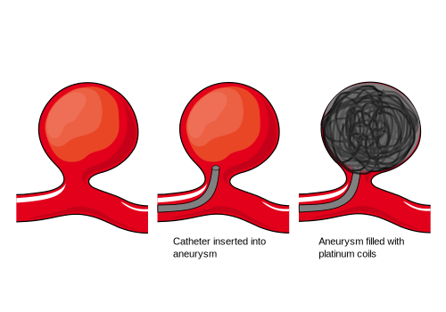
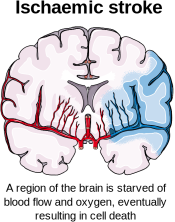

# About Dr Lynch {0} 

## Biography
 
Dr Jeremy Lynch MBHCB MRCS FRCR is a London-based Consultant Interventional Neuroradiologist. He has been an NHS doctor for 13 years and is experienced in the diagnosis and treatment of vascular diseases involving the brain, head and neck, and spine. Dr Lynch trained in Medicine at the University of Bristol and qualified in 2007. He underwent several years of surgical training, during which he gained membership of the Royal College of Surgeons. He then underwent further specialisation in interventional radiology and neuroradiology in a range of specialist hospitals in London including the National Hospital for Neurology and Neurosurgery, Great Ormond Street Hospital, Kings College Hospital, St George’s Hospital, and Queen’s Hospital. He underwent a further international fellowship in Toronto Western Hospital in Canada where he was one of the first doctors in the world to gain experience in robotic endovascular techniques. 

Dr Lynch has published several academic book chapters and journal articles. He is a reviewer for Clinical Neuroradiology. His special interests include the role of new technologies including artificial intelligence in the diagnosis of neurovascular disease. He has been invited to lecture on interventional neuroradiology and neuroimaging in international conferences. He is the author of the popular neurointerventional educational website neurotool.org.

## Interventional neuroradiology 

Interventional neuroradiology (otherwise known as neurointerventional radiology or endovascular neurosurgery) is a medical specialty that deals with minimally invasive treatments for diseases of the brain and spine involving blood vessels. Common conditions that are treated include brain aneurysms, strokes, carotid stenosis, and brain tumour embolisation. 

## Training

* International Fellowship Interventional Neuroradiology - Toronto Western Hospital (Ontario, Canada)

* CCT Interventional Radiology (GMC registration)

* Fellowship Interventional Neuroradiology - National Hospital for Neurology and Neurosurgery, Great Ormonds Street Hospital, Kings College Hospital, St George’s Hospital, and Queen’s Hospital (London)

* Radiology/interventional Radiology Training Rotation - Chelsea and Westminster Hospital

* Surgical Training Rotation - Kent, Surrey, and Sussex and Wessex Deaneries

* FRCR - Royal College of Radiologists

* MRCS - Royal College of Surgeons

* Clinical Medicine - University of Bristol

# Research {0}

* Sood A, Mansoor N, Memmi C, Lynch M, Lynch J. Generative pretrained transformer-4, an artificial intelligence text predictive model, has a high capability for passing novel written radiology exam questions. Int J Comput Assist Radiol Surg. 2024 Apr;19(4):645-653.
* Pasarikovski CR, Lynch J, Corrin M, Ku JC, Kumar A, Pereira VM, Krings T, da Costa L, Black SE, Agid R, Yang VX. Carotid stenting for symptomatic carotid artery web: Multicenter experience. Interv Neuroradiol. 2024 Jan 17:15910199231226293. 
* Benger, M., Wood, D., Kafiabadi, S., Al Busaidi, A., Guilhem, E., Lynch, J., Townend, M., Montvila, A., Siddiqui, J., Gadapa, N., Barker, G. J., Ourselin, S., Cole, J. H., & Booth, T. (Year). Factors affecting the labeling accuracy of brain MRI studies relevant for deep learning abnormality detection. Frontiers in Radiology, Neuroradiology. 
* Hendriks EJ, Guardini F, Chung E, Lynch J, Krings T. Delayed foreshortening and prolapse of Silk Vista Baby into superior cerebellar artery aneurysm. World Neurosurg. 2023 Oct 11:S1878-8750(23)01430-4. 
* Booth TC, Bassiouny A, Lynch J, Sonwalkar H, Bleakley A, Iqbal A, Minett T, Buwanabala J, Narata AP, Patankar T, Islim FI, Kandasamy N, Balasundaram P, Sciacca S, Siddiqui J, Walsh D, Tolias C, Kailaya-Vasan A, Sultan AA, Abd El-Latif M, Mortimer A, Sastry A. Outcome study of the Pipeline Vantage Embolization Device (second version) in unruptured (and ruptured) aneurysms (PEDVU(R) study). J Neurointerv Surg. 2023 Dec 9:jnis-2023-020754. 
* Sciacca S, Bassiouny A, Mansoor N, Minett T, Balasundaram P, Siddiqui J, Joshi Y, Derakhshani S, Kandasamy N, Booth TC, Lynch J. Early Outcomes of the Pipeline Vantage Flow Diverter : A Multicentre Study. Clin Neuroradiol. 2023 Jun 28. doi: 10.1007/s00062-023-01314-x. Epub ahead of print. PMID: 37378843. 
* Batur H, Lynch J, Sayin B, Derakhshani S, Akmangit I, Daglioglu E, Arat A. Utility of flow diverters in treatment of acutely ruptured uncoilable aneurysms of the posterior circulation of the brain. Jpn J Radiol. 2023 Mar 15. 
* Dhillon, Permesh Singh; Butt, Waleed; Podlasek, Anna; Bhogal, Pervinder; McConachie, Norman; Lenthall, Robert; Nair, Sujit; Malik, Luqman; Lynch, Jeremy; Goddard, Tony; Barrett, Emma; Krishnan, Kailash; Dineen, Robert A .; England, Timothy J. Effect of proximal blood flow arrest during endovascular thrombectomy (ProFATE): Study protocol for a multicentre randomised controlled trial. European Stroke Journal. 2023;0(0). 
* Vollherbst DF, Cekirge HS, Saatci I, Baltacioglu F, Onal B, Koc O, Rautio R, Sinisalo M, Tomasello A, Vega P, Martínez-Galdámez M, Lynch J, Mendes Pereira V, Bendszus M, Möhlenbruch MA. First clinical multicenter experience with the new Pipeline Vantage flow diverter. J Neurointerv Surg. 2022 Feb 16:neurintsurg-2021-018480. 
* Wood DA, Kafiabadi S, Al Busaidi A, Guilhem EL, Lynch J, Townend MK, Montvila A, Kiik M, Siddiqui J, Gadapa N, Benger MD, Mazumder A, Barker G, Ourselin S, Cole JH, Booth TC. Deep learning to automate the labelling of head MRI datasets for computer vision applications. Eur Radiol. 2022 Jan;32(1):725-736. 
* Wood DA, Kafiabadi S, Busaidi AA, Guilhem E, Montvila A, Lynch J, Townend M, Agarwal S, Mazumder A, Barker GJ, Ourselin S, Cole JH, Booth TC. Accurate brain-age models for routine clinical MRI examinations. Neuroimage. 2022 Jan 5;249:118871. 
* Martínez-Galdámez M, Onal Y, Cohen JE, Kalousek V, Rivera R, Sordo JG, Echeverria D, Pereira VM, Blasco J, Mardighian D, Velioglu M, van Adel B, Wang BH, Gomori JM, Filioglo A, Čulo B, Lynch J, Binboga AB, Onay M, Galvan Fernandez J, Schüller Arteaga M, Guio JD, Bhogal P, Makalanda L, Wong K, Aggour M, Gentric JC, Gavrilovic V, Navia P, Fernandez Prieto A, González E, Aldea J, López JL, Lorenzo-Gorriz A, Madelrieux T, Rouchaud A, Mounayer C. First multicenter experience using the Silk Vista flow diverter in 60 consecutive intracranial aneurysms: technical aspects. J Neurointerv Surg. 2021 Dec;13(12):1145-1151. 
* Crinnion W, Jackson B, Sood A, Lynch J, Bergeles C, Liu H, Rhode K, Mendes Pereira V, Booth TC. Robotics in neurointerventional surgery: a systematic review of the literature. J Neurointerv Surg. 2021 Nov 19:neurintsurg-2021-018096. 
* Wood DA, Kafiabadi S, Busaidi AA, Guilhem E, Montvila A, Lynch J, Townend M, Agarwal S, Mazumder A, Barker GJ, Ourselin S, Cole JH, Booth TC. Deep learning models for triaging hospital head MRI examinations. Med Image Anal. 2022 May;78:102391. 
* Eef J Hendriks, Lynch J, Saravana Kumar Swaminathan, Patrick Nicholson, Ronit Agid, Ivan Radovanovic, Vitor M Pereira, Karel terBrugge1, Timo Krings. Embolization Strategies for Intracranial Dural Arteriovenous Fistulas with an Isolated Sinus: a Single-Center Experience in 20 Patients. J Neurointerv Surg. 2021 Jun 3;neurintsurg-2021-017652. 
* Cancelliere NM, Lynch J, Nicholson P, Dobrocky T, Swaminathan SK, Hendriks EJ, Krings T, Radovanovic I, Drake KE, Turner R, Sungur JM, Pereira VM. Robotic-assisted intracranial aneurysm treatment: 1 year follow-up imaging and clinical outcomes. J Neurointerv Surg. 2021 Dec 15:neurintsurg-2021-017865. 
* Zeleňák K, Krajina A, Meyer L, Fiehler J, Esmint Artificial Intelligence And Robotics Ad Hoc Committee, Behme D, Bulja D, Caroff J, Chotai AA, Da Ros V, Gentric JC, Hofmeister J, Kass-Hout O, Kocatürk Ö, Lynch J, Pearson E, Vukasinovic I.How to Improve the Management of Acute Ischemic Stroke by Modern Technologies, Artificial Intelligence, and New Treatment Methods. Life (Basel, Switzerland). 2021 May;11(6).
* Dobrocky T, Lee H, Nicholson P, Agid R, Lynch J, Swaminathan SK, Krings T, Radovanovic I, Pereira VM. When Two Is Better than One : The Buddy-wire Technique in Flow-diversion Procedures. Clin Neuroradiol. 2021 Jul 8. 
* Lynch J, Sciacca S, Siddiqui J, Kanagarajah L, Derakhshani S. Safety and Efficacy of the Neuroform Atlas Stent for Treatment of Intracranial Aneurysms : A Systematic Review and Meta-Analysis. Clin Neuroradiol. 2021 Dec;31(4):1167-1180. 
* Dobrocky T, Piechowiak EI, Goldberg J, Barvulsky Aleman E, Nicholson P, Lynch J, Bervini D, Kaesmacher J, Agid R, Krings T, Raabe A, Gralla J, Pereira VM, Mordasini P. Absence of pontine perforators in vertebrobasilar dolichoectasia on ultra-high resolution cone-beam computed tomography. J Neurointerv Surg. 2021 Jun;13(6):580-584. 
* Wood DA, Kafiabadi S, Al Busaidi A, Guilhem E, Lynch J, Townend M, Montvila A,Siddiqui J, Gadapa N, Benger M, Barker G, Ourselin S, Cole JH, Booth T.C. Labelling imaging datasets on the basis of neuroradiology reports: a validation study. 
* Wood, David A.; Lynch, Jeremy; Kafiabadi, Sina; Guilhem, Emily; Al Busaidi, Aisha; Montvila, Antanas; Varsavsky, Thomas; Siddiqui, Juveria; Gadapa, Naveen; Townend, Matthew; Kiik, Martin; Patel, Keena; Barker, Gareth; Ourselin, Sebastian; Cole, James H.; Booth, Thomas C. Automated Labelling using an Attention model for Radiology reports of MRI scans (ALARM). February 2020 . 
* D. Atasoy, N. Kandasamy, J. Hart, J. Lynch, S.-H. Yang, D. Walsh, C. Tolias and T.C. Booth. Outcome Study of the Pipeline Embolization Device with Shield Technology in Unruptured Aneurysms (PEDSU). American Journal of Neuroradiology December 2019, 40 (12) 2094-2101
* Sciacca S, Lynch J, Dagnanam I. Barker RP. Midbrain, pons and medulla anatomy and syndromes – an attempt to (brain)stem the rising tide of uncertainty. RadioGraphics.
* Lynch J, Carlton L. The Apparently Normal CT Head: A review of some of the most commonly encountered missed pathologies. Rad Magazine. 01/01/2019
* Lynch J, Parameswaran R. Management of Unilateral Recurrent Laryngeal Nerve Injury after Thyroid Surgery: A review. Head & Neck. 2017 Apr 3. 
* Shelmerdine S, Lynch J, Arthurs OJ. Presentation to Publication: Abstract to Publication Ratios for ESPR, SPR and IPR. Pediatric Radiology 2016 Sep 13;46(10):1371-7
* Lynch J, Cox A, Vasdev N, Patel A. Bilateral Obstruction of Bilaterally Duplicated Collecting Systems Requiring Upper and Lower Moiety Drainage. Ann R Coll Surg Engl. 2016 Apr;98(4)
* Craciun H, Mankad K, Lynch J. Risk management in radiology departments. World J Radiol 2015. June 28; 7(6): 00-00
* S Shelmerdine, S Ameli-Renani, Lynch J, M Gonsalves. Transarterial catheter embolisation for an unusual cause of upper gastrointestinal haemorrhage. BMJ Case Reports. 2015 May 28;2015
* Shelmerdine SC, Lynch J. Smartphone applications in paediatric radiology: availability and authority. Pediatr Radiol. 2015 Aug;45(9):1293-302. 
* Lynch J, Montgomery M, Shelmerdine S, Taylor J, Singh S. Ruptured Aneurysm of an Aberrant Left Hepatic Artery: A Case Report. BMJ Case Rep. 2013 Nov 5;2013
* Lynch J, Belgaumkar A. Bariatric Surgery is Effective and Safe in Patients Over 55: A Systematic Review and Meta-Analysis. Obesity Surgery. 2012 Sep;22(9):1507-16.
* Hashim B, Lynch J, Gywali P. An audit into anticoagulation and junior doctor education. Journal of Clinical Audits 2012. 4:2
* Lynch J, Etkind S. Spontaneous Liver Haematoma as a Result of Thrombolytic Therapy. Grand Rounds Journal. 2010. 10:1-4
* Lynch J, Aughwane P, Hammond TM. Video Games And Surgical Ability: A Literature Review. Journal of Surgical Education. May-Jun 2010;67(3):184-9.

#  Introduction to brain aneurysms {1}

## What is an aneurysm?

An aneurysm is a bulge in the wall of a blood vessel caused by a small area of weakness. Aneurysms can occur in various parts of the body, but one of the most common locations is the brain. These are known as intracranial or cerebral aneurysms. Some aneurysms have the potential to rupture which can result in severe bleeding around the brain which is called subarachnoid haemorrhage. 

{#fig:aneurysm }

Brain aneurysms most commonly affect middle aged and older adults with a higher prevalence in women. They are extremely rare in children. The cause of any particular aneurysms is unknown in most cases, although some individuals have a genetic predisposition to developing them. Aneurysms can also rarely develop after certain infections or trauma. 

{#fig:aneurysm_angio}

## What is the prevalence of brain aneurysms?

Brain aneurysms are present in about 3% of the population (3 in 100 people) [1]. There are some factors that increase the risk of developing a brain aneurysm [2]: 

1. **Family history of brain aneurysm or subarachnoid haemorrhage (bleeding around the brain)**
2. **Atherosclerosis**: This is a condition characterised by the buildup of plaque in the arteries. It is associated with an increased risk of brain aneurysms.
3. **Smoking**
4. **High blood pressure**
5. **Female gender**: Women have a higher risk of developing brain aneurysms compared to men.
6. **Age**: The risk of brain aneurysms may increase with age.
7. **Autosomal Dominant Polycystic Kidney Disease (ADPKD)**: This is a genetic condition leading to the development of multiple cysts in the kidneys. It is also associated with brain aneurysms.
8. **Sickle cell disease**: This is a disorder of the red blood cells that is also associated with brain aneurysms.

## Are brain aneurysms dangerous?

Many aneurysms are benign: they cause no symptoms and never rupture. However, some do rupture, leading to life-threatening bleeding around the brain known as subarachnoid haemorrhage. In rare cases, unruptured aneurysms can still cause symptoms such as reduced vision, double vision, seizures, or strokes. These symptoms result from inflammation, pressure on nearby brain structures, or the formation of blood clots. Unfortunately, there is no test that can reliably predict which aneurysms will rupture, though certain factors are known to increase the risk:

* **Aneurysm size**: Larger aneurysms carry a higher risk
* **Location**: Aneurysms on the posterior circulation (e.g. basilar artery) are more prone to rupture
* **Growth over time**: Increasing size on follow-up imaging suggests higher risk
* **Previous rupture**: Patients who have had one ruptured aneurysm are at higher risk of another rupturing
* **Family history**: A strong family history of aneurysmal subarachnoid haemorrhage increases risk
* **Smoking**: Significantly associated with both aneurysm formation and rupture
* **Hypertension**: High blood pressure is a known risk factor
* **Age and sex**: Rupture risk increases with age and is more common in females
* **Aneurysm shape**: Irregular or lobulated shapes are more likely to rupture than smooth, round ones

## References

1. Vlak MH, Algra A, Brandenburg R, Rinkel GJ. Prevalence of unruptured intracranial aneurysms, with emphasis on sex, age, comorbidity, country, and time period: a systematic review and meta-analysis. Lancet Neurol. 2011 Jul;10(7):626-36. 

2. Juvela S. Prevalence of and risk factors for intracranial aneurysms. Lancet Neurol. 2011 Jul;10(7):595-7. doi: 10.1016/S1474-4422(11)70125-9. PMID: 21641283.

#  Symptoms of brain aneurysms {1}

A brain aneurysm typically doesn't present symptoms until it's large or ruptures. However, it's crucial to recognise potential signs to seek timely medical help.

## Ruptured Brain Aneurysm

A ruptured aneurysm is a medical emergency. Symptoms may include:

* Sudden, severe headache ("worst headache of your life")
* Neck stiffness or pain
* Light sensitivity (photophobia)
* Sudden blurred or double vision
* Sudden pain above or behind the eye
* Changes in mental status or awareness
* Difficulty walking or sudden dizziness
* Sudden weakness and numbness

Most of the time aneurysm rupture is a serious and dramatic event that would be very noticeable to the patient. Commonly there is a severe headache, neck, pain, and sensitivity to light, which may be accompanied by loss of consciousness and patients are usually immediately brought to the hospital for further investigation and treatment.

Rarely, however, aneurysm rupture can produce less noticeable symptoms. Typically, there is still a severe headache. If you have any concerns you should immediately contact emergency medical services, especially if you’re known to have a brain aneurysm.

## Unruptured Brain Aneurysm

Most aneurysms do not give any symptoms until they rupture. In rare instances unruptured aneurysms symptoms might include:

* Pain above and behind an eye
* Dilated pupil
* Vision changes (e.g., double vision)
* Facial numbness

#  Diagnosis of brain aneurysms {1}

When it comes to diagnosing brain aneurysms, a range of imaging technologies may be used. Here is an overview of these different modalities:

## Computerised Tomography (CT Scan)

A CT scan employs X-rays to create a detailed image of the brain. This technology is widely available, quick, and particularly effective in identifying bleeding in or around the brain, which can occur if an aneurysm ruptures. The scan may be performed with or without a 'contrast' dye, which helps in distinguishing different brain structures more clearly. Although a CT scan does involve a small amount of radiation, the dosage is generally not high enough to pose a significant risk to the patient.

CT Angiography is a specialized CT scan that uses an injection of contrast dye to visualize the blood vessels, making it an effective tool in the diagnosis of brain aneurysms. As the contrast dye highlights the blood vessels, it allows doctors to see the shape and size of an aneurysm, if present. This procedure is mostly non-invasive, other than the small injection required for the contrast dye.

CT scans involve being placed in a donut shaped machine. Scans usually take about 10 minutes. 

## Magnetic Resonance Imaging (MRI) 

MRI and MR angiography (MRA) are techniques that generate high-resolution images of the brain and blood vessels respectively, without using X-rays. Instead, they use strong magnetic fields. These methods can offer a more detailed image of an aneurysm and its exact location, compared to CT scans. However, they are generally slower, more expensive, and cannot be used on patients with certain metallic implants, due to the powerful magnets involved.

MRI scans involve being positioned in a tunnel and typically take 20-60 minutes to complete the scan. 

## Cerebral Angiography

Cerebral angiography is a diagnostic procedure that uses X-rays to produce very high-resolution images of the brain's blood vessels, and it is the gold-standard method for identifying aneurysms. During this test, a small incision is made in the patient's groin or wrist, through which a catheter is guided to the blood vessels in the brain. Contrast dye is then injected through the catheter to visualize the aneurysm. This procedure provides the most detailed images of an aneurysm, but it is more invasive than MRI or CT/CTA scans. While it's a generally safe procedure, there is a small risk (less than 0.5%) of a patient suffering a stroke as a result of the procedure.

## Lumbar Puncture

A lumbar puncture, often known as a spinal tap, is a medical procedure where a needle is inserted into the lower portion of the spine (the lumbar region) to extract a sample of cerebrospinal fluid (CSF). This fluid envelops your brain and spinal cord, acting as a protective layer and facilitating a stable environment.

In relation to diagnosing potential ruptured intracranial aneurysms, a lumbar puncture can be useful. This procedure is typically performed when doctors suspect an aneurysm as ruptured but other imaging tests, such as a CT scan, aren't conclusive. This could be because the bleed was minimal, or the blood has dispersed over time. During a lumbar puncture, the collected CSF is meticulously examined for the presence of blood or xanthochromia. The latter is a yellowish or pinkish discoloration that results from the breakdown of red blood cells in the CSF — both of these signs point towards a recent subarachnoid hemorrhage.

#  Ruptured aneurysm treatment {1}

## What are the consequences of aneurysm rupture?

Aneurysm rupture results in a severe headache caused by bleeding around the brain, termed subarachnoid haemorrhage. A common description of this is a "thunderclap" headache. It may be accompanied by a stiff neck, sickness, vomiting, sensitivity to light, and loss of consciousness. Aneurysmal haemorrhage may lead to death. Rates of death vary in different studies and range from 20-50% [1]. It is likely that the death rate from aneurysm rupture is decreasing over time due to advances in medical care. 

A patient with a ruptured aneurysm is admitted to hospital. In the initial phase, the individual is placed in an intensive care unit (ICU) where healthcare professionals can closely monitor their condition. The duration of the hospital stay will differ from person to person. Depending on the severity of the condition, it may range from a couple of weeks to a longer duration.

One complication that may arise after aneurysm rupture  is hydrocephalus. This condition is characterised by an accumulation of cerebrospinal fluid (CSF) in the brain, leading to increased pressure, which could potentially affect brain function. Management of hydrocephalus is often tackled by temporary methods like external ventricular drains or more permanent solutions such as a shunt. A shunt serves to divert the CSF to another part of the body where it can be reabsorbed more effectively.

Another significant complication that may follow aneurysm rupture is cerebral vasospasm. This involves the narrowing of the brain's blood vessels, leading to reduced blood flow and potentially causing strokes and brain damage. Vasospasms usually occur a few days after the initial bleeding, making regular monitoring crucial. Medications, and sometimes additional procedures, are employed to mitigate this risk.

## How are ruptured aneurysms treated?

Ruptured aneurysms require immediate treatment to prevent further bleeding, as the consequences of this may be disastrous. Two techniques are available to achieve this. The primary and less invasive method is endovascular coiling. In this procedure, a catheter is inserted into a blood vessel and guided towards the aneurysm, whereupon small coils are released. These coils facilitate blood clotting, thus averting further rupture. The National Institute for Health and Care Excellence (NICE) recommends endovascular treatment for aneurysmal rupture if it possible due to the significantly improved chance of survival following the treatment [1]. In addition, patients have a higher likelihood of living independently coupled with a reduced risk of developing seizures. This is based on evidence from high-quality clinical trials such as the International Subarachnoid Aneurysm Trial conducted over a period of 16 years [2]. 

The alternative method, surgical clipping, involves a neurosurgeon creating an opening in the skull and placing a metallic clip on the aneurysm's neck, effectively blocking the blood flow within. This is performed in the minority of cases where endovascular treatment is not possible. 

## What are the long-term consequences of aneurysm rupture?

It is possible to make a full recovery from aneurysm rupture. Unfortunately, some patients are left with permanent disabilities, such as weakness in the face, hands, or legs, or speech or visual difficulties. Patients may also experience more vague symptoms that persist over time, such as a reduced ability to concentrate and frequent headaches.

## References

1. Subarachnoid haemorrhage caused by a ruptured aneurysm: diagnosis and management. NICE guideline [NG228]. Published: 23 November 2022. Section 1.2.

2. Molyneux AJ, Birks J, Clarke A, Sneade M, Kerr RS. The durability of endovascular coiling versus neurosurgical clipping of ruptured brain aneurysms: 18 year follow-up of the UK cohort of the International Subarachnoid Aneurysm Trial (ISAT). Lancet. 2015 Feb 21;385(9969):691-7. 

#  Unruptured aneurysm treatment {1}

## I have an aneurysm. Does it need to be treated?

Not necessarily. 

Aneurysms can be dangerous but some require no treatment at all. The decision to treat is often a complex one and requires discussion with an experienced medical professional. Any medical treatment involves a degree of risk, no matter how small. It is probable that for certain low-risk aneurysms the risk of the aneurysm is outweighed by the risk of the treatment. 

For brain aneurysms there are generally three management strategies:

1. Monitoring: a period of observation may be undertaken to ensure the aneurysm is not growing or changing.
2. Endovascular treatment. This involves treating the aneurysm through the blood vessels. Generally, a small incision is made in the groin or wrist and a very thin tube is directed, under X-rays, into the aneurysm. Through this tube tiny coils and stents can be inserted to block off the aneurysm. This is less invasive than surgical treatment. 
3. Surgical clipping. This is an operation involving temporarily removing some of the skull bone ('craniotomy') to access the aneurysm and place a clip around its neck. It is by nature more invasive than endovascular treatment. As the brain is very delicate this procedure is carried out with the use of an operating microscope. 

There are no medications that can be given to shrink aneurysms, however stopping smoking and controlling blood pressure if it is high can reduce the risk of it rupturing.

## What factors might lead to an aneurysm being treated? {#factors}

* Symptoms: If the aneurysm is causing symptoms such as double vision or headaches. This is uncommon, however, as most aneurysms do not cause symptoms. 
* Location: Aneurysms located in certain parts of the brain are more dangerous than others. This includes aneurysms within the ‘posterior' circulation, which includes the basilar, vertebral, and posterior cerebral arteries. 
* Size: Larger aneurysms are more likely to rupture. This rule does not hold universally true, however, as it is not uncommon to see ruptured smaller aneurysms.
* Shape: Aneurysms with an irregular shape have been associated with increased rupture rates.
* Previous aneurysm rupture: If the aneurysm has previously ruptured, or the patient has other brain aneurysms which have bled before, then treatment is more likely to be recommended.
* High blood pressure: Blood pressure should be controlled in patients with aneurysms as it predisposes aneurysms to rupture.
* Smoking: Aneurysms are more likely to rupture in people who smoke and cessation is recommended if possible. 

## What does endovascular treatment involve?

Endovascular treatment is a minimally invasive procedure to treat aneurysms. Rather than requiring a large incision and direct surgical access to the aneurysm, endovascular treatment achieves its goal by guiding small, specialized devices through the patient's blood vessels to the site of the aneurysm. Embolisation means to promote clot formation within the aneurysm, commonly by inserting platinum coils or placing stents of flow diverters acoss its neck. These techniques seal off the aneurysm, preventing blood from entering it.

## What are the types of endovascular treatment?

1. Coiling (Endovascular Coiling or Coil Embolization). Coiling is a method where small, soft platinum coils are threaded through a catheter and placed directly into the aneurysm. The aim is to initiate a blood clotting process that fills the aneurysm with a stable clot. This effectively isolates the aneurysm from your blood circulation, reducing the risk of rupture. 
2. Stent-Assisted Coiling. Stent-assisted coiling uses a small, tube-shaped device called a stent in conjunction with coiling. The stent provides support to the weakened arterial wall and helps keep the coils within the aneurysm sac. This method is often used when the aneurysm has a wider neck or irregular shape that makes regular coiling challenging. The stent remains in the artery permanently.
3. Flow Diversion. Flow diversion is a treatment method that uses a device called a flow diverter, similar to a stent but denser. It's placed in the artery carrying blood to the aneurysm. Instead of filling the aneurysm with coils, the flow diverter redirects blood flow away from the aneurysm. This reduced blood flow into the aneurysm promotes clotting within the aneurysm, leading to its closure. Flow diverters may also be used with coils although this is less necessary. 
4. Intrasaccular devices such as Woven Endobridge (WEB). Intrasaccular devices are a newer development in aneurysm treatment. These devices are placed directly into the aneurysm sac via a catheter, similar to coiling, but are able to treat aneurysms that would otherwise require stents.

## What is coil embolisation?

Coil embolisation, also known as endovascular coiling, is a procedure to treat brain aneurysms. The process is minimally invasive and is a proven technique to prevent the rupture of the aneurysm.

The procedure starts with the patient being placed under general anesthesia so that they do not experience any pain during the operation. The doctor then makes a small incision, typically in the wrist or groin, to access a blood vessel. Following this, the doctor inserts a long, thin tube, called a catheter, through the incision into the blood vessel. Using a method called fluoroscopy, which involves real-time X-ray imaging, the doctor is able to navigate the catheter through the patient's vascular system until it reaches the blood vessels of the brain where the aneurysm is located.

Once the catheter is in position, small platinum coils are threaded through the catheter and into the aneurysm. These coils are soft and flexible, allowing them to adapt to the shape of the aneurysm. The role of the coils is to promote the formation of blood clots within the aneurysm. As the blood comes into contact with the coils, it begins to clot, gradually filling up the aneurysm over time. This process effectively isolates the aneurysm from the rest of the circulatory system, thus preventing it from rupturing. The coils are left in place and do not need to be removed. 

After the coils are properly placed, the catheter is carefully withdrawn from the body. The patient is usually required to stay in the hospital for the night following the procedure to enable the medical team to monitor the recovery.

{#fig:aneurysm_angio}

## What is stent assisted coiling?

Stent-assisted coiling involves the insertion of a small, mesh-like tube called a stent in addition to tiny coils to treat the aneurysm.

Similar to coil embolisation, a tiny catheter is navigated through the blood vessels, starting from an access point typically in the wrist or groin, all the way up to the site of the aneurysm in the brain. A stent is then placed across the opening of the aneurysm, acting like a small scaffold that provides support to the blood vessel wall, which can be weakened due to the aneurysm.

Once the stent is in place, small coils are threaded through the catheter and placed into the aneurysm. The coils promote blood clotting, thereby filling the aneurysm and preventing it from rupturing. The stent helps to hold these coils in place and prevents them from slipping into the normal blood vessel. It's particularly useful in treating wide-neck aneurysms, where the risk of coils slipping into the parent vessel (the blood vessel supplying the aneurysm) is higher.

After the procedure, you will likely need to take antiplatelet medications such as aspirin or clopidogrel, which help to prevent the formation of blood clots around the stent. This is a routine precaution and an important part of ensuring the success of the procedure. Antiplatelet medications are given in low doses and make the platelets in your blood less sticky, reducing the chance that a clot will form. 

{#fig:aneurysm_angio}

## What is flow diversion?

Flow diversion is another minimally invasive endovascular treatment designed to manage brain aneurysms. The primary aim of this treatment is to divert blood flow away from the aneurysm and therefore prevent rupture.

A flow diverter, similar to a stent, is a small tubular mesh device that's placed inside the parent artery, the blood vessel supplying the aneurysm. The flow diverter is designed to alter the blood flow dynamics in the artery, thereby diverting blood away from the aneurysm. They can be used with or without placement of coils in the aneurysm.

Over time, this decreased blood flow into the aneurysm encourages the formation of a blood clot within the aneurysm, which helps to seal it off from the rest of the blood vessel. As the aneurysm shrinks and heals, the artery resumes a more normal shape and function. This process can take several weeks to months.

Flow diversion is particularly effective for recurrent, large, wide-necked, or thrombosed aneurysms that can't be adequately treated with other methods. It is also necessary to take antiplatelets after insertion of flow diverters. 

{#fig:aneurysm_angio}

## What is an intrasaccular device?

Intrasaccuar devices such as the WEB (Woven EndoBridge) device may be used in the treatment of wide neck aneurysms which would otherwise require stents or flow diverters.

The WEB device, made of ultra-fine braided wires, is a flexible, self-expanding mesh that resembles a tiny basket. It is introduced into the aneurysm using a catheter navigated through the blood vessels from a small incision usually made in the wrist or groin. Once inside the aneurysm, the WEB device expands to fit the shape and size of the aneurysm, serving as a barrier that disrupts the blood flow within. This promotes clot formation within the aneurysm, sealing it off and isolating it from the rest of the circulation, thereby reducing or eliminating the risk of rupture. 

A benefit of the WEB device is related to post-procedure medications. With stents or flow diverters, patients are typically required to take antiplatelet medications for a period of time to prevent blood clot formation around the treatment site. However, because of the way the WEB device works, patients usually do not need to take these medications for a prolonged period.

## Is endovascular treatment durable? 

Yes. Endovascular treatment is highly effective at providing lifelong protection from brain aneurysms. For this reason it is now the most common method to treat brain aneurysms worldwide and has been employed to save countless lives. 

In preventing adverse consequences such as disability or death endovascular treatment is as effective as surgical clipping. It is the recommended treatment in ruptured aneurysms as studies have shown that endovascular treatment is safer. 

However, like any treatment, there is no absolute guarantee that an aneurysm treated with endovascular therapy will never recur necessitating additional procedures. In a large study retreatment was carried out in 4.9% of patients [1]. Rebleeding was exceedingly rare, occuring in less than 1 in 200 patients. It's worth noting that surgical clipping, much like endovascular treatment, isn't exempt from the possibility of requiring further intervention. For this reason endovascularly treated aneurysms are regularly monitored with follow-up scans to ensure that the treatment remains effective. If a further treatment is required this can normally be performed safely in a planned elective setting also with an endovascular procedure. 

Overall, endovascular therapy provides a highly effective and durable treatment. After embolisation of a brain aneurysm you would be more likely to die from another completely unrelated cause such as cancer of heart disease, than from recurrence of the aneurysm [3]. 

## What are the risks of endovascular treatment?

Endovascular embolisation of aneurysms is normally performed successfully without complication, but all medical treatments carry the potential for risk. 

Recovery is usually relatively rapid after endovascular treatment. Patients typically spend one night in hospital for monitoring and are discharged the day after. The site of arterial entry in the wrist or groin might be sore for a few days when it heals. Rarele there are minor side effects like oozing or bleeding from these sites. Applying pressure usually stops this. A small, typically temporary bruise may also form. Occasionally the patient might experience headaches that typically settle over days to weeks. 

Serious but rare risks include a 5% chance of stroke from the procedure due to aneurysm rupture or blood vessel occlusion, causing potential limb weakness, speech or vision difficulty which could be temporary or permanent. A very rare 1% risk of a severe brain injury leading to death exists. There is a small chance of vessel damage in the groin or wrist from the catheter entry necessitating surgery. 

## Surgical treatment

Surgical clipping is an established but more invasive method of treatment that still has a role in managing certain cerebral aneurysms. The procedure involves making an opening in the skull (a procedure called a craniotomy) to locate the aneurysm. With the help of a microscope, the surgeon places the clip on the aneurysm's neck, sealing it off from the rest of the blood vessel.

Recovery times vary but are typically longer than for endovascular treatment. Like all surgical procedures clipping carries some risks. Strokes occur in about 5% of cases which can manifest as weakness in the limbs, disturbances in speech, or visual problems. There is about a 1% chance of catastrophic brain injury resulting in death. The surgery might also affect the area of your brain near the aneurysm. This could lead to short-term effects due to swelling or bruising, or in rare cases, long-term effects. These effects would be specific to the location of each aneurysm and may also cause neurological stroke-like symptoms.

The procedure can lead to some physical discomfort in the days following the surgery. Swelling and bruising to the face are common, which might cause your eyes to close temporarily. Alongside this headaches are relatively common. The wound site can become infected. One unusual sensation some patients note is the feeling that the bone flap, the piece of bone removed during the surgery, seeming to move. This sensation, while strange, is not dangerous. The bone flap is secured with plates during the operation and will heal properly in time. The muscle used for chewing food might be impacted temporarily by the operation. As this muscle heals, you might find it challenging to open your mouth or chew, but these symptoms typically resolve within six months. 

The period following the operation requires careful management of your activities. In the first few weeks after going home, it's essential to maintain a routine, stay hydrated, eat well, and rest regularly. Enlist help for household chores if possible and consider some gentle exercise to gradually build up your strength. Most people require about 2-3 months off work for full recovery. Returning to work earlier won't necessarily harm you, but it may prolong the recovery period due to increased tiredness.

However, in skilled hands, surgical clipping can provide a solution for many types of aneurysms, particularly those that may not be suitable for other treatments, like coil embolisation or flow diversion.

## References

1. Rizvi A, Seyedsaadat SM, Alzuabi M, Murad MH, Kadirvel R, Brinjikji W, Kallmes DF. Long-Term Rupture Risk in Patients with Unruptured Intracranial Aneurysms Treated with Endovascular Therapy: A Systematic Review and Meta-Analysis. AJNR Am J Neuroradiol. 2020 Jun;41(6):1043-1048. doi: 10.3174/ajnr.A6568. Epub 2020 May 28. PMID: 32467181; PMCID: PMC7342755.

#  Further information {1}

## United Kingdom

* [The Brain & Spine Foundation](https://www.brainandspine.org.uk/): The Brain & Spine Foundation provides professional information and support for neurological conditions affecting those living in the UK.

## United States
* [The Aneurysm and AVM Foundation](https://www.taafonline.org/): This based charity is dedicated to bettering the lives, support networks, and medical care of those affected by aneurysm and other types of vascular malformation of the brain.

- [National Institute of Neurological Disorders and Stroke](https://www.ninds.nih.gov/): A service of the National Institutes of Health. Provides detailed, scientifically reliable information about a variety of neurological disorders, including aneurysms and stroke.

- [Brain Aneurysm Foundation](https://www.bafound.org/): Provides comprehensive resources about brain aneurysms, including prevention, symptoms, treatment, and support for patients and families.

- [Subarachnoid Haemorrhage Information](https://patient.info/brain-nerves/subarachnoid-haemorrhage-leaflet): Patient.info provides a patient-oriented resource on subarachnoid haemorrhage. It includes information about symptoms, causes, diagnosis, treatment, and complications.

- [Brain & Life](https://www.brainandlife.org/): Published by the American Academy of Neurology, it provides information about various neurological conditions, including aneurysms and strokes.

* [DrBulletin](https://www.drbulletin.com/): The latest medical research news for a range of subjects including neurointervention and neurosurgery. 

#  Introduction to AVMs {2}

A brain arteriovenous malformation (AVM) is a complex, abnormal network of blood vessels in the brain. In a healthy brain, blood circulates from arteries to veins via tiny vessels called capillaries. The capillaries allow for the exchange of oxygen and nutrients from the blood to the brain tissue, and the removal of waste products. However, in a brain AVM, direct connections form between the arteries and veins, bypassing these capillaries. This abnormality can disrupt normal blood flow and oxygen circulation. 

Whilst AVMs may lead to health problems, many do not cause any problems and can be left alone without treatment. 

The most frequently observed problems related to a cerebral AVM are headaches and seizures. These headaches can vary in intensity and frequency, potentially mimicking migraines in some instances. Seizures may manifest in various ways, ranging from changes in a person's behavior or consciousness to involuntary movements or loss of control over movement. In serious cases, the abnormal blood vessels in an AVM may rupture, causing bleeding within the brain (intracranial haemorrhage). Bleeding from a ruptured AVM can cause a sudden, severe headache, nausea, vomiting, incontinence, blurred vision, and even loss of consciousness. Depending on the location of the bleed, impairments caused by local brain tissue damage are also possible, including seizure, weakness on one side of the body (hemiparesis), a loss of touch sensation on one side of the body, and deficits in language processing (aphasia).

## Cause 

The exact cause of brain AVMs is not fully understood, but they are most commonly believed to originate before birth. They may grow over time or remain static in size. 

## Epidemiology of Brain AVMs

Brain AVMs are relatively rare, with an estimated annual detection rate of around 1 per 100,000 people. The prevalence in adults is approximately 18 per 100,000.

AVMs seem to occur more often in males than females. However, symptoms may start or worsen in females during pregnancy due to the increased blood flow and volume. There is also a significant occurrence (15-20%) of AVMs in patients with hereditary hemorrhagic telangiectasia, also known as Osler-Weber-Rendu syndrome, which is a genetic disorder that leads to abnormal blood vessel formation.

## Prognosis of Brain AVMs

The main risk associated with brain arteriovenous malformations (AVMs) is intracranial hemorrhage, which is bleeding inside the skull. This risk varies among patients and is difficult to measure because many patients with AVMs don't show symptoms and therefore never seek medical attention.

The earlier in life an AVM appears, the greater the likelihood of experiencing a haemorrhage over one's lifetime. Ruptured AVMs can lead to serious health complications. Ruptures may cause loss of life or permanent disability. 

#  Symptoms of AVMs {2}

Brain and spine arteriovenous malformations (AVMs) are abnormal tangles of blood vessels consisting of connections between the arteries and veins. They often do not cause any clinical problems until they rupture. AVMs can cause symptoms either by bleeding (rupturing), pressing on the brain or spinal cord, or by reducing the amount of oxygen reaching the brain tissue. 

Symptoms might include the following: 

## Bleeding

Brain AVMs may cause bleeding into the brain (haemorrhage), causing sudden, severe headaches, confusion, nausea, vomiting, and may lead to a loss of consciousness. 

## Seizures

Seizures are a sudden, uncontrolled electrical disturbance in the brain that can cause changes in behavior, movements, feelings, and levels of consciousness. They can range in severity, from virtually undetectable periods of inattention or staring to full-blown convulsions. 

Seizures can be categorized into focal (partial) and generalized (total) seizures:

1. **Focal (Partial) Seizures**: These seizures appear to result from abnormal activity in just one part of the brain. Focal seizures can occur without a loss of consciousness or with a change in consciousness. Symptoms might include sudden, jerky movements of one part of the body, distortions in hearing or seeing, stomach discomfort, or a sudden sense of fear. These seizures can also progress to a loss of consciousness and convulsions, a progression known as a focal-to-bilateral tonic-clonic seizure.

2. **Generalized (Total) Seizures**: These seizures involve all areas of the brain. They can cause a loss of consciousness, falls, muscle spasms, or convulsions. Generalized seizures are further categorized into several types including absence (formerly known as petit mal), tonic-clonic (formerly known as grand mal), atonic, and myoclonic seizures.

Convulsions refer to repeated, uncontrolled body movements. These are often seen in tonic-clonic seizures where the person may stiffen and have jerking muscle activity. The person may also lose consciousness. Finally, a person's "level of consciousness" refers to their awareness of themselves and their environment. Changes in a person's level of consciousness include being fully awake, responsive, unresponsive, or anything in between.

In the context of AVMs, these symptoms can result from the AVM disrupting the normal electrical activity of the brain. 

## Neurological Symptoms

 These depend on the location of the AVM and can include muscle weakness or paralysis in one part of the body, a loss of coordination (ataxia) that can lead to such problems as gait disturbances, difficulties carrying out tasks that require planning, memory deficits, dizziness, visual disturbances such as a loss of part of the visual field, difficulties with speech (dysarthria), and abnormal sensations such as numbness, tingling, or spontaneous pain (paresthesia or dysesthesia).

#  Diagnosis of AVMs {2}

There are three primary imaging techniques used in the diagnosis and investigation of brain AVMs: computed tomography (CT), magnetic resonance imaging (MRI), and cerebral angiography.

**Computed Tomography (CT)**

A CT scan is usually the initial imaging study performed when a patient is symptomatic. A CT scan is a type of X-ray that produces detailed cross-sectional images of the brain. It can suggest the approximate site of a bleed if one has occurred. 

For a more detailed view, a computerized tomography angiogram (CTA) may be performed. In a CTA, a contrast agent (a type of dye) is injected into the patient's bloodstream. The contrast agent helps to illuminate the blood vessels on the CT scan, providing a more detailed view of the AVM's structure.

**Magnetic Resonance Imaging (MRI)**

MRI is more sensitive than CT in diagnosing AVMs and provides better information about the exact location of the malformation. MRI uses a powerful magnetic field and radio waves to create detailed images of the brain and other structures. An MRI can provide a clear, detailed view of the brain's soft tissues, making it particularly useful in imaging AVMs. For even more detailed imaging, a magnetic resonance angiogram (MRA) can be performed, similar to a CTA, a contrast agent is injected into the bloodstream to highlight the blood vessels.

**Cerebral Angiography**

Cerebral angiography, sometimes also called a cerebral arteriogram, provides the most detailed images of a cerebral AVM. This procedure involves threading a catheter (a thin, flexible tube) through an artery in the arm or leg up to the arteries in the head. A contrast agent is then injected through the catheter. As the contrast agent flows through the blood vessels of the brain, a sequence of X-ray images are taken. These images can provide a highly detailed view of the AVM, showing the exact location, size, and the blood flow pattern.

#  Treatment of AVMs {2}

The treatment of brain arteriovenous malformations (AVMs) depends on several factors, including the AVM's location and size, and whether it has caused bleeding.

**Medical Treatment**

Anticonvulsant medications, such as phenytoin, are used to control seizures. Other medications or procedures can be employed to relieve pressure inside the skull caused by the AVM. Curative treatment may be required eventually to prevent  hemorrhage. However, all interventions come with some risk of causing neurological deficits.

**Surgical Treatment**

Surgical removal of the involved blood vessels is a preferred treatment for many types of AVMs. In this procedure, a neurosurgeon temporarily removes part of the skull (craniotomy), separates the AVM from the surrounding brain tissue, and removes (resects) the abnormal vessels. This method can result in an immediate, complete removal of the AVM, but the risks depend on the size and location of the malformation. Not all AVMs are suitable for surgical treatment, and the decision depends on several factors, including the AVM's size, location, and the patient's overall health status.

**Radiosurgical Treatment**

Radiosurgery, such as Gamma Knife therapy, can successfully treat small and medium sized AVMs. This method precisely delivers controlled radiation doses to the AVM area in the brain. While radiosurgery does not require an incision or craniotomy, it may take three or more years to fully know the treatment's effects, during which time there's still a risk of bleeding. Some patients may need repeat treatments. Radiosurgery can also have risks such as headache, seizures, or permanent neurological deficits. 

**Neuroendovascular Therapy**

Embolisation is a treatment approach performed by specialists known as interventional neuroradiologists. This procedure involves injecting substances into the blood vessels feeding the AVM to block them, reducing blood flow to the AVM. These substances are delivered via a catheter guided by real-time imaging. Embolisation is may be the primary therapy, or an additional treatment before surgery or radiosurgery to reduce the AVM size. 

#  Further information {2}

## United Kingdom

* [The Butterfly AVM Charity](https://www.butterflyavmcharity.org.uk/): The first specific AVM charity in the UK.

* [The Brain & Spine Foundation](https://www.brainandspine.org.uk/): The Brain & Spine Foundation provides professional information and support for neurological conditions affecting those living in the UK.

* [Different Strokes](https://differentstrokes.co.uk/): Different Strokes is a UK based stroke charity run by younger stroke survivors for younger stroke survivors.

* [National Stroke Association](https://www.stroke.org/): Provides resources on stroke prevention, treatment, and recovery, as well as resources for healthcare professionals and stroke survivors.

## United States

* [DrBulletin](https://www.drbulletin.com/): The latest medical research news for a range of subjects including neurointervention and neurosurgery. 

# Introduction to DAVF {3}

## What is a dural arteriovenous fistula? 

A dural arteriovenous fistula (DAVF) is an abnormal connection between the arteries and veins of the brain. 

Normally a fine network of microscopic capillaries connects arteries and veins in all tissues including the brain. Capillaries assist in slowing down the blood flow between arteries and veins. A DAVF is a tangle of feeding arteries and draining veins in the brain that have abnormal connections which bypass the normal capillaries. The word “dura” refers to the membrane covering the brain and spinal cord. The high pressure blood flowing from arteries directly into thinner walled draining veins or venous sinuses results in a risk of brain haemorrhage (bleeding). This abnormal blood flow between arteries and veins is called a shunt. DAVF can vary in size, between a few millimetres to several centimetres and can occur anywhere in the dura directly outside of the brain or spinal cord.

The cause of DAVF in a specific patient may not be always be discovers. In general they are not thought to be inherited from parents but instead caused by previous blood clots in the large draining veins of the brain (called venous thrombosis), head injuries, previous brain surgery, or brain infections. Some types of DAVF, termed "high-grade" fistulas, have a risk of bleeding into or around the brain which may have severe consequences. The risk is further increased following a previous bleed. Other types of fistula may have very little risk, termed "low-grade". Some patients have no symptoms and the DAVF is discovered incidentally on a CT or MRI scan. Nevertheless this does not mean that the DAVF carries no risk and further investigation is commonly [required](diagnosis). 

# Symptoms of DAVF {3}

A Dural Arteriovenous Fistula (DAVF) is an abnormal connection between an artery and a vein in the tough covering over the brain or spine (the dura). It is a rare, but serious condition.

Not everyone with a Dural Arteriovenous Fistula will experience symptoms, and symptoms can vary based on the location and characteristics of the DAVF. The symptoms may develop gradually and subtly or can become suddenly apparent. If you experience any of these symptoms, especially the severe ones, it's important to seek immediate medical help.

# Why do DAVF cause symptoms?

Normally, blood flows from arteries to capillaries, then into veins. Arteries carry blood with a high amount of pressure from the heart, whereas veins carry blood back to the heart at a lower pressure. The capillaries are small, thin blood vessels in between, which act as a kind of 'buffer' system that slows down the flow of blood and allows for the exchange of nutrients and waste products between your blood and your body's cells.

When a DAVF is present there is an abnormal direct connection between the high-pressure arteries and the low-pressure veins, bypassing the capillaries. This abnormal connection can cause high-pressure blood to flow directly into the veins, which are not designed to handle such high pressure. This increased pressure can dilate and even rupture the veins and small vessels around the DAVF, causing bleeding in or around the brain. 

In addition, the high-pressure blood flow can cause the blood in the veins to flow in the wrong direction, a condition called venous reflux. This venous reflux can lead to the congestion of blood and reduction of blood flow to certain areas of the brain or spinal cord. Over time, this can result in tissue damage and loss of function in the affected areas, which can cause symptoms such as weakness, numbness, or even seizures.

In addition, DAVFs can divert blood away from normal brain or spinal tissues. Because of this diversion, these areas may not receive enough oxygen and nutrients, which can cause various neurological symptoms.

The specific symptoms a person experiences can depend on the location of the DAVF and the extent of blood flow disturbance it causes. For example, a DAVF located near the ear may lead to a symptom called pulsatile tinnitus, a whooshing or ringing noise in the ear that corresponds with the heartbeat.

# Types of symptoms

## Neurological symptoms

* Headaches: Unusual or chronic headaches that are different from previous headaches in pattern and intensity.
* Visual disturbances: This can include blurry vision, double vision, or loss of vision.
* Problems with balance or coordination: Difficulty walking or clumsiness may be noticed.
* Weakness or numbness: This is typically on one side of the body.

## Auditory symptoms

* Pulsatile tinnitus: This refers to a whooshing sound in the ears, typically in sync with the heartbeat.

## Severe symptoms

* Seizures: This is a sudden, uncontrolled electrical disturbance in the brain. It can cause changes in your behavior, movements or feelings, and in levels of consciousness. There are several types of seizures, but a typical, large, seizure consists of sudden collapse, loss of consciousness, and convulsions (body shaking rapidly and uncontrollably). 

* Stroke-like symptoms: This can include difficulty speaking, facial drooping, or sudden onset of weakness on one side of the body.

# Diagnosis of DAVF {3}

Diagnosing a dural arteriovenous fistula (DAVF) is a step-by-step process that involves various tests and examinations. The goal is not only to confirm the presence of a DAVF, but also to understand its size, location, and the precise pattern of abnormal blood flow. This helps doctors formulate a suitable treatment plan.

## Medical History and Physical Examination

The first step in diagnosing a DAVF typically involves a thorough review of your medical history. Your doctor will ask you detailed questions about your symptoms, including their nature, duration, and severity. They may also ask you about your overall health, including any other medical conditions you may have and any medications you are currently taking.

In addition, they might inquire about any history of trauma, infection, or surgery. This is because these factors can sometimes contribute to the development of a DAVF. For instance, a prior injury or surgery to the head might damage the blood vessels, leading to the abnormal connections seen in DAVFs. Similarly, certain infections can also affect the blood vessels in the dura.

In the process of diagnosing a DAVF, understanding your symptoms plays a crucial role. The symptoms of a DAVF can vary greatly from person to person, depending on factors like the location of the fistula and the pattern of abnormal blood flow.

Common symptoms that your doctor may ask about include:

* **Headaches or neck pain**: These can range from mild to severe and might be the first noticeable sign of a DAVF.

* **Pulsatile tinnitus**: This is a condition where you hear a rhythmic whooshing or humming sound in one or both of your ears. It is often caused by altered blood flow, such as that seen in a DAVF.

* **Vision changes**: This could involve blurry vision, vision loss, or even double vision. These changes can occur if the DAVF affects the blood supply to your eyes.

* **Neurological symptoms**: These can encompass a wide range of issues, from muscle weakness and balance difficulties to more severe problems like seizures or even stroke-like symptoms. These occur due to the altered blood flow in the brain.

Following this, your doctor will carry out a physical examination. They will likely focus on your neurological health, looking for signs of issues such as muscle weakness, vision changes, or balance difficulties. This can involve testing your reflexes, assessing your sense of touch and pain, and examining your eyes, among other things. These checks are important because DAVFs can affect your neurological function due to the altered blood flow in your brain.

## Imaging Tests

Several types of imaging tests can help visualize the blood vessels in the brain and detect any abnormalities. These include:

- **Magnetic Resonance Imaging (MRI):** An MRI is a non-invasive imaging technique that employs powerful magnets and radio waves to generate comprehensive images of the brain and spinal cord. These images can often highlight the presence of a DAVF or illustrate the impact it has on the brain or spinal cord. MRI can also be combined with angiography (MRA) to visualize blood vessels and the flow of blood, offering a detailed view of any abnormal vascular structures associated with DAVF.

- **Computed Tomography (CT):** A CT scan uses X-ray technology to capture images from various angles, creating cross-sectional views of the brain. These can reveal abnormalities or changes in the brain that might be indicative of a DAVF. Additionally, a CT scan can be combined with angiography (CTA) to provide detailed images of the blood vessels, enhancing the visualization of a possible DAVF.

- **Digital Subtraction Angiogram (DSA):** DSA is a more invasive procedure that is often used when other imaging tests are inconclusive or when precise details of the blood vessels are needed for treatment planning. In this test, a contrast dye is injected into your blood vessels through a catheter, usually inserted in your groin. As the dye travels through your vessels, a series of X-ray images are taken, which can provide a clear, detailed view of the blood flow and reveal the exact location and characteristics of a DAVF. While more involved and with more potential risks than other imaging studies, DSA is considered the "gold standard" for diagnosing DAVFs due to its high level of detail.

# Treatment of DAVF {3}

## How can endovascular treatment help?

“Endovascular” means that access to the brain or surroundings is achieved by threading a very fine tube through your arteries. Embolisation is a way of blocking abnormal blood vessels and is usually carried out to prevent the DAVF from bleeding. This is done by injecting a special glue-like liquid into the DAVF to cut off the blood vessels supplying the fistula. 

Endovascular treatment is performed by specialist doctors called interventional neuroradiologists (INRs)

If the DAVF is particularly large or complex, an embolisation may be performed prior to further surgical excision (removal) of the lesion to reduce blood flow to the DAVF and ensure that further surgical treatment is safer. 

## What are the risks of DAVF embolisation? 

All treatments and procedures have risks associated with them. Risks may vary depending on the size, position, and configuration of the blood vessels. Rarely it is not possible to embolise a DAVF safely. 

During the DAVF embolisation a contrast agent (iodine based) will be injected into the arteries. This allows for the doctor to visualise the blood vessels when an X-Ray is taken. Contrast agents are considered safe but have the potential to cause an allergic reaction. The department and team are well equipped to deal with reactions in the rare event of this happening. It is important that you contact the department as soon as possible before your procedure if you have reacted to an x-ray contrast agent before or have severe asthma and have been admitted to hospital with an asthma attack in the past year. The contrast agent is excreted through the kidneys and may affect the kidney function after the procedure. This is more common in patients with pre-existing kidney dysfunction and some patients will have a blood test to test the kidney function beforehand to ensure that it is safe to have contrast. The procedure will need to take place under a general anaesthetic. The anaesthetist will discuss the risks of general anaesthesia with you.

DAVF embolisation may be a complex procedure. Serious complications are rare but possible:

The procedure may cause a stroke, the risk varies but is in the range of approximately 5% (1 in 20 patients) in most cases. This may be caused by rupture of the aneurysm during treatment or occlusion of blood vessels. Strokes can take different forms but most commonly involve weakness in the arms or legs and difficulty with speech or vision. This may be temporary or permanent, mild or severe. There is a very rare risk of catastrophic brain injury resulting in death of approximately 1% (1 in 100 patients). 

* The use of X-rays during any procedure results in a very small increase in the risk of developing cancer in the future. Very rarely there is temporary hair loss and skin reddening that may occur up to a few weeks after the procedure.. We make every effort to reduce radiation dose to as low as possible. 

* We are required by law to ask patients of childbearing capacity between the ages of 12 and 55 years are required by law to be asked about the possibility of pregnancy when undergoing examinations involving x-ray. In the urgent case of a thrombectomy, the procedure will most likely still go ahead but with additional precautions in place. .

* The small bruise at the place where the needle is inserted (usually the groin or wrist) may become large and uncomfortable and you may need more treatment, including surgery.

## Are there any alternatives? 

Surgical excision is an alternative. This involves making an incision in the skull (craniotomy) to allow the surgeon to access the DAVF. The feeding arteries and draining veins that remain in the brain are then clipped off. Surgery is a well established and effective treatment and can provide protection from DAVF rupture or haemorrhage. Surgical excision has its own specific risks and your neurosurgeon will discuss these in detail with you. 

## What happens during the embolisation procedure? 

The DAVF embolisation is performed while you are under a general anaesthetic. The anaesthetic team will put you to sleep prior to the procedure. The procedure is performed by your doctor in the angiography suite in the neuroradiology department and it usually takes between one and three hours. A dedicated team of radiologists, radiographers, anaesthetists, and nurses in the angiography suite will monitor you closely throughout the procedure. 

Once the procedure has started your doctor will place a thin flexible plastic tube (catheter) into the femoral artery in the groin or artery in the wrist. The catheter then passes through the main artery in the body called the aorta and finally into the arteries in the neck and brain (cerebral arteries). When the most accessible feeding blood vessel is identified, further catheters (including a microcatheter) are placed inside the first catheter and into this artery and up to the point of the fistulous connection. Embolic material (glue-like) is then injected into this point to obliterate the DAVF. Occasionally small platinum coils will be used in addition. The embolic material creates an artificial blood clot and blocks further blood flowing into the DAVF. X-Rays are taken during the procedure to ensure the DAVF is obliterated. 

After the procedure the catheters are removed and the blood vessel in the groin or wrist is sealed off with a collagen plug or manual compression to prevent bleeding.

The procedure usually takes takes 2-3 hours.

## Will it hurt? 

The procedure is done under a general anaesthetic and therefore you should not feel any pain. Sometimes it can be uncomfortable around the wrist or groin access site afterwards, but usually this settles with simple analgesics.

## What happens after the embolisation? 

When you arrive on the ward you will need to stay in bed for a few hours to recover. During this time, the ward nurse will check you regularly, including looking at the site where you had the catheter put into your groin, to make sure there is no bleeding. If you do have bleeding, we will ask you to stay in bed resting a bit longer. You may have some bruising around your groin, which can be sore, but most people have little or no after effects. 

# Introduction to spinal vascular disease {4}

Spinal vascular malformations are uncommon conditions that involve abnormal connections between blood vessels in your spinal cord. They are essential to recognize because, if left undiagnosed and untreated, they can lead to serious complications. Symptoms can vary from person to person and can include pain, numbness, weakness, or difficulty moving your limbs. Bladder and bowel function can be impaired. The process of diagnosing these conditions is frequently prolonged due to the gradual onset of symptoms and limited awareness of the disease among non-expert practitioners. Radiological investigation can also be challenging as these conditions can resemble other non-vascular processes. 

There are a number of different types.

## Arteriovenous Fistulae

Arteriovenous fistulae form when there is a direct connection between an artery and a vein, bypassing the capillaries. This abnormal shunting of blood can put additional pressure on your heart and blood vessels and can deprive tissues of the necessary oxygen and nutrients, leading to various symptoms such as pain or numbness.

## Arteriovenous Malformations (AVMs)

AVMs are a tangled web of arteries and veins with no capillaries in between. These abnormalities can disrupt normal blood flow and oxygen circulation, causing nearby tissues to suffer. Over time, these vessels can enlarge and rupture, leading to bleeding into the spinal cord. This can cause sudden pain and other neurological issues.

## Cavernous Malformations

Cavernous malformations, also known as cavernomas, are clusters of abnormal, tiny blood vessels and larger, dilated vessels filled with slow-moving blood. They can form anywhere in the body, but when they occur in the spinal cord, they can compress neural structures leading to pain, numbness, or weakness in your limbs.

## Capillary Telangiectasia

Capillary telangiectasia involves clusters of widened capillaries that do not have a normal vessel wall. While they are typically the least symptomatic of spinal vascular malformations, they can occasionally put pressure on the spinal cord, causing symptoms such as difficulty walking or loss of bowel or bladder control.

# Symptoms of spinal vascular disease {4}

The symptoms of spinal vascular malformations can widely vary from person to person. They are largely dependent on the location and severity of the malformation. Some individuals may not experience noticeable symptoms for many years, or even at all, while others may endure symptoms that severely disrupt daily activities or present life-threatening risks.

These conditions typically present symptoms during early adulthood, but it's worth noting that a significant percentage of those diagnosed are under the age of 16.

The onset of symptoms can either be abrupt or gradual. Common initial symptoms often include:

   - Difficulty with walking or climbing stairs
   - Unexpected numbness, tingling, or sudden pain in the legs
   - Weakness affecting one or both sides of the body

As the condition worsens, additional symptoms might manifest, such as:

   - Sudden, severe back pain
   - Loss of sensation in the legs
   - Problems with urination or bowel movements
   - Headaches
   - A stiff neck
   - Increased sensitivity to light

Without timely and appropriate treatment, spinal vascular malformations can progressively lead to disability due to damage to the spinal cord and nearby tissues. Potential complications may include:

   - Difficulties with movement (motor deficits)
   - Pain, tingling sensations, and numbness (sensory deficits)
   - Deformities of the spinal column
   - Bulging of a blood vessel (aneurysm)
   - Increased blood pressure in the veins (venous hypertension), which can cause fluid accumulation (edema) and tissue death from lack of oxygen (spinal cord infarction)
   - Bleeding (hemorrhage), which can accelerate damage to the spinal cord
   
# Diagnosis of spinal vascular disease {4}

Spinal vascular malformations can be challenging to diagnose due to their symptoms often mirroring those of other spinal conditions, such as spinal dural arteriovenous fistula, spinal stenosis, multiple sclerosis, or a spinal cord tumor.

To determine the cause of your symptoms, your doctor will likely recommend several tests, including:

   - **Magnetic Resonance Imaging (MRI):** This imaging test uses strong magnetic fields and radio waves to produce detailed images of your spinal cord. An MRI can help identify abnormalities such as a mass resulting from irregularly connected blood vessels often seen in vascular malformations.

   - **Angiography:** This test is typically required to pinpoint the exact location and characteristics of the blood vessels involved in the malformation. During an angiography, a slender tube, known as a catheter, is inserted into an artery in the groin and carefully directed towards the spinal cord. A dye is then injected into the blood vessels in the spinal cord, making them visible under X-ray imaging. This helps provide a clearer picture of any vascular irregularities.
   
# Treatment of spinal vascular disease {4}

Treating spinal vascular malformations typically involves a combination of methods aimed at alleviating symptoms and minimizing the risk of potential complications. The treatment plan is customized based on various factors such as the size, location, and blood flow of the malformation, your neurological exam findings, and your overall health status.

The primary aim of treating spinal vascular malformations is to mitigate the risk of bleeding and halt or prevent the progression of disability and other symptoms. Given the close proximity of the malformation to the spinal cord, surgery for spinal vascular malformations is often a technically demanding and complex procedure. 

## Medication

Medications to relieve pain may be prescribed to manage symptoms like back discomfort and stiffness. However, many spinal vascular malformations might ultimately necessitate surgical intervention.

## Surgery

Surgical removal of the malformation is sometimes required. There are three main surgical approaches. In this method, a surgeon makes an incision in the skin to remove the malformation, ensuring careful avoidance of the spinal cord and nearby regions. This approach is generally favored when the malformation is relatively small and situated in an easily accessible area of the spinal cord.

## Endovascular Embolisation

This is a minimally invasive procedure, often used to reduce the risk of bleeding and other complications related to spinal vascular malformations. A catheter is inserted into an artery in the leg and navigated to the artery in the spinal cord supplying the malformation. Small particles of a glue-like substance are then injected to block the artery, hence reducing blood flow into the malformation. This procedure doesn't permanently eliminate the malformation. Your doctor may suggest endovascular embolization before other types of surgery to lower the risk of bleeding during surgery or to shrink the malformation, making surgical removal more effective.

## Radiosurgery
This treatment uses targeted radiation to destroy the malformation's blood vessels. Over time, these vessels degenerate and close off. Radiosurgery is frequently employed to treat small, unruptured malformations.

# Introduction to stroke {5}

## What is a Stroke?

A stroke is a medical emergency caused by a sudden interruption in the blood flow to the brain, leading to cell death due to lack of oxygen. This is often due to a blood clot blocking a vessel (ischaemic stroke) or bleeding in or around the brain (hemorrhagic stroke). When oxygen supply is cut off, neurological functions become impaired, manifesting in a variety of symptoms. The majority of strokes occurring in those over 65 years old

## Types of Stroke

There are two major categories of strokes:

1. **Ischaemic Stroke**: This is the most common type of stroke, accounting for about 87% of all cases. It is caused by a blood clot blocking a blood vessel in the brain, resulting in a lack of blood flow and oxygen to the brain tissue. 

2. **Hemorrhagic Stroke**: This is less common but can be more serious. It is caused by bleeding directly into the brain or the space around the brain, typically due to a ruptured blood vessel or an abnormal vascular structure. 

## Symptoms

Symptoms of a stroke usually appear suddenly and may include:

- Weakness or numbness on one side of the body
- Drooping of one side of the face
- Difficulty in speaking or understanding
- Dizziness or loss of balance
- Loss of vision to one side
- Severe headache (typically in hemorrhagic stroke)

In some cases, the symptoms may be temporary, lasting a few minutes or persisting up to 24 hours. This is known as a transient ischaemic attack (TIA) or a "mini-stroke." Even if symptoms resolve they should be treated urgently as they often serve as a warning for an impending full stroke. 

## Risk Factors

Key risk factors for stroke include high blood pressure, high blood cholesterol, smoking, obesity, diabetes mellitus, a previous TIA, end-stage kidney disease, and atrial fibrillation. 

## Diagnosis and Treatment

Stroke is diagnosed based on physical examination and medical imaging like CT scans or MRI scans. Other tests like ECG and blood tests help determine risk factors and rule out other causes.

Time is critical in stroke treatment. For ischaemic strokes, a medication that can break down the clot may be effective if given within the first few hours. Procedures may be necessary in certain instances to remove the obstructing blood clot, called mechanical thrombectomy. 

Additionally, if the stroke leads to brain swelling surgery might be necessary to mitigate pressure on other parts of the brain.

## Prevention

Prevention measures include managing risk factors, surgery for problematic carotid narrowing, and medication in certain cases. 

## Long-term Implications

Strokes can have permanent symptoms such as persistent weakness, inability to walk and speak normally, and impaired vision. Stroke rehabilitation is essential to help recover lost functions.

# Symptoms of stroke {5}

# Recognizing the Symptoms of a Stroke

A stroke can be a life-threatening condition, and it's crucial to recognise the signs and act quickly to get medical help. If you suspect that you or someone else is experiencing a stroke, it's essential to seek medical help immediately. Rapid action can significantly improve outcomes and reduce the long-term effects of a stroke. Remember, every minute counts.

## 1. Understanding Stroke Symptoms 

A stroke can cause a range of symptoms, depending on which part of the brain is affected. These symptoms usually begin suddenly and may not progress further. 

Symptoms of stroke can include:

- **Hemiplegia and muscle weakness**: This can affect your face or cause one arm to drift downward when you try to raise it. 
- **Numbness or reduced sensory sensation**: You may experience this on one side of your body or face.
- **Speech difficulty**: You may find it hard to speak clearly or to understand what others are saying.
- **Vision problems**: You may lose vision in one or both eyes, or see double.
- **Severe headache**: This may occur with a hemorrhagic stroke, which involves bleeding in the brain.
- **Balance problems and vertigo**: You may feel dizzy, unsteady or have difficulty walking.

## 2. Remember the FAST Mnemonic

To help you remember the main symptoms of a stroke, you can use the FAST mnemonic:

- **F (Face)**: Ask the person to smile. Does one side of the face droop?
- **A (Arms)**: Ask the person to raise both arms. Does one arm drift downward?
- **S (Speech)**: Ask the person to repeat a simple phrase. Is their speech slurred or strange?
- **T (Time)**: If you observe any of these signs, call your local emergency number immediately.

## 3. Other Symptoms

Depending on the exact part of the brain affected by the stroke, specific symptoms may be experienced: 

- **Problems with taste, smell, hearing or vision**
- **Drooping of an eyelid and weakness of ocular muscles**
- **Decreased reflexes, such as a reduced gag or swallow reflex**
- **Altered breathing and heart rate**
- **Confusion or lack of insight into their disability**
- **Difficulty with voluntary movements (apraxia) or issues with coordination**

The more extensive the area of the brain affected, the more functions are likely to be lost. 

## 5. Regular Check-ups

If you have any risk factors for a stroke, such as high blood pressure, obesity, diabetes or a previous mini-stroke (TIA), it's important to have regular check-ups with your doctor. They can help you manage your risk and possibly prevent a stroke from occurring.

The symptoms of a stroke can be alarming. Knowing what to look for and acting quickly can make a significant difference. Remember, if you suspect a stroke, don't wait — seek help immediately.

# Diagnosis of stroke {5}

Diagnosing a stroke involves the use of imaging technologies to view the brain and detect any abnormalities. Let's delve into the details of how doctors diagnose a stroke.

Radiology scans are the primary diagnostic tools for identifying stroke. They help distinguish between ischaemic stroke (caused by a blockage) and haemorrhagic stroke (caused by bleeding).

## Computed Tomography (CT) Scan

A CT scan of the brain is often the first imaging modality used in suspected stroke cases because it is quick, affordable, and widely available. While CT is excellent for excluding hemorrhage, it has limited sensitivity in detecting an ischemic stroke in the acute setting. Over time, however, the effects of stroke become more pronounced and obvious on CT scans. 

The main goals of an acute CT scan are to:
1. Exclude intracranial hemorrhage, which would rule out the use of thrombolytic therapy.
2. Look for early signs of ischemia.
3. Exclude other conditions that might mimic a stroke, such as a brain tumor.

## CT Angiography

CT angiography involves the injection of a contrast dye into the veins to  identify clots within an intracranial blood vessel, provide insights into the stroke's etiology, assess the carotid and vertebral arteries in the neck, and help to guide intra-arterial thrombolysis or clot retrieval. 

## CT Perfusion

CT perfusion is another type of test involving the injection of a contrast dye that can increase the accuracy of stroke diagnosis and helps to determine patient selection for reperfusion therapy. It enables the visualisation of the infarct core (the area of the brain that will not recover) and the penumbra (the area of the brain that is starved of oxygen but has not yet infarcted and may still be salvaged). 

## Magnetic Resonance Imaging (MRI)

MRI provides higher sensitivity and specificity than CT for diagnosing acute ischemic stroke. However, it is more time-consuming and not as readily available as CT. MR angiography can also be performed which is similar to CT angiography, and can help identify the location of the blood clot. MR angiography does not necessitate the injection of dye, however. 

## 3. Further Investigations 

Once a stroke has been diagnosed, additional studies are conducted to determine the underlying cause. These may include:

-  Ultrasound/Doppler study: These tests look at the carotid arteries to detect narrowing (stenosis) or a tear in the artery wall (dissection).
- Electrocardiogram (ECG) and Echocardiogram : These heart tests can identify irregular heart rhythms and clots that could lead to stroke.
-  Holter monitor : This device is worn for 24 to 72 hours to identify intermittent abnormal heart rhythms.
- Angiogram: This procedure involves injecting a contrast dye into the blood vessels to make them visible under X-rays. It can identify any abnormalities such as aneurysms or arteriovenous malformations.
- Blood tests: Various blood tests are conducted to identify possible stroke causes, such as high cholesterol or an abnormal bleeding tendency.

# Treatment of stroke {5}

Stroke treatment involves immediate interventions like thrombolysis and thrombectomy, neurosurgical procedures, and supportive care, followed by long-term risk factor management. This article delves into these strategies, outlining their significance in stroke recovery and future stroke prevention.

## Thrombolysis

Thrombolysis, a procedure involving the dissolution of blood clots, plays a crucial role in the treatment of acute ischemic stroke. It is especially effective when administered within the first three hours of symptom onset. Using recombinant tissue plasminogen activator (rtPA), a 10% overall benefit regarding living without disability can be achieved, although this treatment does not improve chances of survival. The sooner it's administered, the greater the benefits.

However, the effect of thrombolysis becomes less certain when administered between three and four and a half hours after symptom onset. Beyond four and a half hours, thrombolysis can result in adverse outcomes. Certain patients with findings of salvageable tissue on medical imaging between 4.5 hours and 9 hours after symptom onset, or those who wake up with a stroke, may still benefit from alteplase treatment.

Endorsements for the use of thrombolysis come from reputable organizations such as the American Heart Association, the American College of Emergency Physicians, and the American Academy of Neurology. It's worth noting that 6.4% of patients with large strokes could experience substantial brain bleeding as a complication of rtPA administration, contributing to increased short-term mortality.

Intra-arterial fibrinolysis, where a catheter is passed up an artery into the brain and the medication is injected at the site of thrombosis, can also enhance outcomes in people with acute ischemic stroke.

## Thrombectomy

Thrombectomy is a surgical procedure for removing a blood clot. In mechanical thrombectomy, the procedure involves using a special retrieval device to remove the clot and restore normal blood flow. If the clot is removed before it causes permanent damage, the prognosis usually improves. It's performed globally in specialist hospitals and is suitable for many, but not all, stroke patients.

Risks associated with mechanical thrombectomy include potential failure to retrieve the clot, potential allergic reactions to contrast dye agents, and potential kidney dysfunction resulting from the excretion of the contrast agent. Additionally, the procedure requires general anesthesia, posing its own risks. More serious, but rarer, complications include severe brain injury, post-procedure brain bleeding, and radiation-induced health issues.

Mechanical thrombectomy is usually considered an emergency and potentially life-saving treatment. An alternative to thrombectomy is the administration of a ‘clot-busting’ thrombolytic drug, although this option may not be as effective or suitable for all patients due to various risk factors.

# Neurosurgical Intervention and Supportive Care

In certain cases, neurosurgical intervention can be employed to help patients survive the period of maximal swelling after a stroke. Such interventions include decompressive craniectomies, performed with or without duroplasty. These procedures are particularly useful for younger patients with large Middle Cerebral Artery (MCA) infarcts or posterior fossa infarcts.

Moreover, supportive care is integral to the treatment of stroke patients. This often involves dedicated inpatient stroke units to prevent the numerous complications encountered by stroke patients, such as aspiration pneumonia and pressure ulcers.

# Risk Factor Management in Stroke

Risk factor management is a fundamental part of stroke treatment and aims to reduce the chances of future stroke events. This involves lifestyle modifications, such as a balanced diet, regular exercise, smoking cessation, and limited alcohol consumption, combined with appropriate medical therapy. Underlying medical conditions, such as hypertension, diabetes, high cholesterol, and atrial fibrillation, need to be appropriately managed with the help of medication and lifestyle changes.

# Further information  {5}

## United Kingdom

* [Different Strokes](https://differentstrokes.co.uk/): Different Strokes is a UK based stroke charity run by younger stroke survivors for younger stroke survivors.

- [National Stroke Association](https://www.stroke.org/): Provides resources on stroke prevention, treatment, and recovery, as well as resources for healthcare professionals and stroke survivors.

* [The Brain & Spine Foundation](https://www.brainandspine.org.uk/): The Brain & Spine Foundation provides professional information and support for neurological conditions affecting those living in the UK.

## United States

- [American Stroke Association](http://www.strokeassociation.org/): A division of the American Heart Association. This site provides comprehensive information on all types of stroke, including risk factors, warning signs, and treatment.

- [National Institute of Neurological Disorders and Stroke](https://www.ninds.nih.gov/): A service of the National Institutes of Health. Provides detailed, scientifically reliable information about a variety of neurological disorders, including aneurysms and stroke.

- [World Stroke Organization](https://www.world-stroke.org/): Offers resources about stroke awareness, prevention, and treatment, as well as stories from stroke survivors around the world.

- [Brain & Life](https://www.brainandlife.org/): Published by the American Academy of Neurology, it provides information about various neurological conditions, including aneurysms and strokes.

* [DrBulletin](https://www.drbulletin.com/): The latest medical research news for a range of subjects including neurointervention and neurosurgery. 

# Interventional neuroradiology  {6}

## What is an interventional neuroradiology doctor?

Interventional neuroradiologists, otherwise known as neurointerventional radiologists, neurointerventionalists, or endovascular neurosurgeons, are doctors who perform procedures upon the brain or spine without making large incisions. Instead the minimally invasive procedures are performed through the blood vessels, or through small needles. The use of “neuro” in “Neurointerventional” means we particularly focus on treatments for disease or disorders of the nervous system located within the head, neck and spine systems of the body. They use advanced imaging equipment to guide their procedures. 

## Are interventional neuroradiologists surgeons? 

Doctors who perform interventional neuroradiology procedures undergo many years of specialised training and may come from backgrounds in radiology, surgery, or neurology. The field is also known as neurointervention or endovascular neurosurgery. Unlike traditional open neurosurgery—which requires opening the skull and operating under a microscope—interventional neuroradiology uses minimally invasive techniques. Despite the different approaches, both specialties often treat the same conditions, such as aneurysms and arteriovenous malformations (AVMs).

## Are these techniques safe or are they considered experimental?

Interventional neuroradiology employs techniques that have been proven, through rigorous clinical trials, to be safe and effective. Many vascular diseases of the brain and spine, previously treated through open surgery, can now be treated with reduced complication rates associated with the interventional neuroradiology. As an added benefit there is usually reduced pain and shorter recovery time. Neurointerventionalists work closely with other specialists including neurosurgeons to ensure that the correct treatment is chosen. Many of our patients are referred to us by our surgical colleagues who also recognize the benefits of minimally invasive treatments.

## What are the most common types of diseases that are treated?

There are many conditions treated by interventional neuroradiologists. 

Brain aneurysms are bulges on the wall of an artery. We treat them before they burst to prevent a stroke. In the emergency setting we also treat aneurysms that have already burst to stop further bleeding. Approximately 3% of the population have brain aneurysms, however not all of these are dangerous and need treating.  

We treat stroke patients by removing the clot which is blocking the artery in the brain. If this is done quickly enough (normally just a few hours after the stroke onset) then the prognosis is much better. Stroke is one of the leading causes of death in the United Kingdom. 

We treat stenosis (narrowing) in the blood vessels of the neck or brain using stents or balloons in order to increase the blood flow and prevent stroke. 

We treat a disease called arteriovenous fistula, which is an abnormal connection between arteries and veins within the brain or spine. This causes abnormally high pressure in the veins and can lead to symptoms such as tinnitus, vision or hearing loss, or stroke. A related condition, known as arteriovenous malformation, can also often be treated using interventional techniques. 

We often treat patients with tumours of the brain, face, or neck who are going to have a surgical resection. We can often shrink the tumour down by blocking the blood flow (embolisation) using tiny particles. 

A common procedure that we perform is called a cerebral angiogram. “Cerebral” meaning brain, “angio-” meaning blood vessel, and “-gram” indicating that an X-ray is being performed. This is a diagnostic, minimally invasive procedure to diagnose diseases of the blood vessels of the brain. 

## How do interventional neuroradiologists perform their procedures?

This is achieved via inserting a tiny tube called a catheter into an artery or vein. The usual entrance site is the groin or the wrist, as these are easily accessible and safe places. We then advance the tube into the blood vessel involved in the disease process. We can place tiny devices, such as coils or stents, or retrieve blood clots, through these tubes. As the tubes inside the body we use advanced imaging equipment, such as X-rays, CT, or MRI to guide them. 

# Cerebral angiography  {7}

## What is a cerebral angiogram?

An angiogram is an X-ray test that produces high-resolution images of the blood vessels. Cerebral angiograms produce imaging of the blood vessels of the head and neck. 

The test involves insertion of a tube in the groin or wrist that is then navigated through the body to the vessel of interest. An iodine based dye (known as 'contrast') is then injected through the tube.

Why is cerebral angiography performed?
Cerebral angiograms are commonly performed to diagnose diseases of the blood vessels such as:

* Cerebral aneurysms

* Carotid stenosis

* Dural arteriovenous fistulas

They are also used to follow-up diseases previously treated.

## Why not just do a CT or MRI?

The image quality is often superior when using angiography, allowing the discovery of diseases that do not show up on alternative scans and allowing the planning of certain procedures. As CT and MRI scans are safer, faster, and usually more pleasant to undergo we only do cerebral angiograms when we need to. Having said that, generally the risk (and degree of unpleasantness) is not usually very great. 

## Can I eat or drink before the procedure?

In some hospitals you may be given instructions not to eat or drink for a few hours before the procedure. This main reason for this is just in case general anaesthesia or sedation is needed during the procedure. Anaesthetists ideally do not like you to have food or drink in the stomach if you are to have general anaesthesia as there is a risk of regurgitation in to the lungs. 

Having said this, the great majority of angiograms do not require general anaesthesia or sedation and so in many other hospitals you are allowed to have a light breakfast before coming to hospital and drink clear fluids until the examination. Exact instructions will be given to you before your angiogram. 

## Should I take my normal medications?

You should your medication as usual unless instructed otherwise (this includes any aspirin-based or anti-platelet medication, for example clopidogrel). You can take your normal medication with small sips of water. 

## I have allergies. Can I still take the test?
It is important to inform the staff if you have any allergies. It is especially important to mention allergies to:

Iodine or iodine based contrast agents.

Latex.

Plasters.

Cleaning solutions such as chlorhexidine. 

## Can I have an angiogram if I am pregnant?

Cerebral angiograms involve small doses of radiation, but usually directed towards the head. The dose to any developing foetus is very low, and can be further lowered by wearing protective lead clothing. Angiograms are sometimes performed in emergency settings where there may be a danger to the mother if they are not performed. However, if the procedure can be avoided by performing an alternative test, or delayed until after the pregnancy this is preferred. If you are pregnant, trying to get pregnant, or if there is any chance that you could possibly be pregnant however unlikely, please inform the staff. 

## What is it like to have an angiogram?

At least a few days before the procedure you would have routine blood tests performed. 

Typically you would enter the hospital on the day of the procedure. A nurse will go through your medical history. You will then be given a gown to wear during the procedure and remove your underwear. You will then be consented for the procedure by a doctor. You should use the toilet before the procedure. 

The angiogram is done in a dedicated angiography suite where you will lie flat on the table. In the room there will be members of the team who help to perform the procedure, including a nurse, a radiographer/technologist (who will help operate the machine), and a doctor (usually an interventional neuroradiologist) who will perform the procedure. 

The wrist or groin is usually the site that is used for delivery of the instruments for the procedure and this is shaved and cleaned with sterile solution. Drapes are then placed around the site. The doctor will inject a small amount of local anaesthesia (which unfortunately stings when it goes in) to numb the skin. They will then insert a plastic tube in to the artery and navigate a long thin plastic tube called a catheter through the body and in to the blood vessels of the neck. Through this tube 'contrast' dye is injected whilst performing an X-ray to obtain images of the blood vessels. You do not feel the tube as it passes through the blood vessels in your body as they have no sensory receptors. You may feel some pushing and pulling at the groin. 

The x-ray machines will move into position over your head. They will move around you during the procedure but will not touch you. You may experience funny sensations such as flashing lights in the eyes, hot or cold over the side of the face, a funny taste in the mouth, or pressure at the back of the head during the examination. These are all normal and tend to pass within a few seconds.. They result from the contrast dye travelling through the blood vessels. The whole examination usually takes less than an hour, although the time can be variable due to the ease or difficulty of the procedure. 

It is very important you stay still throughout the procedure to ensure the pictures taken are as clear as possible. If you feel unwell or in pain please let us know. You can talk to your doctor during the exam. 

After all the imaging is finished the tube in the access site is removed. If the puncture site was the groin sometimes a collagen "plug" is used to seal the blood vessel. Alternatively, usually just applying firm pressure to the blood vessel for 10 minutes is sufficient as the hole is fairly small. If the puncture site was the wrist then an inflatable compression device is applied for a few hours after. 

## What happens after the exam?

You will be monitored by a nurse for a few hours after the angiogram. If the access site was the groin you will be instructed to lie flat for a variable length of time (typically over 1 hour but less than 6 hours). The nursing staff will carry out regular observations, including checking your groin site and foot pulses. You should be able to eat and drink on returning to the ward, but please check with nursing staff first. Sometimes patients experience some bruising around the groin. This is nothing to worry about and will fade over a few days.

Most people can go home on the same day as the procedure. It is not advised to use public transport after you’ve had an angiogram in case you feel unwell, so it’s important that you make arrangements for someone to collect you from the ward and take you home by car. 

## What should I do when I return home?

You should make advance arrangements for someone to stay with you for 24 hours after you get home. To avoid provoking bleeding at the access site avoid strenuous activities such as heavy lifting, running and cycling for 1 week. Do not operate machinery or drive for 48 hours.

## When will I receive the results?

Sometimes the doctor can tell you at the end of the procedure. It is not unusual, however, for it to be necessary for the images to be analysed on a computer before they can be interpreted. In this case the final results will be delivered later at a clinic attendance or over the phone.  

## Does the procedure involve any risk?

A cerebral angiogram is considered safe, however any medical procedure can involve small risks. It is important to understand that the risks involved in not undertaking the test (for example, non-diagnosis of a serious disease) usually outweigh the small risks of the procedure. 

The main potential complication of cerebral angiography is of having a stroke, with a rate of approximately 0.5% (or 1 in 200 people). This risk varies with a few different factors and would likely be lower if you are normally in good health and not very elderly. The symptoms can involve one or more of the following: weakness of the face, arms, or legs; difficulty with speech; or difficulty with vision. Strokes can also be of variable severity: from brief and barely noticeable to very severe. They can also be temporary or result in permanent deficit. The good news is that strokes that result from cerebral angiogram often tend to be of the lesser severity with good potential for recovery. As strokes tend to occur during, or shortly after the procedure you are also in the best place (under direct medical supervision) if they were to occur. 

The second main risk is of damage to artery at the access site. It is common to get small amounts of bleeding after the procedure and this usually stops spontaneously. If the bleeding is heavier or if there is internal bleeding then sometimes special injections or surgery is required. It is rare for this to be necessary, however. Very rarely the artery can become blocked, resulting in not enough blood getting to the leg. This condition requires surgery to remedy. 

# All topics  {8}

Here
