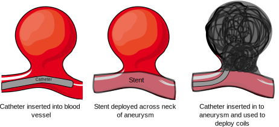
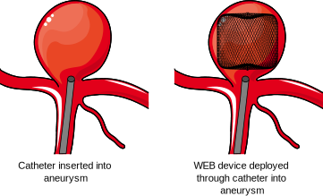

#  Introduction to brain aneurysms {1}

## What is an aneurysm?

An aneurysm is a bulge in the wall of a blood vessel caused by a small area of weakness. Aneurysms can occur in various parts of the body, but one of the most common locations is the brain. These are known as intracranial or cerebral aneurysms. Some aneurysms have the potential to rupture which can result in severe bleeding around the brain which is called subarachnoid haemorrhage. 

Brain aneurysms primarily affect middle aged and older adults with a higher prevalence in women. They are extremely rare in children. The cause of aneurysms is unknown in most cases, although some individuals have a genetic predisposition to developing them. Aneurysms can also rarely develop after certain infections or trauma. 

## What is the prevalence of brain aneurysms?

Brain aneurysms are present in about 3% of the population (3 in 100 people) [1]. There are some factors that increase the risk of developing a brain aneurysm [2]: 

1. Family history of brain aneurysm or subarachnoid haemorrhage (bleeding around the brain).
2. Atherosclerosis: This is a condition characterised by the buildup of plaque in the arteries. It is associated with an increased risk of brain aneurysms. 
3. Smoking
4. High blood pressure 
3. Female gender: Women have a higher risk of developing brain aneurysms compared to men.
4. Age: The risk of brain aneurysms may increase with age.
5. Autosomal Dominant Polycystic Kidney Disease (ADPKD): This is a genetic condition leading to the development of multiple cysts in the kidneys. It is also associated with brain aneurysms. 
6. Sickle cell disease: This is a disorder of the red blood cells that is also associated with brain aneurysms. 

## Are brain aneurysms dangerous?

Many aneurysms are benign: they cause no symptoms and will never rupture. However, other aneurysms do rupture causing life-threatening bleeding around the brain, called subarachnoid haemorrhage. Rarely aneurysms can cause symptoms without rupturing, such as reduced vision, double vision, seizures, or strokes. These effects are caused by inflammation or pressure on the surrounding brain structures, or due to the development of blood clots. Unfortunately there is no test that can accurately identify aneurysms that will go on to rupture, although we do have some idea of [factors which make certain aneurysms more likely to do so](../unruptured-aneurysms#factors).

## References

1. Vlak MH, Algra A, Brandenburg R, Rinkel GJ. Prevalence of unruptured intracranial aneurysms, with emphasis on sex, age, comorbidity, country, and time period: a systematic review and meta-analysis. Lancet Neurol. 2011 Jul;10(7):626-36. 

2. Juvela S. Prevalence of and risk factors for intracranial aneurysms. Lancet Neurol. 2011 Jul;10(7):595-7. doi: 10.1016/S1474-4422(11)70125-9. PMID: 21641283.

#  Symptoms of brain aneurysms {1}

A brain aneurysm typically doesn't present symptoms until it's large or ruptures. However, it's crucial to recognise potential signs to seek timely medical help.

## Ruptured Brain Aneurysm

A ruptured aneurysm is a medical emergency. Symptoms may include:

* Sudden, severe headache ("worst headache of your life")
* Neck stiffness or pain
* Light sensitivity (photophobia)
* Sudden blurred or double vision
* Sudden pain above or behind the eye
* Changes in mental status or awareness
* Difficulty walking or sudden dizziness
* Sudden weakness and numbness

Most of the time aneurysm rupture is a serious and dramatic event that would be very noticeable to the patient. Commonly there is a severe headache, neck, pain, and sensitivity to light, which may be accompanied by loss of consciousness and patients are usually immediately brought to the hospital for further investigation and treatment.

Rarely, however, aneurysm rupture can produce less noticeable symptoms. Typically, there is still a severe headache. If you have any concerns you should immediately contact emergency medical services, especially if you’re known to have a brain aneurysm.

## Unruptured Brain Aneurysm

Most aneurysms do not give any symptoms until they rupture. In rare instances unruptured aneurysms symptoms might include:

* Pain above and behind an eye
* Dilated pupil
* Vision changes (e.g., double vision)
* Facial numbness

#  Diagnosis of brain aneurysms {1}

When it comes to diagnosing brain aneurysms, a range of imaging technologies may be used. Here is an overview of these different modalities:

## Computerised Tomography (CT Scan)

A CT scan employs X-rays to create a detailed image of the brain. This technology is widely available, quick, and particularly effective in identifying bleeding in or around the brain, which can occur if an aneurysm ruptures. The scan may be performed with or without a 'contrast' dye, which helps in distinguishing different brain structures more clearly. Although a CT scan does involve a small amount of radiation, the dosage is generally not high enough to pose a significant risk to the patient.

CT Angiography is a specialized CT scan that uses an injection of contrast dye to visualize the blood vessels, making it an effective tool in the diagnosis of brain aneurysms. As the contrast dye highlights the blood vessels, it allows doctors to see the shape and size of an aneurysm, if present. This procedure is mostly non-invasive, other than the small injection required for the contrast dye.

CT scans involve being placed in a donut shaped machine. Scans usually take about 10 minutes. 

## Magnetic Resonance Imaging (MRI) 

MRI and MR angiography (MRA) are techniques that generate high-resolution images of the brain and blood vessels respectively, without using X-rays. Instead, they use strong magnetic fields. These methods can offer a more detailed image of an aneurysm and its exact location, compared to CT scans. However, they are generally slower, more expensive, and cannot be used on patients with certain metallic implants, due to the powerful magnets involved.

MRI scans involve being positioned in a tunnel and typically take 20-60 minutes to complete the scan. 

## Cerebral Angiography

Cerebral angiography is a diagnostic procedure that uses X-rays to produce very high-resolution images of the brain's blood vessels, and it is the gold-standard method for identifying aneurysms. During this test, a small incision is made in the patient's groin or wrist, through which a catheter is guided to the blood vessels in the brain. Contrast dye is then injected through the catheter to visualize the aneurysm. This procedure provides the most detailed images of an aneurysm, but it is more invasive than MRI or CT/CTA scans. While it's a generally safe procedure, there is a small risk (less than 0.5%) of a patient suffering a stroke as a result of the procedure.

## Lumbar Puncture

A lumbar puncture, often known as a spinal tap, is a medical procedure where a needle is inserted into the lower portion of the spine (the lumbar region) to extract a sample of cerebrospinal fluid (CSF). This fluid envelops your brain and spinal cord, acting as a protective layer and facilitating a stable environment.

In relation to diagnosing potential ruptured intracranial aneurysms, a lumbar puncture can be useful. This procedure is typically performed when doctors suspect an aneurysm as ruptured but other imaging tests, such as a CT scan, aren't conclusive. This could be because the bleed was minimal, or the blood has dispersed over time. During a lumbar puncture, the collected CSF is meticulously examined for the presence of blood or xanthochromia. The latter is a yellowish or pinkish discoloration that results from the breakdown of red blood cells in the CSF — both of these signs point towards a recent subarachnoid hemorrhage.

#  Ruptured aneurysms {1}

## What are the consequences of aneurysm rupture?

Aneurysm rupture results in a severe headache caused by bleeding around the brain, termed subarachnoid haemorrhage. A common description of this is a "thunderclap" headache. It may be accompanied by a stiff neck, sickness, vomiting, sensitivity to light, and loss of consciousness. Aneurysmal haemorrhage may lead to death. Rates of death vary in different studies and range from 20-50% [1]. It is likely that the death rate from aneurysm rupture is decreasing over time due to advances in medical care. 

A patient with a ruptured aneurysm is admitted to hospital. In the initial phase, the individual is placed in an intensive care unit (ICU) where healthcare professionals can closely monitor their condition. The duration of the hospital stay will differ from person to person. Depending on the severity of the condition, it may range from a couple of weeks to a longer duration.

One complication that may arise after aneurysm rupture  is hydrocephalus. This condition is characterised by an accumulation of cerebrospinal fluid (CSF) in the brain, leading to increased pressure, which could potentially affect brain function. Management of hydrocephalus is often tackled by temporary methods like external ventricular drains or more permanent solutions such as a shunt. A shunt serves to divert the CSF to another part of the body where it can be reabsorbed more effectively.

Another significant complication that may follow aneurysm rupture is cerebral vasospasm. This involves the narrowing of the brain's blood vessels, leading to reduced blood flow and potentially causing strokes and brain damage. Vasospasms usually occur a few days after the initial bleeding, making regular monitoring crucial. Medications, and sometimes additional procedures, are employed to mitigate this risk.

## How are ruptured aneurysms treated?

Ruptured aneurysms require immediate treatment to prevent further bleeding, as the consequences of this may be disastrous. Two techniques are available to achieve this. The primary and less invasive method is endovascular coiling. In this procedure, a catheter is inserted into a blood vessel and guided towards the aneurysm, whereupon small coils are released. These coils facilitate blood clotting, thus averting further rupture. The National Institute for Health and Care Excellence (NICE) recommends endovascular treatment for aneurysmal rupture if it possible due to the significantly improved chance of survival following the treatment [1]. In addition, patients have a higher likelihood of living independently coupled with a reduced risk of developing seizures. This is based on evidence from high-quality clinical trials such as the International Subarachnoid Aneurysm Trial conducted over a period of 16 years [2]. 

The alternative method, surgical clipping, involves a neurosurgeon creating an opening in the skull and placing a metallic clip on the aneurysm's neck, effectively blocking the blood flow within. This is performed in the minority of cases where endovascular treatment is not possible. 

## What are the long-term consequences of aneurysm rupture?

It is possible to make a full recovery from aneurysm rupture. Unfortunately, some patients are left with permanent disabilities, such as weakness in the face, hands, or legs, or speech or visual difficulties. Patients may also experience more vague symptoms that persist over time, such as a reduced ability to concentrate and frequent headaches.

## References

1. Subarachnoid haemorrhage caused by a ruptured aneurysm: diagnosis and management. NICE guideline [NG228]. Published: 23 November 2022. Section 1.2.

2. Molyneux AJ, Birks J, Clarke A, Sneade M, Kerr RS. The durability of endovascular coiling versus neurosurgical clipping of ruptured brain aneurysms: 18 year follow-up of the UK cohort of the International Subarachnoid Aneurysm Trial (ISAT). Lancet. 2015 Feb 21;385(9969):691-7. 

#  Unruptured aneurysms {1}

## I have an aneurysm. Does it need to be treated?

Not necessarily. 

Aneurysms can be dangerous but some require no treatment at all. The decision to treat is often a complex one and requires discussion with an experienced medical professional. Any medical treatment involves a degree of risk, no matter how small. It is probable that for certain low-risk aneurysms the risk of the aneurysm is outweighed by the risk of the treatment. 

For brain aneurysms there are generally three management strategies:

1. No treatment: a period of observation may be undertaken to ensure the aneurysm is not growing or changing.
2. Endovascular treatment. This involves treating the aneurysm through the blood vessels. Generally, a small incision is made in the groin or wrist and a very thin tube is directed, under X-rays, into the aneurysm. Through this tube tiny coils and stents can be inserted to block off the aneurysm. This is less invasive than surgical treatment. 
3. Surgical clipping. This is an operation involving temporarily removing some of the skull bone ('craniotomy') to access the aneurysm and place a clip around its neck. It is by nature more invasive than endovascular treatment. As the brain is very delicate this procedure is carried out with the use of an operating microscope. 

There are no medications that can be given to shrink aneurysms, however stopping smoking and controlling blood pressure if it is high can reduce the risk of it rupturing.

## What factors might lead to an aneurysm being treated? {#factors}

* Symptoms: If the aneurysm is causing symptoms such as double vision or headaches. This is uncommon, however, as most aneurysms do not cause symptoms. 
* Location: Aneurysms located in certain parts of the brain are more dangerous than others. This includes aneurysms within the ‘posterior' circulation, which includes the basilar, vertebral, and posterior cerebral arteries. 
* Size: Larger aneurysms are more likely to rupture. This rule does not hold universally true, however, as it is not uncommon to see ruptured smaller aneurysms.
* Shape: Aneurysms with an irregular shape have been associated with increased rupture rates.
* Previous aneurysm rupture: If the aneurysm has previously ruptured, or the patient has other brain aneurysms which have bled before, then treatment is more likely to be recommended.
* High blood pressure: Blood pressure should be controlled in patients with aneurysms as it predisposes aneurysms to rupture.
* Smoking: Aneurysms are more likely to rupture in people who smoke and cessation is recommended if possible. 

## What does endovascular treatment involve?

Endovascular treatment is a minimally invasive procedure to treat aneurysms. Rather than requiring a large incision and direct surgical access to the aneurysm, endovascular treatment achieves its goal by guiding small, specialized devices through the patient's blood vessels to the site of the aneurysm. Embolisation means to promote clot formation within the aneurysm, commonly by inserting platinum coils or placing stents of flow diverters acoss its neck. These techniques seal off the aneurysm, preventing blood from entering it.

## What are the types of endovascular treatment?

1. Coiling (Endovascular Coiling or Coil Embolization). Coiling is a method where small, soft platinum coils are threaded through a catheter and placed directly into the aneurysm. The aim is to initiate a blood clotting process that fills the aneurysm with a stable clot. This effectively isolates the aneurysm from your blood circulation, reducing the risk of rupture. 
2. Stent-Assisted Coiling. Stent-assisted coiling uses a small, tube-shaped device called a stent in conjunction with coiling. The stent provides support to the weakened arterial wall and helps keep the coils within the aneurysm sac. This method is often used when the aneurysm has a wider neck or irregular shape that makes regular coiling challenging. The stent remains in the artery permanently.
3. Flow Diversion. Flow diversion is a treatment method that uses a device called a flow diverter, similar to a stent but denser. It's placed in the artery carrying blood to the aneurysm. Instead of filling the aneurysm with coils, the flow diverter redirects blood flow away from the aneurysm. This reduced blood flow into the aneurysm promotes clotting within the aneurysm, leading to its closure. Flow diverters may also be used with coils although this is less necessary. 
4. Intrasaccular devices such as Woven Endobridge (WEB). Intrasaccular devices are a newer development in aneurysm treatment. These devices are placed directly into the aneurysm sac via a catheter, similar to coiling, but are able to treat aneurysms that would otherwise require stents.

## What is coil embolisation?

Coil embolisation, also known as endovascular coiling, is a procedure to treat brain aneurysms. The process is minimally invasive and is a proven technique to prevent the rupture of the aneurysm.

The procedure starts with the patient being placed under general anesthesia so that they do not experience any pain during the operation. The doctor then makes a small incision, typically in the wrist or groin, to access a blood vessel. Following this, the doctor inserts a long, thin tube, called a catheter, through the incision into the blood vessel. Using a method called fluoroscopy, which involves real-time X-ray imaging, the doctor is able to navigate the catheter through the patient's vascular system until it reaches the blood vessels of the brain where the aneurysm is located.

Once the catheter is in position, small platinum coils are threaded through the catheter and into the aneurysm. These coils are soft and flexible, allowing them to adapt to the shape of the aneurysm. The role of the coils is to promote the formation of blood clots within the aneurysm. As the blood comes into contact with the coils, it begins to clot, gradually filling up the aneurysm over time. This process effectively isolates the aneurysm from the rest of the circulatory system, thus preventing it from rupturing. The coils are left in place and do not need to be removed. 

After the coils are properly placed, the catheter is carefully withdrawn from the body. The patient is usually required to stay in the hospital for the night following the procedure to enable the medical team to monitor the recovery.

## What is stent assisted coiling?

Stent-assisted coiling involves the insertion of a small, mesh-like tube called a stent in addition to tiny coils to treat the aneurysm.

Similar to coil embolisation, a tiny catheter is navigated through the blood vessels, starting from an access point typically in the wrist or groin, all the way up to the site of the aneurysm in the brain. A stent is then placed across the opening of the aneurysm, acting like a small scaffold that provides support to the blood vessel wall, which can be weakened due to the aneurysm.

Once the stent is in place, small coils are threaded through the catheter and placed into the aneurysm. The coils promote blood clotting, thereby filling the aneurysm and preventing it from rupturing. The stent helps to hold these coils in place and prevents them from slipping into the normal blood vessel. It's particularly useful in treating wide-neck aneurysms, where the risk of coils slipping into the parent vessel (the blood vessel supplying the aneurysm) is higher.

After the procedure, you will likely need to take antiplatelet medications such as aspirin or clopidogrel, which help to prevent the formation of blood clots around the stent. This is a routine precaution and an important part of ensuring the success of the procedure. Antiplatelet medications are given in low doses and make the platelets in your blood less sticky, reducing the chance that a clot will form. 

## What is flow diversion?

Flow diversion is another minimally invasive endovascular treatment designed to manage brain aneurysms. The primary aim of this treatment is to divert blood flow away from the aneurysm and therefore prevent rupture.

A flow diverter, similar to a stent, is a small tubular mesh device that's placed inside the parent artery, the blood vessel supplying the aneurysm. The flow diverter is designed to alter the blood flow dynamics in the artery, thereby diverting blood away from the aneurysm. They can be used with or without placement of coils in the aneurysm.

Over time, this decreased blood flow into the aneurysm encourages the formation of a blood clot within the aneurysm, which helps to seal it off from the rest of the blood vessel. As the aneurysm shrinks and heals, the artery resumes a more normal shape and function. This process can take several weeks to months.



Flow diversion is particularly effective for recurrent, large, wide-necked, or thrombosed aneurysms that can't be adequately treated with other methods. It is also necessary to take antiplatelets after insertion of flow diverters. 

## What is an intrasaccular device?

Intrasaccuar devices such as the WEB (Woven EndoBridge) device may be used in the treatment of wide neck aneurysms which would otherwise require stents or flow diverters.

The WEB device, made of ultra-fine braided wires, is a flexible, self-expanding mesh that resembles a tiny basket. It is introduced into the aneurysm using a catheter navigated through the blood vessels from a small incision usually made in the wrist or groin. Once inside the aneurysm, the WEB device expands to fit the shape and size of the aneurysm, serving as a barrier that disrupts the blood flow within. This promotes clot formation within the aneurysm, sealing it off and isolating it from the rest of the circulation, thereby reducing or eliminating the risk of rupture. 

A benefit of the WEB device is related to post-procedure medications. With stents or flow diverters, patients are typically required to take antiplatelet medications for a period of time to prevent blood clot formation around the treatment site. However, because of the way the WEB device works, patients usually do not need to take these medications for a prolonged period.

## Is endovascular treatment durable? 

Yes. Endovascular treatment is highly effective at providing lifelong protection from brain aneurysms. For this reason it is now the most common method to treat brain aneurysms worldwide and has been employed to save countless lives. 

In preventing adverse consequences such as disability or death endovascular treatment is as effective as surgical clipping. It is the recommended treatment in ruptured aneurysms as studies have shown that endovascular treatment is safer. 

However, like any treatment, there is no absolute guarantee that an aneurysm treated with endovascular therapy will never recur necessitating additional procedures. In a large study retreatment was carried out in 4.9% of patients [1]. Rebleeding was exceedingly rare, occuring in less than 1 in 200 patients. It's worth noting that surgical clipping, much like endovascular treatment, isn't exempt from the possibility of requiring further intervention. For this reason endovascularly treated aneurysms are regularly monitored with follow-up scans to ensure that the treatment remains effective. If a further treatment is required this can normally be performed safely in a planned elective setting also with an endovascular procedure. 

Overall, endovascular therapy provides a highly effective and durable treatment. After embolisation of a brain aneurysm you would be more likely to die from another completely unrelated cause such as cancer of heart disease, than from recurrence of the aneurysm [3]. 

## What are the risks of endovascular treatment?

Endovascular embolisation of aneurysms is normally performed successfully without complication, but all medical treatments carry the potential for risk. 

Recovery is usually relatively rapid after endovascular treatment. Patients typically spend one night in hospital for monitoring and are discharged the day after. The site of arterial entry in the wrist or groin might be sore for a few days when it heals. Rarele there are minor side effects like oozing or bleeding from these sites. Applying pressure usually stops this. A small, typically temporary bruise may also form. Occasionally the patient might experience headaches that typically settle over days to weeks. 

Serious but rare risks include a 5% chance of stroke from the procedure due to aneurysm rupture or blood vessel occlusion, causing potential limb weakness, speech or vision difficulty which could be temporary or permanent. A very rare 1% risk of a severe brain injury leading to death exists. There is a small chance of vessel damage in the groin or wrist from the catheter entry necessitating surgery. 

## Surgical treatment

Surgical clipping is an established but more invasive method of treatment that still has a role in managing certain cerebral aneurysms. The procedure involves making an opening in the skull (a procedure called a craniotomy) to locate the aneurysm. With the help of a microscope, the surgeon places the clip on the aneurysm's neck, sealing it off from the rest of the blood vessel.

Recovery times vary but are typically longer than for endovascular treatment. Like all surgical procedures clipping carries some risks. Strokes occur in about 5% of cases which can manifest as weakness in the limbs, disturbances in speech, or visual problems. There is about a 1% chance of catastrophic brain injury resulting in death. The surgery might also affect the area of your brain near the aneurysm. This could lead to short-term effects due to swelling or bruising, or in rare cases, long-term effects. These effects would be specific to the location of each aneurysm and may also cause neurological stroke-like symptoms.

The procedure can lead to some physical discomfort in the days following the surgery. Swelling and bruising to the face are common, which might cause your eyes to close temporarily. Alongside this headaches are relatively common. The wound site can become infected. One unusual sensation some patients note is the feeling that the bone flap, the piece of bone removed during the surgery, seeming to move. This sensation, while strange, is not dangerous. The bone flap is secured with plates during the operation and will heal properly in time. The muscle used for chewing food might be impacted temporarily by the operation. As this muscle heals, you might find it challenging to open your mouth or chew, but these symptoms typically resolve within six months. 

The period following the operation requires careful management of your activities. In the first few weeks after going home, it's essential to maintain a routine, stay hydrated, eat well, and rest regularly. Enlist help for household chores if possible and consider some gentle exercise to gradually build up your strength. Most people require about 2-3 months off work for full recovery. Returning to work earlier won't necessarily harm you, but it may prolong the recovery period due to increased tiredness.

However, in skilled hands, surgical clipping can provide a solution for many types of aneurysms, particularly those that may not be suitable for other treatments, like coil embolisation or flow diversion.

## References

1. Rizvi A, Seyedsaadat SM, Alzuabi M, Murad MH, Kadirvel R, Brinjikji W, Kallmes DF. Long-Term Rupture Risk in Patients with Unruptured Intracranial Aneurysms Treated with Endovascular Therapy: A Systematic Review and Meta-Analysis. AJNR Am J Neuroradiol. 2020 Jun;41(6):1043-1048. doi: 10.3174/ajnr.A6568. Epub 2020 May 28. PMID: 32467181; PMCID: PMC7342755.

#  Further information {1}

## United Kingdom

* [The Brain & Spine Foundation](https://www.brainandspine.org.uk/): The Brain & Spine Foundation provides professional information and support for neurological conditions affecting those living in the UK.

## United States
* [The Aneurysm and AVM Foundation](https://www.taafonline.org/): This based charity is dedicated to bettering the lives, support networks, and medical care of those affected by aneurysm and other types of vascular malformation of the brain.

- [National Institute of Neurological Disorders and Stroke](https://www.ninds.nih.gov/): A service of the National Institutes of Health. Provides detailed, scientifically reliable information about a variety of neurological disorders, including aneurysms and stroke.

- [Brain Aneurysm Foundation](https://www.bafound.org/): Provides comprehensive resources about brain aneurysms, including prevention, symptoms, treatment, and support for patients and families.

- [Subarachnoid Haemorrhage Information](https://patient.info/brain-nerves/subarachnoid-haemorrhage-leaflet): Patient.info provides a patient-oriented resource on subarachnoid haemorrhage. It includes information about symptoms, causes, diagnosis, treatment, and complications.

- [Brain & Life](https://www.brainandlife.org/): Published by the American Academy of Neurology, it provides information about various neurological conditions, including aneurysms and strokes.

* [DrBulletin](https://www.drbulletin.com/): The latest medical research news for a range of subjects including neurointervention and neurosurgery. 

# About {3} 

## Biography

Dr Jeremy Lynch MBHCB MRCS FRCR is a London-based Consultant Interventional Neuroradiologist. He has been an NHS doctor for 13 years and is experienced in the diagnosis and treatment of vascular diseases involving the brain, head and neck, and spine. Dr Lynch trained in Medicine at the University of Bristol and qualified in 2007. He underwent several years of surgical training, during which he gained membership of the Royal College of Surgeons. He then underwent further specialisation in interventional radiology and neuroradiology in a range of specialist hospitals in London including the National Hospital for Neurology and Neurosurgery, Great Ormond Street Hospital, Kings College Hospital, St George’s Hospital, and Queen’s Hospital. He underwent a further international fellowship in Toronto Western Hospital in Canada where he was one of the first doctors in the world to gain experience in robotic endovascular techniques. 

Dr Lynch has published several academic book chapters and journal articles. He is a reviewer for Clinical Neuroradiology. His special interests include the role of new technologies including artificial intelligence in the diagnosis of neurovascular disease. He has been invited to lecture on interventional neuroradiology and neuroimaging in international conferences. He is the author of the popular neurointerventional educational website neurotool.org.

## Training

* International Fellowship Interventional Neuroradiology - Toronto Western Hospital (Ontario, Canada)

* CCT Interventional Radiology (GMC registration)

* Fellowship Interventional Neuroradiology - National Hospital for Neurology and Neurosurgery, Great Ormonds Street Hospital, Kings College Hospital, St George’s Hospital, and Queen’s Hospital (London)

* Radiology/interventional Radiology Training Rotation - Chelsea and Westminster Hospital

* Surgical Training Rotation - Kent, Surrey, and Sussex and Wessex Deaneries

* FRCR - Royal College of Radiologists

* MRCS - Royal College of Surgeons

* Clinical Medicine - University of Bristol

## Research

* Sood A, Mansoor N, Memmi C, Lynch M, Lynch J. Generative pretrained transformer-4, an artificial intelligence text predictive model, has a high capability for passing novel written radiology exam questions. Int J Comput Assist Radiol Surg. 2024 Apr;19(4):645-653.
* Pasarikovski CR, Lynch J, Corrin M, Ku JC, Kumar A, Pereira VM, Krings T, da Costa L, Black SE, Agid R, Yang VX. Carotid stenting for symptomatic carotid artery web: Multicenter experience. Interv Neuroradiol. 2024 Jan 17:15910199231226293. 
* Benger, M., Wood, D., Kafiabadi, S., Al Busaidi, A., Guilhem, E., Lynch, J., Townend, M., Montvila, A., Siddiqui, J., Gadapa, N., Barker, G. J., Ourselin, S., Cole, J. H., & Booth, T. (Year). Factors affecting the labeling accuracy of brain MRI studies relevant for deep learning abnormality detection. Frontiers in Radiology, Neuroradiology. 
* Hendriks EJ, Guardini F, Chung E, Lynch J, Krings T. Delayed foreshortening and prolapse of Silk Vista Baby into superior cerebellar artery aneurysm. World Neurosurg. 2023 Oct 11:S1878-8750(23)01430-4. 
* Booth TC, Bassiouny A, Lynch J, Sonwalkar H, Bleakley A, Iqbal A, Minett T, Buwanabala J, Narata AP, Patankar T, Islim FI, Kandasamy N, Balasundaram P, Sciacca S, Siddiqui J, Walsh D, Tolias C, Kailaya-Vasan A, Sultan AA, Abd El-Latif M, Mortimer A, Sastry A. Outcome study of the Pipeline Vantage Embolization Device (second version) in unruptured (and ruptured) aneurysms (PEDVU(R) study). J Neurointerv Surg. 2023 Dec 9:jnis-2023-020754. 
* Sciacca S, Bassiouny A, Mansoor N, Minett T, Balasundaram P, Siddiqui J, Joshi Y, Derakhshani S, Kandasamy N, Booth TC, Lynch J. Early Outcomes of the Pipeline Vantage Flow Diverter : A Multicentre Study. Clin Neuroradiol. 2023 Jun 28. doi: 10.1007/s00062-023-01314-x. Epub ahead of print. PMID: 37378843. 
* Batur H, Lynch J, Sayin B, Derakhshani S, Akmangit I, Daglioglu E, Arat A. Utility of flow diverters in treatment of acutely ruptured uncoilable aneurysms of the posterior circulation of the brain. Jpn J Radiol. 2023 Mar 15. 
* Dhillon, Permesh Singh; Butt, Waleed; Podlasek, Anna; Bhogal, Pervinder; McConachie, Norman; Lenthall, Robert; Nair, Sujit; Malik, Luqman; Lynch, Jeremy; Goddard, Tony; Barrett, Emma; Krishnan, Kailash; Dineen, Robert A .; England, Timothy J. Effect of proximal blood flow arrest during endovascular thrombectomy (ProFATE): Study protocol for a multicentre randomised controlled trial. European Stroke Journal. 2023;0(0). 
* Vollherbst DF, Cekirge HS, Saatci I, Baltacioglu F, Onal B, Koc O, Rautio R, Sinisalo M, Tomasello A, Vega P, Martínez-Galdámez M, Lynch J, Mendes Pereira V, Bendszus M, Möhlenbruch MA. First clinical multicenter experience with the new Pipeline Vantage flow diverter. J Neurointerv Surg. 2022 Feb 16:neurintsurg-2021-018480. 
* Wood DA, Kafiabadi S, Al Busaidi A, Guilhem EL, Lynch J, Townend MK, Montvila A, Kiik M, Siddiqui J, Gadapa N, Benger MD, Mazumder A, Barker G, Ourselin S, Cole JH, Booth TC. Deep learning to automate the labelling of head MRI datasets for computer vision applications. Eur Radiol. 2022 Jan;32(1):725-736. 
* Wood DA, Kafiabadi S, Busaidi AA, Guilhem E, Montvila A, Lynch J, Townend M, Agarwal S, Mazumder A, Barker GJ, Ourselin S, Cole JH, Booth TC. Accurate brain-age models for routine clinical MRI examinations. Neuroimage. 2022 Jan 5;249:118871. 
* Martínez-Galdámez M, Onal Y, Cohen JE, Kalousek V, Rivera R, Sordo JG, Echeverria D, Pereira VM, Blasco J, Mardighian D, Velioglu M, van Adel B, Wang BH, Gomori JM, Filioglo A, Čulo B, Lynch J, Binboga AB, Onay M, Galvan Fernandez J, Schüller Arteaga M, Guio JD, Bhogal P, Makalanda L, Wong K, Aggour M, Gentric JC, Gavrilovic V, Navia P, Fernandez Prieto A, González E, Aldea J, López JL, Lorenzo-Gorriz A, Madelrieux T, Rouchaud A, Mounayer C. First multicenter experience using the Silk Vista flow diverter in 60 consecutive intracranial aneurysms: technical aspects. J Neurointerv Surg. 2021 Dec;13(12):1145-1151. 
* Crinnion W, Jackson B, Sood A, Lynch J, Bergeles C, Liu H, Rhode K, Mendes Pereira V, Booth TC. Robotics in neurointerventional surgery: a systematic review of the literature. J Neurointerv Surg. 2021 Nov 19:neurintsurg-2021-018096. 
* Wood DA, Kafiabadi S, Busaidi AA, Guilhem E, Montvila A, Lynch J, Townend M, Agarwal S, Mazumder A, Barker GJ, Ourselin S, Cole JH, Booth TC. Deep learning models for triaging hospital head MRI examinations. Med Image Anal. 2022 May;78:102391. 
* Eef J Hendriks, Lynch J, Saravana Kumar Swaminathan, Patrick Nicholson, Ronit Agid, Ivan Radovanovic, Vitor M Pereira, Karel terBrugge1, Timo Krings. Embolization Strategies for Intracranial Dural Arteriovenous Fistulas with an Isolated Sinus: a Single-Center Experience in 20 Patients. J Neurointerv Surg. 2021 Jun 3;neurintsurg-2021-017652. 
* Cancelliere NM, Lynch J, Nicholson P, Dobrocky T, Swaminathan SK, Hendriks EJ, Krings T, Radovanovic I, Drake KE, Turner R, Sungur JM, Pereira VM. Robotic-assisted intracranial aneurysm treatment: 1 year follow-up imaging and clinical outcomes. J Neurointerv Surg. 2021 Dec 15:neurintsurg-2021-017865. 
* Zeleňák K, Krajina A, Meyer L, Fiehler J, Esmint Artificial Intelligence And Robotics Ad Hoc Committee, Behme D, Bulja D, Caroff J, Chotai AA, Da Ros V, Gentric JC, Hofmeister J, Kass-Hout O, Kocatürk Ö, Lynch J, Pearson E, Vukasinovic I.How to Improve the Management of Acute Ischemic Stroke by Modern Technologies, Artificial Intelligence, and New Treatment Methods. Life (Basel, Switzerland). 2021 May;11(6).
* Dobrocky T, Lee H, Nicholson P, Agid R, Lynch J, Swaminathan SK, Krings T, Radovanovic I, Pereira VM. When Two Is Better than One : The Buddy-wire Technique in Flow-diversion Procedures. Clin Neuroradiol. 2021 Jul 8. 
* Lynch J, Sciacca S, Siddiqui J, Kanagarajah L, Derakhshani S. Safety and Efficacy of the Neuroform Atlas Stent for Treatment of Intracranial Aneurysms : A Systematic Review and Meta-Analysis. Clin Neuroradiol. 2021 Dec;31(4):1167-1180. 
* Dobrocky T, Piechowiak EI, Goldberg J, Barvulsky Aleman E, Nicholson P, Lynch J, Bervini D, Kaesmacher J, Agid R, Krings T, Raabe A, Gralla J, Pereira VM, Mordasini P. Absence of pontine perforators in vertebrobasilar dolichoectasia on ultra-high resolution cone-beam computed tomography. J Neurointerv Surg. 2021 Jun;13(6):580-584. 
* Wood DA, Kafiabadi S, Al Busaidi A, Guilhem E, Lynch J, Townend M, Montvila A,Siddiqui J, Gadapa N, Benger M, Barker G, Ourselin S, Cole JH, Booth T.C. Labelling imaging datasets on the basis of neuroradiology reports: a validation study. 
* Wood, David A.; Lynch, Jeremy; Kafiabadi, Sina; Guilhem, Emily; Al Busaidi, Aisha; Montvila, Antanas; Varsavsky, Thomas; Siddiqui, Juveria; Gadapa, Naveen; Townend, Matthew; Kiik, Martin; Patel, Keena; Barker, Gareth; Ourselin, Sebastian; Cole, James H.; Booth, Thomas C. Automated Labelling using an Attention model for Radiology reports of MRI scans (ALARM). February 2020 . 
* D. Atasoy, N. Kandasamy, J. Hart, J. Lynch, S.-H. Yang, D. Walsh, C. Tolias and T.C. Booth. Outcome Study of the Pipeline Embolization Device with Shield Technology in Unruptured Aneurysms (PEDSU). American Journal of Neuroradiology December 2019, 40 (12) 2094-2101
* Sciacca S, Lynch J, Dagnanam I. Barker RP. Midbrain, pons and medulla anatomy and syndromes – an attempt to (brain)stem the rising tide of uncertainty. RadioGraphics.
* Lynch J, Carlton L. The Apparently Normal CT Head: A review of some of the most commonly encountered missed pathologies. Rad Magazine. 01/01/2019
* Lynch J, Parameswaran R. Management of Unilateral Recurrent Laryngeal Nerve Injury after Thyroid Surgery: A review. Head & Neck. 2017 Apr 3. 
* Shelmerdine S, Lynch J, Arthurs OJ. Presentation to Publication: Abstract to Publication Ratios for ESPR, SPR and IPR. Pediatric Radiology 2016 Sep 13;46(10):1371-7
* Lynch J, Cox A, Vasdev N, Patel A. Bilateral Obstruction of Bilaterally Duplicated Collecting Systems Requiring Upper and Lower Moiety Drainage. Ann R Coll Surg Engl. 2016 Apr;98(4)
* Craciun H, Mankad K, Lynch J. Risk management in radiology departments. World J Radiol 2015. June 28; 7(6): 00-00
* S Shelmerdine, S Ameli-Renani, Lynch J, M Gonsalves. Transarterial catheter embolisation for an unusual cause of upper gastrointestinal haemorrhage. BMJ Case Reports. 2015 May 28;2015
* Shelmerdine SC, Lynch J. Smartphone applications in paediatric radiology: availability and authority. Pediatr Radiol. 2015 Aug;45(9):1293-302. 
* Lynch J, Montgomery M, Shelmerdine S, Taylor J, Singh S. Ruptured Aneurysm of an Aberrant Left Hepatic Artery: A Case Report. BMJ Case Rep. 2013 Nov 5;2013
* Lynch J, Belgaumkar A. Bariatric Surgery is Effective and Safe in Patients Over 55: A Systematic Review and Meta-Analysis. Obesity Surgery. 2012 Sep;22(9):1507-16.
* Hashim B, Lynch J, Gywali P. An audit into anticoagulation and junior doctor education. Journal of Clinical Audits 2012. 4:2
* Lynch J, Etkind S. Spontaneous Liver Haematoma as a Result of Thrombolytic Therapy. Grand Rounds Journal. 2010. 10:1-4
* Lynch J, Aughwane P, Hammond TM. Video Games And Surgical Ability: A Literature Review. Journal of Surgical Education. May-Jun 2010;67(3):184-9.

# Interventional neuroradiology {3} 

Interventional neuroradiology (otherwise known as neurointerventional radiology or endovascular neurosurgery) is a medical specialty that deals with minimally invasive treatments for diseases of the brain and spine involving blood vessels. Common conditions that are treated include brain aneurysms, strokes, carotid stenosis, and brain tumour embolisation. 

________________

# Front page
About 
Dr Ali is a Dental Surgeon who graduated from King’s College London with distinction and honours, having won multiple undergraduate dental awards. l
Her academic pursuits began at the University of Bristol where she studied pre-clinical Medicine, before graduating from the same institution with a Bachelor of Science in Neurophysiology. She then undertook a Master of Research in Translational Medicine at the prestigious Imperial College London, where she excelled with Distinction, before transitioning to dentistry. 
 
Dr Ali is committed to rigorous academic learning, completing her Membership of the Faculty of Dental Surgery examination at the Royal College of Surgeons of England whilst simultaneously undertaking post-graduate training in facial aesthetics at the London Academy of Aesthetic Medicine. 

Dr Ali’s services include general dentistry, restorative and cosmetic dentistry, and non-surgical facial aesthetic treatments. 
PHILOSOPHY
Dr Ali focuses on personalised treatment plans for aesthetic enhancement, meticulously aligned with each individual's unique goals. Her approach involves selecting specific products and techniques to complement her patients’ skin type, facial structure, teeth and smile. She adopts a minimally-invasive approach towards both cosmetic dentistry and facial aesthetics, believing that less is more. She is passionate about enhancing her patients’ natural smiles and beauty with subtle ‘tweaks’ to achieve beautiful yet natural results.

DR COUSINS
Photo of Me
Founder and Medical Director

Dr Cousins is dual trained in dentistry and facial aesthetics. She is well respected in her fields having achieved multiple academic qualifications and awards. Her expertise in facial rejuvenation, focusing on non-surgical and minimally invasive approaches, is deeply rooted in her thorough understanding of the physiological aspects of aging. This knowledge allows her to appreciate the subtle nuances of how the skin and underlying structures change over time, enabling her to tailor her approach to each individual's unique needs.

About Ali
Dr. Alison Cousins is a highly skilled dentist and an expert in aesthetic botox injections, renowned for her comprehensive educational background and remarkable achievements in the field of dentistry and translational medicine. Her academic pursuits began with a Bachelor of Science in Physiological Science from the University of Bristol, where she graduated with First Class Honours. She furthered her studies at the same institution, embarking on Medicine (MBChB) before transitioning to a Master of Research in Translational Medicine at Imperial College London, where she excelled with Distinction.

Dr. Cousins' dedication to dentistry was solidified at King’s College London, where she earned a Bachelor of Dental Surgery with Honours. Her commitment to continuous learning is evident from her completion of the Dental Foundation Training at Quality Dental Fulham and her participation in the MFDS at the Royal College of Surgeons of England.

Her academic excellence is matched by her numerous awards, including The School Prize and Gold Star Award from the Faculty of Dentistry, Oral and Craniofacial Sciences at Guy’s, King’s and St. Thomas’s Hospitals, and the War Memorial Prize from the Dental Institute at the same institution. Dr. Cousins has also been actively involved in various courses and conferences, enhancing her expertise in recent advances in dentistry and aesthetics. 

Dr. Cousins holds memberships in several prestigious professional bodies, including the General Dental Council and the British Dental Association, and contributes to journals like the British Dental Journal and Dental Update. Her work experience spans across various respected dental practices, showcasing her versatility and depth of knowledge in general dentistry, endodontics, and restorative dentistry.

Her commitment to her profession is further demonstrated by her involvement in audits and continuous professional development, covering critical areas such as infection control, medical emergencies, and special patient groups. Dr. Cousins' blend of academic rigor, practical experience, and a passion for patient-centered care make her a distinguished figure in her field.

________________

# CONTACT US 

# TERMS AND CONDITIONS

# CANCELLATIONS

